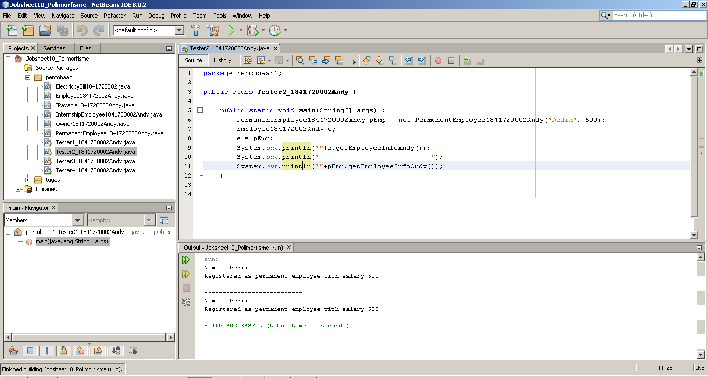

# Laporan Praktikum #10 - Polimorfisme

## Kompetensi

Setelah melakukan percobaan pada jobsheet ini, diharapkan mahasiswa
mampu:
1. Memahami konsep dan bentuk dasar polimorfisme
2. Memahami konsep virtual method invication
3. Menerapkan polimorfisme pada pembuatan heterogeneous collection
4. Menerapkan polimorfisme pada parameter/argument method
5. Menerapkan object casting untuk meng-ubah bentuk objek


## Ringkasan Materi

Pada praktikum kali ini kita belajar tentang konsep Polimorfisme di PBO. Kata polimorfisme memiliki arti yakni memiliki banyak bentuk. Sedangkan dalam PBO polimorfisme adalah kemampuan suatu objek untuk memiliki banyak bentuk.

Penggunaan dari polimorfisme biasanya digunakan pada relasi jenis inheritance, yakni object dari superclass dapat diinstansiasi sebagai object dari subclassnya.

Polimorfisme juga dapat diterapkan dalam pengunaan interface, yakni  ketika ada objek yang dideklarasikan dari suatu interface, maka ia bisa digunakan untuk mereferensi ke objek dari class-class yang implements ke interface tersebut.

Terdapat beberapa konsep yang harus kita pahami ketika kita belajar tentang polimorfisme. Konsep tersebut yaitu :

**A. Virtual method Invocation**<br>
Virtual method invocation terjadi ketika ada pemanggilan overriding method dari suatu objek polimorfisme. Disebut virtual karena antara method yang dikenali oleh compiler dan method yang dijalankan oleh JVM berbeda.

Contoh sederhananya adalah terdapat superclass yang diinstansiasi sebagi object dari subclassnya, kemudian superclass tersebut memanggil method yang ada pada subclass melalui object dari superclass.

**B. Heterogeneous Collection**<br>
Heterogeneous Collection adalah pendeklarasian array yang bertipe superclass kemudian index pada array tersebut diisi dengan object dari subclassnya. Contohnya sebagai berikut :

```java
Animal1841720002Andy arr[] = new Animal[2];
arr[0] = new Deer1841720002Andy();
arr[1] = new Lion1841720002Andy();
```

Class Animal1841720002Andy merupakan superclass dari class Deer1841720002Andy dan Lion1841720002Andy. Sehingga array dari class Animal1841720002Andy dapat diisi dengan class Deer1841720002Andy dan Lion1841720002Andy.

**C. Polymorphic Argument**<br>
Polymorpic Argument adalah pemberian argument atau parameter pada method yang menggunakan suatu object dari class. Object yang digunakan adalah superclass atau interface dari subclass yang mengextends atau mengimplements superclass atau interface tersebut.

Berikut ini adalah contoh dari Polymorphic Argument :

```java
public class Human1841720002Andy{
    public void driveAndy(Animal1841720002Andy mAnim){
        mAnim.walkAndy();
    }
}
```

Class Human memiliki method driveAndy yang memiliki argument object mAnim dari class Animal1841720002Andy. Kemudia di dalam method tersebut object mAnim memanggil method walkAndy().

```java
Deer1841720002Andy d = new Deer1841720002Andy();
Lion1841720002Andy l = new Lion1841720002Andy();
Human1841720002Andy hum = new Human1841720002Andy();
hum.driveAndy(d);
hum.driveAndy(l);
```

Karena pada class Human1841720002Andy method driveAndy() memiliki argument superclass dari class Lion1841720002Andy dan Deer1841720002Andy, method tersebut dapat diisi object sub class class Animal1841720002Andy yakni class Lion1841720002Andy dan Deer1841720002Andy

**D. Operator instanceof**<br>
Operator instanceof bisa digunakan untuk mengecek apakah suatu objek merupakan hasil instansiasi dari suatu class tertentu. Hasil dari instanceof berupa nilai boolean.

Contoh penggunaan opertator instanceof adalah sebagai berikut :

```java
Deer1841720002Andy d = new Deer1841720002Andy();
Lion1841720002Andy l = new Lion1841720002Andy();
Animal1841720002Andy a1 = d;
Animal1841720002Andy a2 = l;
```

Kemudian jika digunakan operator instanceof adalah sebagai berikut :

```java
a1 instanceof Deer // akan menghasilkan true
a2 instanceof Lion // akan menghasilkan true
```

Berdasarkan contoh di atas dapat diambil kesimpulan apakah a1 atau a2 merupakan object dari class Deer1841720002Andy atau Lion1841720002Andy, dan hasilnya adalah true.

**E. Object Casting**<br>
Casting objek digunakan untuk mengubah tipe dari suatu objek. Jika ada suatu objek dari subclass kemudian tipenya diubah ke superclass, maka hal ini termasuk ke upcasting. Contoh:

```java
Deer d = new Deer();
Animal a1 = d; // proses ini bisa disebut juga upcasting
```

Downcast terjadi jika ada suatu objek superclass, kemudian diubah menjadi
objek dari subclass. Contoh:

```java
Deer d = new Deer();
Animal a1 = d; // proses ini bisa disebut juga upcasting
Deer d = (Deer) a1; //proses downcasting
```

Proses downcasting sering disebut juga sebagai explicit casting, karena bentuk tujuan dari casting harus dituliskan dalam tanda kurung, di depan objek yang akan di-casting

Pada praktikum ini kita menggunakan sebuah studi kasus yang nantinya digunakan sebagai acuan untuk mengerjakan percobaan-percobaan yang ada pada praktikum ini.

Berikut ini adalah studi kasus yang akan kita gunakan :

Dalam suatu perusahaan, pemilik pada tiap bulannya harus membayar gaji pegawai tetap dan rekening listrik. Selain pegawai tetap perusahaan juga memiliki pegawai magang, dimana pegawai ini tidak mendapatkan gaji. 

Berikut ini adalah class diagram berdasarkan studi kasus di atas :


## Percobaan

### Percobaan 1

Pada percobaan 1 ini, kita akan mencoba membuat bentuk dasar polimorfisme sesuai dengan studi kasus dan class diagram yang ada pada praktikum ini.

Berdasarkan studi kasus dan diagram class diatas, maka pada percobaan 1 ini akan ada 6 class yang nantinya akan kita buat. Class tersebut yaitu : 
1. Class Employee1841720002Andy.
2. Class IPayable1841720002Andy sebagai interface.
3. Class InternshipEmployee1841720002Andy yang merupakan sub class dari class Employee1841720002Andy. 
4. Class PermanentEmployee1841720002Andy yang merupakan sub class dari class Employee1841720002Andy dan mengimplents interface IPayable1841720002Andy.
5. Class ElectricityBill1841720002Andy yang merupakan class yang mengimplements interface IPayable1841720002Andy.
6. Class Tester1_1841720002Andy sebagai class main.

Berikut ini adalah screenshot hasil running dari kode program yang telah kita buat di percobaan 1.


Pada class Tester1_1841720002Andy terdapat object superclass dan interface yang instansiasi sebagai object dari subclass atau class yang mengimplements interface tersebut. Itulah yang disebut bentuk dasar polimorfisme, suatu object dapat memiliki banyak bentuk. 

Berikut ini adalah link untuk menuju kode program class-class yang sudah kita buat di percobaan 1 ini : <br>
1. [Class Employee1841720002Andy](../../src/10_Polimorfisme/percobaan1/Employee184172002Andy.java)<br>
2. [Class IPayable1841720002Andy](../../src/10_Polimorfisme/percobaan1/IPayable1841720002Andy.java)<br>
3. [Class InternshipEmployee1841720002Andy](../../src/10_Polimorfisme/percobaan1/InternshipEmployee1841720002Andy.java)<br>
4. [Class PermanentEmployee1841720002Andy](../../src/10_Polimorfisme/percobaan1/PermanentEmployee1841720002Andy.java)<br>
5. [Class ElectricityBill1841720002Andy](../../src/10_Polimorfisme/percobaan1/ElectricityBill1841720002.java)<br>
6. [Class Tester1_1841720002Andy](../../src/10_Polimorfisme/percobaan1/Tester1_1841720002Andy.java)<br>
   
### Percobaan 2

Pada percobaan 2 ini, kita akan mencoba praktik menggunakan Virtual method invocation. percobaan 2 ini menggunakan class dan interface pada percobaan 1, hanya saja menambahkan sebuah class yakni Tester2_1841720002Andy sebagai class main.

Berikut ini adalah screenshot hasil running dari kode program yang telah kita buat di percobaan 2.



Berikut ini adalah link untuk menuju kode program class-class yang sudah kita buat di percobaan 2 ini : <br>
1. [Class Tester2_1841720002Andy](../../src/10_Polimorfisme/percobaan1/Tester2_1841720002Andy.java)<br>

### Percobaan 3

Pada percobaan 3 ini, kita akan mencoba praktik menggunakan Heterogenous Collection. percobaan 3 ini menggunakan class dan interface pada percobaan 1, hanya saja menambahkan sebuah class yakni Tester3_1841720002Andy sebagai class main.

Berikut ini adalah screenshot hasil running dari kode program yang telah di buat di percobaan 3.


Berikut ini adalah link untuk menuju kode program class-class yang sudah kita buat di percobaan 3 ini : <br>
1. [Class Tester3_1841720002Andy](../../src/10_Polimorfisme/percobaan1/Tester3_1841720002Andy.java)<br>

### Percobaan 4

Pada percobaan 4 ini, kita akan mencoba praktik menggunakan argumen polimorfisme, instanceod dan
casting objek. percobaan 4 ini menggunakan class dan interface pada percobaan 1, hanya saja menambahkan class  Tester4_1841720002Andy sebagai class main dan class Owner1841720002Andy.

Berikut ini adalah screenshot hasil running dari kode program yang telah di buat di percobaan 3.


Berikut ini adalah link untuk menuju kode program class-class yang sudah kita buat di percobaan 4 ini : <br>
1. [Class Tester4_1841720002Andy](../../src/10_Polimorfisme/percobaan1/Tester4_1841720002Andy.java)<br>
2. [Class Owner1841720002Andy](../../src/10_Polimorfisme/percobaan1/Owner1841720002Andy.java)<br>

## Pertanyaan
Berikut ini adalah pertanyaan-pertanyaan yang harus kita kerjakan setelah melakukan percobaan-percobaan di atas.
1. Class apa sajakah yang merupakan turunan dari class **Employee1841720002Andy**? <br>
    **Jawab:**<br>
    Yang merupakan class turunan dari class Employee1841720002Andy adalah
    - InternshipEmployee1841720002Andy
    - PermanentEmployee1841720002Andy

2. Class apa sajakah yang implements ke interface **IPayable1841720002Andy**?<br>
    **Jawab:**<br>
    Class yang meng-implements ke interface yaitu:

    - ElectricityBill1841720002Andy.
    - PermanentEmployee1841720002Andy.

3. Perhatikan class **Tester1_1841720002Andy**, baris ke-10 dan 11. Mengapa e, bisa diisi dengan objek **pEmp** (merupakan objek dari class **PermanentEmployee1841720002Andy**) dan objek **iEmp** (merupakan objek dari class **InternshipEmploye1841720002Andy**) ?<br>
    **Jawab:**<br>
    Karena class PermanentEmployee1841720002Andy dan class InternshipEmploye1841720002Andy merupakan turunan dari class Employee1841720002Andy.

4. Perhatikan class **Tester1_1841720002Andy**, baris ke-12 dan 13. Mengapa **p**, bisa diisi
dengan objek **pEmp** (merupakan objek dari class **PermanentEmployee1841720002Andy**) dan objek **eBill** (merupakan objek dari class **ElectricityBill1841720002Andy**) ?<br>
    **Jawab:**<br>
    Karena class PermanentEmployee1841720002Andy dan class ElectricityBill1841720002Andy mengimplements ke class IPayable1841720002Andy.

1. Coba tambahkan sintaks pada class **Tester1_1841720002Andy** :
    ```java
    p = iEmp;

    e = eBill;
    ```
    pada baris 14 dan 15 (baris terakhir dalam method main) ! Apa yang menyebabkan error?<br>
    **Jawab:**<br>

    Ya terjadi error, karena class IntershipEmployee1841720002Andy tidak mengimplements class IPayable1841720002Andy dan class ElectricityBill1841720002Andy tidak mengextends class Employee1841720002Andy.

2. Ambil kesimpulan tentang konsep/bentuk dasar polimorfisme!<br>
    **Jawab:**<br>
    Polimorfisme bisa diterapkan pada class yang memiliki relasi inheritance dan juga interface. Dan pada polimorfisme ada juga yang disebut dengan Operator Instanceof yang digunakan untuk mengecek apakah suatu object merupakan hasil instansiasi dari suatu class tertentu. Dan ada juga yang bernama Object Casting yang digunakan untuk mengubah tipe dari suatu objek.

3. Perhatikan class **Tester2_1841720002Andy** di atas, mengapa pemanggilan **e.getEmployeeInfoAndy()** pada baris 8 dan **pEmp.getEmployeeInfoAndy()** pada baris 10 menghasilkan hasil sama?<br>
    **Jawab:**<br>
    Karena object e yang merupakan superclass dari object pEmp dicasting menjadi object pEmp, sehingga method getEmployeeInfoAndy() di dalam object pEmp dapat diakses oleh object e.

4. Mengapa pemanggilan method **e.getEmployeeInfoAndy()** pada class **Tester2_1841720002Andy** disebut sebagai pemanggilan method virtual (virtual method invication), sedangkan **pEmp.getEmployeeInfoAndy()** tidak? <br>
    **Jawaban:**<br>
    Karena ketika objek e memanggil method getEmployeeInfoAndy() yang berada pada object pEmp yang sudah dioverriding.

5. Jadi apakah yang dimaksud dari virtual method invocation? Mengapa disebut virtual?<br>
    **Jawaban:**<br>
    Virtual method invocation adalah suatu pemanggilan overriding method dari suatu objek polimorfisme, disebut virtual karena antara method yang dikenali oleh kompiler dan method yang dijalankan oleh JVM berbeda.

6.  Perhatikan array e pada baris ke-8 pada class **Tester3_1841720002Andy**, mengapa ia bisa diisi dengan objek-objek dengan tipe yang berbeda, yaitu objek pEmp (objek dari **PermanentEmployee1841720002Andy**) dan objek **iEmp** (objek dari **InternshipEmployee1841720002Andy**) ?<br>
    **Jawaban:**<br>
    Karena object e merupakan deklarasi dari class Employee1841720002Andy yang merupakan super class dari class PermanentEmployee1841720002Andy dan class InternshipEmployee1841720002Andy.

7.  Perhatikan juga baris ke-9 pada class **Tester3_1841720002Andy**, mengapa array p juga diisi dengan objek-objek dengan tipe yang berbeda, yaitu objek **pEmp** (objek dari **PermanentEmployee1841720002Andy**) dan objek eBill (objek dari **ElectricityBill1841720002Andy**) ?<br>
    **Jawaban:**<br>
    Karena objek p merupakan deklarasi interface IPayable1841720002Andy, dan class PermanentEmployee1841720002Andy dan class ElectricityBill1841720002Andy mengimplement interface tersebut.

8.  Perhatikan baris ke-10 pada class **Tester3_1841720002Andy**, mengapa terjadi error?
    **Jawaban:**<br>
    Terjadi error karena object eBill bukan subclass dan class Employee1841720002Andy.

9.  Perhatikan class Tester41841720002Andy baris ke-7 dan baris ke-11, mengapa pemanggilan ow.payAndy(eBill) dan ow.payAndy(pEmp) bisa dilakukan, padahal jika diperhatikan method payAndy() yang ada di dalam class Owner1841720002Andy memiliki argument/parameter bertipe IPayable1841720002Andy? Jika diperhatikan lebih detil eBill merupakan objek dari ElectricityBill1841720002Andy dan pEmp merupakan objek dari PermanentEmployee1841720002Andy?<br>
    **Jawaban:**<br>
    Karena class ElectricityBill1841720002Andy dan PermanentEmployee1841720002Andy mengimplement interface IPayable1841720002Andy.

10. Jadi apakah tujuan membuat argument bertipe IPayable1841720002Andy pada method payAndy() yang ada di dalam class Owner1841720002Andy?<br>
    **Jawaban:**<br>
    Digunakan untuk mengecheck apakah object tersebut merupakan hasil dari instansiasi dari class ElectricityBill1841720002Andy dan PermanentEmployee1841720002Andy atau bukan dan mennjalankan isi nya yang berada di dalamnya.

11. Coba pada baris terakhir method main() yang ada di dalam class Tester41841720002Andy ditambahkan perintah ow.payAndy(iEmp). Mengapa terjadi error?<br>
    **Jawaban:**<br>
    Terjadi error, karena IntershipEmployee1841720002Andy tidak mengimplements IPayable1841720002Andy.

12. Perhatikan class Owner1841720002Andy, diperlukan untuk apakah sintaks p instanceof ElectricityBill1841720002Andy pada baris ke-6 ?<br>
    **Jawaban:**<br>
    Digunakan untuk mengecek apakah p merupakan hasil instansiasi dari ElectricityBill1841720002Andy.

13. Perhatikan kembali class Owner1841720002Andy baris ke-7, untuk apakah casting objek disana (ElectricityBill1841720002Andy eb = (ElectricityBill1841720002Andy) p) diperlukan ? Mengapa objek p yang bertipe IPayable1841720002Andy harus di-casting ke dalam objek eb yang bertipe ElectricityBill1841720002Andy? <br>
    **Jawaban:**<br>
    Casting tersebut digunakan untuk menampilkan hasil / info tentang ElectricityBill1841720002Andy.

## Tugas

Dalam suatu permainan, Zombie dan Barrier bisa dihancurkan oleh Plant dan bisa menyembuhkan diri. Terdapat dua jenis Zombie, yaitu Walking Zombie dan Jumping Zombie. Kedua Zombie tersebut memiliki cara penyembuhan yang berbeda, demikian juga cara penghancurannya, yaitu ditentukan oleh aturan berikut ini:
- Pada WalkingZombie
  - Penyembuhan : Penyembuhan ditentukan berdasar level
zombie yang bersangkutan
    - Jika zombie level 1, maka setiap kali penyembuhan,
health akan bertambah 20%
    - Jika zombie level 2, maka setiap kali penyembuhan,
health akan bertambah 30%
    - Jika zombie level 3, maka setiap kali penyembuhan,
health akan bertambah 40%
  -  Penghancuran : setiap kali penghancuran, health akan
berkurang 2%

- Pada Jumping Zombie
  - Penyembuhan : Penyembuhan ditentukan berdasar level
zombie yang bersangkutan
    - Jika zombie level 1, maka setiap kali penyembuhan,
health akan bertambah 30%
    - Jika zombie level 2, maka setiap kali penyembuhan,
health akan bertambah 40%
    - Jika zombie level 3, maka setiap kali penyembuhan,
health akan bertambah 50%
  - Penghancuran : setiap kali penghancuran, health akan
berkurang 1%

Buat program dari class diagram di bawah ini!


Contoh: jika class Tester seperti di bawah ini:


Akan menghasilkan output:


**Jawab:**

Pada bagian tugas ini kita akan membuat program sesuai dengan studi kasus dan class diagram di atas. 

Terdapat 7 Class yang nantinya kita buat dalam tugas ini, class-class tersebut yaitu : 
1. Class Zombie1841720002Andy sebagai abstract class.
2. Class IDestroyable1841720002Andy sebagai interface.
3. Class WalkingZombie1841720002Andy yang merupakan sub class dari class Zombie1841720002Andy. 
4. Class JumpingZombie1841720002Andy yang merupakan sub class dari class Zombie1841720002Andy.
5. Class Barrier1841720002Andy yang mengimplements interface IDestroyable1841720002Andy.
6. Class Plant1841720002Andy.
7. Class Tester1841720002Andy.

Berikut ini adalah hasil dari kode program yang telah kita buat :


Berikut ini adalah link untuk menuju kode program class-class yang sudah kita buat di bagian tugas ini : <br>
1. [Class Zombie1841720002Andy](../../src/10_Polimorfisme/tugas/Zombie1841720002Andy.java)<br>
3. [Class IDestroyable1841720002Andy](../../src/10_Polimorfisme/tugas/IDestroyable1841720002Andy.java)<br>
2. [Class WalkingZombie1841720002Andy](../../src/10_Polimorfisme/tugas/WalkingZombie1841720002Andy.java)<br>
4. [Class JumpingZombie1841720002Andy](../../src/10_Polimorfisme/tugas/JumpingZombie1841720002Andy.java)<br>
5. [Class Barrier1841720002Andy](../../src/10_Polimorfisme/tugas/Barrier1841720002Andy.java)<br>
6. [Class Plant1841720002Andy](../../src/10_Polimorfisme/tugas/Plant1841720002Andy.java)<br>
7. [Class Tester1841720002Andy](../../src/10_Polimorfisme/tugas/Tester1841720002Andy.java)<br>

## Kesimpulan

Kesimpulan yang dapat kita ambil dari praktikum kali ini adalah tentang apa itu polimorfisme dan berbagai macam konsep yang ada di dalam polimorfisme. polimorfisme sendiri adalah kemampuan suatu objek untuk memiliki banyak bentuk. Konsep polimorfisme bisa diterapkan pada class-class yang memiliki relasi inheritance (relasi generalisasi atau IS-A), polimorfisme juga bisa diterapkan pada interface.

Diharapkan setelah pertemuan ini kita bisa semakin paham bagaimana cara kerja OOP, semakin mudah ketika membuat program yang menggunakan konsep OOP dan semakin mudah ketika belajar materi selanjutnya. 

## Pernyataan Diri

Saya menyatakan isi tugas, kode program, dan laporan praktikum ini dibuat oleh saya sendiri. Saya tidak melakukan plagiasi, kecurangan, menyalin/menggandakan milik orang lain.

Jika saya melakukan plagiasi, kecurangan, atau melanggar hak kekayaan intelektual, saya siap untuk mendapat sanksi atau hukuman sesuai peraturan perundang-undangan yang berlaku.

Ttd,

***(Oktaviano Andy Suryadi)***
