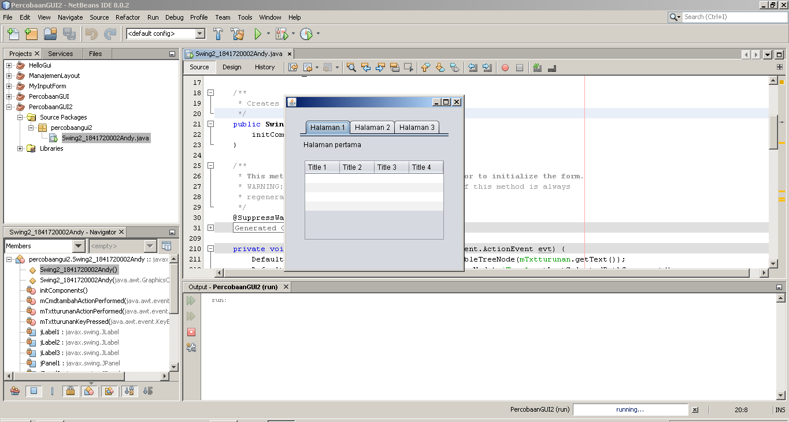

# Laporan Praktikum #1 - Pengantar Konsep PBO

## Kompetensi

Setelah menyelesaikan lembar kerja ini mahasiswa diharapkan mampu:
1. Membuat aplikasi Graphical User Interface sederhana dengan bahasa pemrograman java;
2. Mengenal komponen GUI seperti frame, label, textfield, combobox, radiobutton, checkbox,
textarea, menu, serta table;
3. Menambahkan event handling pada aplikasi GUI.

## Ringkasan Materi

Pada praktikum kali ini kita akan belajar tentang cara menggunakan Java GUI(Graphical User Interface) yakni tampilan output kode program nantinya akan menhasilkan tampilan grafis yang berbeda dari praktikum-praktikum sebelumnya. Pada tampilan tersebut nantinya akan terdapat tombol-tombol (button) yang dapat digunakan oleh user untuk berinteraksi dengan program yang sudah kita buat.

Dalam pemrograman GUI terdapat beberapa bagian yang harus dilakukan yaitu:
1. Membuat windows utama.
2. Menentukan komponen-komponen pendukung program.
3. Menentukan tata letak layout agar nantinya semua komponen – komponen yang sudah dipersiapkan bisa diaatur sedemikian rupa.
4. Event Handling dari sebuah aktivitas, seperti penekanan button, check box dan lain-lain.

Java Swing merupakan bagian dari JFC (Java Foundation Classes) yang menyediakan API untuk menangani hal yang berkaitan dengan GUI bagi program Java. Kita bisa membedakan komponen Swing dengan komponen AWT, di mana pada umumnya kelas-kelas yang berada dalam komponen Swing diawali dengan huruf J, misal: JButton, JLabel, JTextField, JRadioButton.

Untuk membuat aplikasi Java berbasis GUI, kita butuh sebuah frame atau applet untuk media eksekusi aplikasi GUI. Pada Java sebuah frame dapat diwakili oleh sebuah kelas, yaitu JFrame. Melalui kelas JFrame kita bisa mendesain tampilan Java GUI sesuai kebutuhan. Beberapa method yang penting dan sering dipakai yaitu:

1. setSize() : menentukan ukuran frame
2. setLocation() : menentukan lokasi frame pada bagian pojok kiri atas
3. setVisible() : menampilkan frame
4. setDefaultCloseOperation() : menentukan operasi ketika frame ditutup
5. setLocationRelativeTo() : menentukan lokasi frame relatif terhadap parameter
komponen yang diinputkan
6. Pack() : menentukan secara otomatis ukuran frame sesuai komponen yang dimasukkan

Agar kita bisa menggunakan java GUI, kita perlu mengimport library Swing. yakni sebagai berikut : **import javax.swing.*;**

Terdapat beberapa layout yang kita pelajari pada praktikum ini, yakni :
1. Border layout
2. Grid layout
3. Box layout

Untuk bagaimana cara menggunakan layout tersebut akan kita pelajari di percobaan 3.

## Percobaan

### Percobaan 1

Pada percobaan 1 ini, kita akan mencoba membuat sebuah halaman sederhana dengan menggunakan method-method yang dimiliki oleh kelas JFrame. Method-method tersebut digunakan untuk mengatur tampilan halaman yang nantinya kita buat, misalnya letak halaman, ukuran halaman, dll.

Di bawah ini adalah screenshot hasil running kode program yang sudah kita buat pada percobaan 1.


Berikut ini adalah kode program yang sudah kita buat pada percobaan 1, klik link di bawah ini untuk melihat lebih jelas : <br>
[1. class HelloGui1841720002Andy](../../src/11_GUI/HelloGui1841720002Andy.java)

### Percobaan 2

Pada percobaan 2 ini, kita akan mencoba menggunakan komponen-komponen GUI pada Java untuk menangani inputan, dengan memanfaatkan JFrame, JButton, JLabel, JTextField, JPanel, dsb

Di bawah ini adalah screenshot hasil running kode program yang sudah kita buat pada percobaan 2.


Berikut ini adalah kode program yang sudah kita buat pada percobaan 2, klik link di bawah ini untuk melihat lebih jelas : <br>
[1. class MyInputForm1841720002Andy](../../src/11_GUI/MyInputForm1841720002Andy.java)

### Percobaan 3

Pada percobaan 3 ini, kita akan mencoba membuat layout-layout yang ada pada Java GUI. Namun kita hanya akan menggunakan 3 jenis layout, yakni Border layout Grid layout, dan Box layout.

Di bawah ini adalah screenshot hasil running kode program yang sudah kita buat pada percobaan 3.


Berikut ini adalah kode program yang sudah kita buat pada percobaan 3, klik link di bawah ini untuk melihat lebih jelas : <br>
[1. class LayoutGUI1841720002Andy](../../src/11_GUI/LayoutGUI1841720002Andy.java)<br>
[2. class Border1841720002Andy](../../src/11_GUI/Border1841720002Andy.java)<br>
[3. class Box1841720002Andy](../../src/11_GUI/Box1841720002Andy.java)<br>
[4. class Grid1841720002Andy](../../src/11_GUI/Grid1841720002Andy.java.java)

### Percobaan 4

Pada percobaan 4 ini, kita akan mencoba membuat GUI menggunakan JFrame Form. Sehingga ketika membuat GUI tersebut kita hanya perlu drag & drop. Pada percobaan 4 ini juga kita belajar membuat event handler setiap button yang sudah kita buat.

Di bawah ini adalah screenshot hasil running kode program yang sudah kita buat pada percobaan 4.


Berikut ini adalah kode program yang sudah kita buat pada percobaan 4, klik link di bawah ini untuk melihat lebih jelas : <br>
[1. class Swing1841720002Andy](../../src/11_GUI/Swing1841720002Andy.java)<br>
[2. form  Swing1841720002Andy](../../src/11_GUI/Swing1841720002Andy.form)<br>

### Percobaan 5

Pada percobaan 5 ini, kita akan mencoba menggunakan JTabPane sehingga nantinya halaman GUI kita akan terdapat beberapa halaman, dan juga kita mencoba menggunakan JTree.

Di bawah ini adalah screenshot hasil running kode program yang sudah kita buat pada percobaan 5.


Berikut ini adalah kode program yang sudah kita buat pada percobaan 5, klik link di bawah ini untuk melihat lebih jelas : <br>
[1. class Swing2_1841720002Andy](../../src/11_GUI/Swing2_1841720002Andy.java)<br>
[2. form  Swing2_1841720002Andy](../../src/11_GUI/Swing2_1841720002Andy.form)<br>


## Pertanyaan

Berikut ini adalah pertanyaan yang harus kita jawab setelah melakukan percobaan di atas.
1. Modifikasi kode program pada percobaan 2 dengan menambahkan JButton baru untuk melakukan fungsi perhitungan penambahan, sehingga ketika button di klik (event click) maka akan menampilkan hasil penambahan dari nilai A dan B.<br>
**Jawab:** <br>
Gambar di bawah ini adalah screenshot dari hasil modifikasi kode program percobaan 2.

    

    Modifikasi yang dilakukan adalah membuat variable baru menggunakan class JButton dengan nama mButton1.

    Kemudian button tersebut di instansiasi lagi menjadi di dalam method createButtonAndy(). Kemudian membuat listener baru yakni TambahListener1841720002Andy untuk melakukan fungsi perhitungan penambahan. Setelah class tersebut sudah jadi, melakukan set listener mButton1 dengan TambahListener1841720002Andy.

    Setelah proses di atas selesai, selanjutnya adalah memasukkan mButton1 ke dalam mPanel di dalam method createPanelAndy().

    Untuk melihat lebih jelas kode programnya silahkan klik link berikut : <br>
    [class MyInputForm1841720002Andy](../../src/11_GUI/MyInputForm1841720002Andy.java)

2. Apa perbedaan dari Grid Layout, Box Layout dan Border Layout?<br>
**Jawab:** <br>
Perbedaan antara ketiga layout tersebut yaitu :
   - Box layout: Menempatkan komponen dalam satu baris atau satu kolom.
   - Grid layout: Menempatkan komponen dari kiri ke kanan dan dari atas ke bawah.
   - Border layout: Menempatkan komponen berdasarkan East, South, North, West dan Center.

3. Apakah fungsi dari masing-masing kode berikut?
   ``` java
    JFrame frame = new Border1841720002Andy();
    frame.setDefaultCloseOperation(JFrame.EXIT_ON_CLOSE);
    frame.setVisible(true);
        
    JFrame frame2 = new Grid1841720002Andy();
    frame2.setDefaultCloseOperation(JFrame.EXIT_ON_CLOSE);
    frame2.setVisible(true);
        
    JFrame frame3 = new Box1841720002Andy();
    frame3.setDefaultCloseOperation(JFrame.EXIT_ON_CLOSE);
    frame3.setVisible(true);
   ```
   **Jawab:** <br>
   Berikut ini adalah penjelasan dari fungsi dari masing-masing kode di atas.
   ```java
   JFrame frame = new Border1841720002Andy();

   JFrame frame2 = new Grid1841720002Andy();

   JFrame frame3 = new Box1841720002Andy();
   ```
   Kode program di atas digunakan unutk menginstansiasi object dari class Border1841720002Andy, Grid1841720002Andy, Box1841720002Andy.

   ```java
   frame.setDefaultCloseOperation(JFrame.EXIT_ON_CLOSE);

   frame2.setDefaultCloseOperation(JFrame.EXIT_ON_CLOSE);

   frame3.setDefaultCloseOperation(JFrame.EXIT_ON_CLOSE);
   ```

   Kode program di atas digunakan untuk menutup frame dan keluar dari program ketika mengklik tombol close yang terdapat pada frame.

   ```java
   frame.setVisible(true);

   frame2.setVisible(true);

   frame3.setVisible(true);
   ```

   Kode program di atas digunakan untuk mengatur output agar daat ditampilkan.

4. Apakah fungsi dari kode berikut?
   <br>
   **Jawab:**<br>
   Kode program di atas digunakan untuk menampilkan form yang ada di dalam class Swing1841720002Andy.

5. Mengapa pada bagian logika checkbox dan radio button digunakan multiple if ? <br>
   **Jawab:**<br>
   Untuk mengecek pilihan agar hasilnya muncul hanya satu atau beberapa sesuai kondisi dan eksekusi pada multiple if.

6. Lakukan modifikasi pada program percobaan 4 untuk melakukan menambahkan inputan berupa alamat dan berikan fungsi pemeriksaan pada nilai Alamat tersebut jika belum diisi dengan menampilkan pesan peringatan. <br>
   **Jawab:**<br>
   Gambar di bawah ini adalah screenshot dari hasil modifikasi kode program percobaan 4.

    

    Untuk melihat lebih jelas kode program hasil modifikasi saya, silahkan klik link berikut : <br>
    [1. class Swing1841720002Andy](../../src/11_GUI/Swing1841720002Andy.java)<br>
    [2. form Swing1841720002Andy](../../src/11_GUI/Swing1841720002Andy.form)

   
7. Apa kegunaan komponen swing JTabPane, JTtree, pada percobaan 5? <br>
   **Jawab:**<br>
   Fungsi dari JTabPane, JTree, pada percobaan 5 adalah sebagi berikut :
   - JTabPane: digunakan untuk mengelompokkan komponen dalam sebuah tab atau membuat halaman lain dalam satu form.
   - JTtree: digunakan untuk mempresentasikan set data.

8. Modifikasi program pada percobaan 5 untuk menambahkan komponen JTable pada tab Halaman 1 dan tab Halaman 2 <br>
   **Jawab:** <br>
   Gambar di bawah ini adalah screenshot dari hasil modifikasi kode program percobaan 5.

    

    Pada halaman dua juga sama terdapat, JTable.

    Untuk melihat lebih jelas kode program hasil modifikasi saya, silahkan klik link berikut : <br>
    [1. class Swing2_1841720002Andy](../../src/11_GUI/Swing2_1841720002Andy.java)<br>
    [2. form Swing2_1841720002Andy](../../src/11_GUI/Swing2_1841720002Andy.form)

## Tugas

Buatlah Sebuah Program yang mempunyai fungsi seperti kalkulator (mampu menjumlahkan, mengurangkan, mengalikan dan membagikan. Dengan tampilan seperti berikut. 


**Jawab:**

Gambar di bawah ini adalah screenshot dari hasil running kode program pada bagian tugas :


Pada percobaan di atas saya menekan tombol 3 * 5 sehingga muncul nilai 15.0

Berikut ini adalah kode program yang sudah kita buat pada bagian tugas, klik link di bawah ini untuk melihat lebih jelas : <br>
[1. class Kalkulator1841720002Andy](../../src/11_GUI/Kalkulator1841720002Andy.java)<br>
[2. form  Kalkulator1841720002Andy](../../src/11_GUI/Kalkulator1841720002Andy.form)<br>

## Kesimpulan

Kesimpulan yang dapat kita ambil dari praktikum kali ini adalah tentang apa itu java GUI dan bagaimana cara menggunakannya, konsep-konsep yang berhubungan dengan java GUI, membuat komponen-komponen java GUI, event handling, membuat alert dengan Jpanel Message, dll.

Diharapkan setelah pertemuan ini kita bisa semakin paham bagaimana cara kerja OOP, semakin mudah ketika membuat program yang menggunakan konsep OOP dan semakin mudah ketika belajar materi selanjutnya. 

## Pernyataan Diri

Saya menyatakan isi tugas, kode program, dan laporan praktikum ini dibuat oleh saya sendiri. Saya tidak melakukan plagiasi, kecurangan, menyalin/menggandakan milik orang lain.

Jika saya melakukan plagiasi, kecurangan, atau melanggar hak kekayaan intelektual, saya siap untuk mendapat sanksi atau hukuman sesuai peraturan perundang-undangan yang berlaku.

Ttd,

***(Oktaviano Andy Suryadi)***
