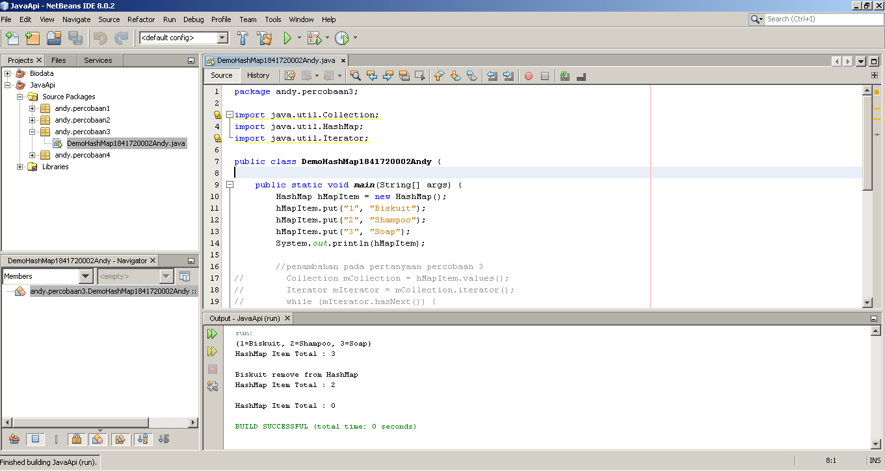

# Laporan Praktikum #12 - Collection (List, Set, Map) dan Database

## Kompetensi

Setelah menyelesaikan lembar kerja ini mahasiswa diharapkan mampu:
1. Memahami cara penyimpanan objek menggunakan Collection dan Map.
2. Mengetahui pengelompokan dari Collection.
3. Mengetahui perbedaan dari interface Set, List dan Map.
4. Mengetahui penggunaan class-class dari interface Set, List, dan Map.
5. Memahami koneksi database menggunakan JDBC dan JDBC API
    
## Ringkasan Materi

Pada praktikum materi yang akan dipelajari adalah tentang Collection dan Database. 

Collection sendiri adalah sebuah objek yang bisa digunakan untuk menyimpan sekumpulan objek. Objek yang ada dalam Collection disebut elemen. Collection menyimpan elemen yang bertipe Object, sehingga berbagai tipe object bisa disimpan dalam Collection. Class-class mengenai Collection tergabung dalam Java Collection Framework. Class-class Collection diletakkan dalam package java.util dan mempunyai dua interface utama yaitu **Collection** sehingga ketika kita akan menggunakan collection kita perlu membuat sebuah object dengan tipe class Collection.

Collection dibagi menjadi tiga kelompok yakni: Set, List, dan Map. Berikut ini adalah penjelasan dari pembagian tiga kelompok collection.
1. **Set** <br>
   Set mengikuti model himpunan, dimana objek/anggota yang tersimpan dalam Set harus unik. Urutan maupun letak dari anggota tidak penting, hanya keberadaan anggota saja yang penting. Kelas konkrit yang mengimplementasikan Set harus memastikan bahwa tidak terdapat elemen duplikat yang dapat ditambahkan ke dalam set. Yaitu, tidak terdapat dua elemen e1 dan e2 yang berada di dalam set yang membuat e1.equals(e2) bernilai true. Class-Class yang mengimplementasikan interface Set adalah HashSet. HashSet dapat digunakan untuk menyimpan elemen-elemen bebas-duplikat. Kelas HashSet merupakan suatu kelas konkrit yang mengimplementasikan Set. Pembuatan objek HashSet adalah sebagai berikut:
   ```java
   Set <nama_objek_HashSet> = new HashSet();
   ```

2. List<br>
   List digunakan untuk menyimpan sekumpulan objek berdasarkan urutan masuk (ordered) dan menerima duplikat. Cara penyimpanannya seperti array, oleh sebab itu memiliki posisi awal dan posisi akhir, menyisipkan objek pada posisi tertentu, mengakses dan menghapus isi list, dimana semua proses ini selalu didasarkan pada urutannya. Class-class yang mengimplementasikan interface List adalah Vector, Stack, Linked List dan Array List. 

    Jenis list yang akan dibahas adalah arrayList. ArrayList digunakan untuk membuat array yang ukurannya dinamis. Berbeda dengan array biasa yang ukurannya harus ditentukan di awal deklarasi array. Dengan ArrayList, ukurannya akan fleksibel tergantung banyaknya elemen yang dimasukkan. Pendeklarasian object ArrayList sebaiknya diikuti dengan nama class yang akan dimasukkan dalam List tersebut.  Tujuannya agar method dan property dari setiap object dalam ArrayList dapat diakses secara langsung. Pembuatan objek ArrayList adalah sebagai berikut:
    ```java
    ArrayList <nama_objek_arraylist>=new ArrayList();
    ```

3. Map<br>
   Dua hal penting yang digunakan dalam map adalah sepasang object yaitu key yang bersifat unik dan nilai yang disimpan. Untuk mengakses nilai tersebut maka kita perlu mengetahui key dari nilai tersebut. Map juga dikenal sebagai dictionary/kamus. Pada saat menggunakan kamus, perlu suatu kata yang digunakan untuk pencarian. Class-class yang  engimplementasikan Map adalah Hashtable,HashMap, LinkedHashMap. jenis map yang akan dibahas adalah HashMap. 
   
   HashMap adalah class implementasi dari Map, Map itu sendiri adalah interface yang memiliki fungsi untuk memetakan nilai dengan key unik. Pembuatan objek HashMap adalah sebagai berikut:
   ```java
   HashMap <nama_objek_HashMap> = new HashMap();
   ```

Dan yang terakhir yang akan kita pelajari adalah tentang penggunaan database pada aplikasi java, yang lebih tepatnya adalah cara menggunakan JDBC API.

JDBC API merupakan Java Database Connectivity Application Programming Interface (JDBC API). Pada dasarnya JDBC API terdiri dari satu set kelas dan interface yang digunakan untuk berinteraksi dengan database dari aplikasi Java. Umumnya, JDBC API  elakukan 3 (tiga) fungsi berikut :
1. Membangun koneksi antara aplikasi Java dan database
2. Membangun dan mengeksekusi query
3. Memproses hasil 
   
## Percobaan

### Percobaan 1

Pada percobaan 1 ini, kita akan mencoba menggunakan Set dengan jenis HashSet. Pada kode program kita nanti, kita akan mengimport library Set, HashSet dan Iterator.

Berikut ini adalah output dari kode program yang sudah kita buat pada percobaan 1.


Berikut ini adalah daftar kode program yang sudah kita buat pada percobaan 1, klik link di bawah ini untuk melihat kode program lebih lanjut : <br> 
[1. Class CobaHashSet1841720002Andy](../../src/12_Java_API/CobaHashSet1841720002Andy.java)

### Percobaan 2

Pada percobaan 2 ini, kita akan mencoba membuat arraylist dengan menggunakan collection jenis list. Nantinya kita akan mengimport library ArrayList dan List.

Berikut ini adalah output dari kode program yang sudah kita buat pada percobaan 2.


Berikut ini adalah daftar kode program yang sudah kita buat pada percobaan 2, klik link di bawah ini untuk melihat kode program lebih lanjut : <br> 
[1. Class CobaArrayList1841720002Andy](../../src/12_Java_API/CobaArrayList1841720002Andy.java)

### Percobaan 3

Pada percobaan 3 ini, kita akan mencoba membuat hashmap dengan menggunakan collection jenis map. Nantinya kita juga akan mengimport library, yakni library hashmap.

Berikut ini adalah output dari kode program yang sudah kita buat pada percobaan 3.



Berikut ini adalah daftar kode program yang sudah kita buat pada percobaan 3, klik link di bawah ini untuk melihat kode program lebih lanjut : <br> 
[1. Class DemoHashMap1841720002Andy](../../src/12_Java_API/DemoHashMap1841720002Andy.java)


### Percobaan 4

Pada percobaan 4 ini, kita akan mencoba menggunakan arraylist dalam GUI. GUI yang akan digunakan adalah JFrame. Nantinya pada hasil akhirnya kita bisa melakukan input pada output percobaan 4 ini dan hasil inputan kita akan tersimpan pada JTable pada outputnya, namun penyimpanan data tersebut hanya sementara.

Berikut ini adalah output dari kode program yang sudah kita buat pada percobaan 4.


Berikut ini adalah daftar kode program yang sudah kita buat pada percobaan 4, klik link di bawah ini untuk melihat kode program lebih lanjut : <br> 
[1. Class InputData1841720002Andy](../../src/12_Java_API/InputData1841720002Andy.java)<br>
[2. Class Mahasiswa1841720002Andy](../../src/12_Java_API/Mahasiswa1841720002Andy.java)<br>
[3. Class TampilGui1841720002Andy](../../src/12_Java_API/TampilGui1841720002Andy.java)<br>
[4. Form TampilGui1841720002Andy](../../src/12_Java_API/TampilGui1841720002Andy.form)

### Percobaan 5

Pada percobaan 5 ini, kita akan mencoba membuat aplikasi biodata yang menggunakan database mysql. Library yang digunakan adalah MySQL JDBC Driver. Aplikasi ini berbasis GUI jadi nantinya juga akan menggunakan JFrame. Nama database yang nantinya digunakan adalah biodata (file dapat di lihat di bagian daftar link percobaan 5).

Berikut ini adalah output dari kode program yang sudah kita buat pada percobaan 5.


Berikut ini adalah daftar kode program yang sudah kita buat pada percobaan 5, klik link di bawah ini untuk melihat kode program lebih lanjut : <br> 
[1. Database biodata.sql](../../src/12_Java_API/biodata.sql)<br>
[2. Class FormKoneksi1841720002Andy](../../src/12_Java_API/FormKoneksi1841720002Andy.java)<br>
[3. Form FormKoneksi1841720002Andy](../../src/12_Java_API/FormKoneksi1841720002Andy.form)

## Pertanyaan

Berikut ini adalah pertanyaan yang harus kita jawab setelah melakukan percobaan di atas.

1. Apakah fungsi **import java.util.*;** pada program percobaan 1 diatas!<br>
   **Jawab:**<br>
   Fungsi dari **import java.util.*;** adalah mengimport semua library atau kelas yang ada di dalam java.

2. Pada program percobaan 1, baris keberapakah yang berfungsi untuk menciptakan object HashSet?<br>
   **Jawab:**<br>
   Berikut ini adalah screenshot kode program percobaan 1.
   
   

   object Hashset diciptakan pada baris ke-10.
   
3. Apakah fungsi potongan program dibawah ini pada percobaan 1!
   ```java
   mSetcity.add("Malang");
   mSetcity.add("Banyuwangi");
   mSetcity.add("Jogjakarta");
   mSetcity.add("Batu");
   ```
   
   **Jawab:**<br>
   Digunakan untuk menambahkan data ke dalam array mSetcity.

4. Tambahkan set.add(“Malang”); kemudian jalankan program! Amati hasilnya dan jelaskan mengapa terjadi error!<br>
   **Jawab:**<br>
   Terjadi error karena data "Malang" sudah terdaftar.

5. Jelaskan fungsi potongan program dibawah ini pada percobaan 1!
   ```java
   Iterator<String> mIterator = mSetCity.iterator();
        
   while (mIterator.hasNext()) {            
       System.out.println(mIterator.next().toLowerCase());
   }
   ```
   **Jawab:**<br>
   Iterator digunakan untuk mengakses seluruh elemen yang ada di dalam di dalam HashSet.
   
   hasNext digunakan untuk memeriksa apakah pada objeck mIterator masih memiliki data selanjutnya, jika ada maka akan ditampilkan (dijadikan output)
   
   next() digunakan untuk mengambil data selanjutnya.
   
   toLowerCase() digunakan untuk data yang ditampilkan menjadi huruf kecil semua.

6. Apakah fungsi potongan program dibawah ini pada percobaan 2!
   ```java
   System.out.println(mListCountry);
   System.out.format("List index 0 = %s\n", mListCountry.get(0));
   System.out.format("List index 2 = %s\n", mListCountry.get(2));
   ```
   **Jawab:**<br>
   Fungsi dari potongan kode program tersebut adalah digunakan untuk menampilkan data yang tersimpan dalam array mListCountry secara manual, atau memanggil menggunakan indexnya.

7. Ganti potongan program pada soal no 6 menjadi sebagai berikut
   ```java
   System.out.println(mListCountry);
   Iterator mIterator = mListCountry.iterator();
   while(mIterator.hasNext()){
       Object element = mIterator.next();
       System.out.format("%s ",element);
   }
   ```
   Kemudian jalankan program tersebut! <br>
   **Jawab**<br>
   Berikut ini adalah ouput dari kode program yang sudah dimodifikasi :

   

8. Jelaskan perbedaan menampilkan data pada ArrayList menggunakan potongan program pada soal no 6 dan no 7 pada percobaan 2! <br>
   **Jawab:**<br>
   Perbedaannya adalah cara menampilkan isi dari arraylist. Pada soal no 6 cara menampilkannya adalah berdasarkan index atau dapat secara keseluruhan menggunakan System.out.println(mLisCountry). Sedangkan nomor 7 menggunakan iterator.

9.  Jelaskan fungsi **hMapItem.put("1","Biskuit")** pada program percobaan 3!<br>
    **Jawab:**<br>
    Fungsi dari kode di atas adalah memasukkan data ke dalam hMapItem dengan menggunakan fungsi put. Data yang dimasukkan adalah data object key "1", nilai key "Biskuit".

10. Jelaskan fungsi **hMapItem.size()** pada program percobaan 3!<br>
    **Jawab:**<br>
    Fungsi dari kode di atas adalah mendapatkan jumlah element yanga ada di dalam hMapItem.


11. Jelaskan fungsi **hMapItem.remove("1")** pada program percobaan 3!<br>
    **Jawab:**<br>
    Fungsi dari kode di atas adalah menghapus data yang object keynya adalah "1".

12. Jelaskan fungsi **hMapItem.clear()** pada program pecobaan 3! <br>
    **Jawab**<br>
    Fungsi dari kode di atas adalah menghapus seluruh elemen yang ada di dalam hMapItem.

13. Tambahkan kode program yang di blok pada program percobaan 3 yang sudah anda buat!
    
    

    **Jawab:** <br>
    Gambar berikut ini adalah kode program yang saya tambahkan pada kode program percobaan 3.
    

14. Jalankan program dengan modifikasi pada soal nomor 13 dan amati apa yang terjadi!<br>
    **Jawab:**<br>
    Gambar berikut ini adalah output dari kode program yang telah saya modifikasi.
    

15. Apakah perbedaan program sebelumnya dan setelah ditambahkan kode program pada soal no 13 diatas? Jelaskan! <br>
    **Jawab:**<br>
    Kode program pada soal no 13 di atas adalah kode program iterator untuk menampilkan ada di dalam  hMapItem. Perbedaannya adalah terletak pada outputnya, apabila kita menggunakan iterator sesuai dengan kode program pada soal no 13, maka key objectnya tidak ditampilkan dan hanya object valuenya saja.

16. Setelah menambah code pada action button klik pada percobaan 5, coba jalankan program dan tambahkan data. Apakah program berhasil menambahkan data? Jika tidak apakah  penyebabnya <br>
    **Jawab:** <br>
    Berhasil di tambahkan namun datanya tidak muncul karena belum membuat kode untuk mengambil data dari database.

17. Jelaskan maksud source code untuk melakukan insert data pada percobaan 5 diatas? <br>
    **Jawab**<br>
    Pada awalnya adalah proses pengambilan data yang berasal dari textfield jTFNama, jTFAlamat, jTFTelepon, yang kemudian disisipkan ke dalam variabel sqlkode. Kemudian variabel tersebut dimasukkan ke dalam fungsi yang ada di dalam object sKoneksi (sKoneksi.prepareStatement).

    Selanjutnya dilakukan pengencekan menggunakan try-catch. Apabila data berhasil masuk ke database maka akan muncul pesan "Data Berhasil Ditambah", apabila gagal maka akan muncul pesan "Terjadi Kesalahan "+ex.getMessage().

18. Jelaskan alur dari method ambil_data_tabel pada percobaan 5? <br>
    **Jawab:**<br>
    Pertama object mModel menghapus seluruh elemen yang ada di dalam jTable. Setelah itu melakukan pengecekan menggunakan try-catch. Pada bagian Try terdapat proses koneksi pada database **biodata**, kemudian pembuatan variable s yang nantinya akan digunakan untuk menjalankan query sql, dan variabel sql yang berisi syntaks sql untuk mengambil data.
    
    Setelah itu variable s mengeksekusi variable sql dan hasilnya di simpan di dalam variable r. Kemudian variable r dimasukkan dalam perulangan while yang nantinya akan menampilkan seluruh data yang ada di dalam table anggota.

    Setelah perulangan while selesai dijalankan selajutnya penutupan koneksi database.
    
    Apabila terjadi eror ketika proses di atas, maka akan muncul peringatan "Terjadi kesalahan " + e.getMessage().

19. Buat fungsi untuk merefresh sehingga data yang baru dapat ditampilkan pada tabel! <br>
    **Jawab:**<br>
    Gambar di bawah ini adalah screenshot modifikasi kode agar bisa merefresh ketika terdapat data baru.

    

    Modifikasi dilakukan pada button refresh dengan memanggil fungsi yang sudah kita buat sebelumnya yakni ambilDataTableAndy().

    klik link di bawah ini untuk melihat kode program lebih lanjut : <br> 
    [1. Class FormKoneksi1841720002Andy](../../src/12_Java_API/FormKoneksi1841720002Andy.java)
    


## Kesimpulan

Kesimpulan yang dapat kita ambil dari praktikum kali ini adalah tentang apa itu Collection, cara menggunakan berbagai macam jenis collection, ArrayList, HashMap, HashSet, JDBC, bagaimana cara menggunakan database pada aplikasi java, dsb.

Diharapkan setelah pertemuan ini kita bisa semakin paham bagaimana cara kerja OOP, semakin mudah ketika membuat program yang menggunakan konsep OOP dan semakin mudah ketika belajar materi selanjutnya. 

## Pernyataan Diri

Saya menyatakan isi tugas, kode program, dan laporan praktikum ini dibuat oleh saya sendiri. Saya tidak melakukan plagiasi, kecurangan, menyalin/menggandakan milik orang lain.

Jika saya melakukan plagiasi, kecurangan, atau melanggar hak kekayaan intelektual, saya siap untuk mendapat sanksi atau hukuman sesuai peraturan perundang-undangan yang berlaku.

Ttd,

***(Oktaviano Andy Suryadi)***
