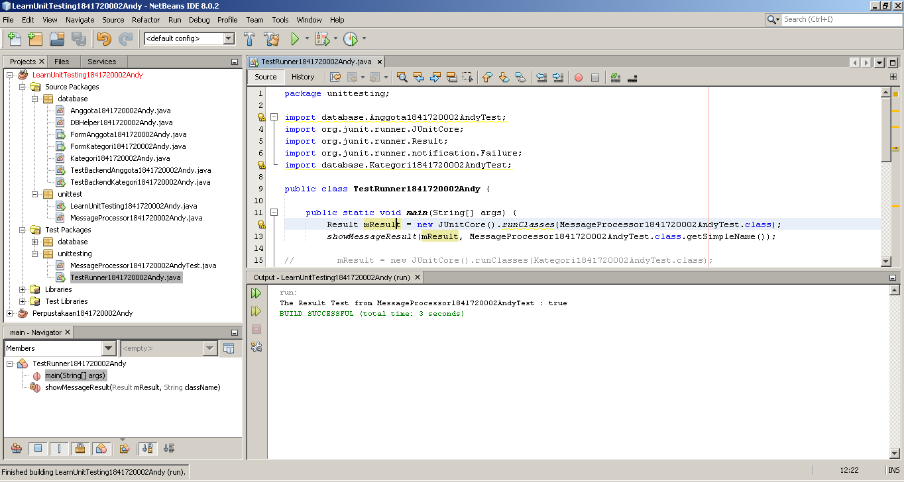
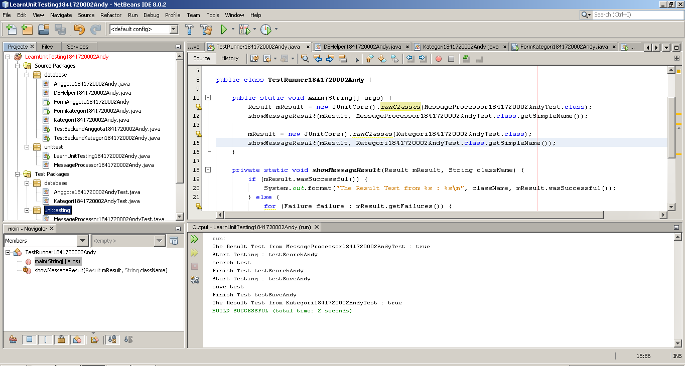
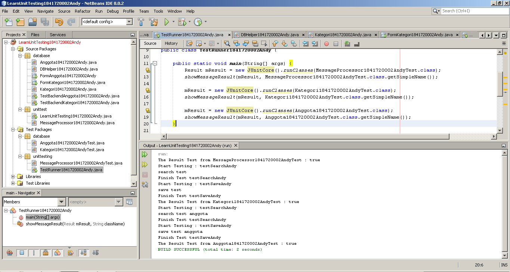

# Laporan Praktikum #15 - Unit Testing

## Kompetensi

Setelah menyelesaikan lembar kerja ini mahasiswa diharapkan mampu:
1. Memahami konsep dan fungsi unit testing
2. Menerapkan unit testing dengan JUnit pada program sederhana.
3. Menerapkan unit testing dengan JUnit pada progam yang terkoneksi database

## Ringkasan Materi

Pada praktikum kali ini kita akan membuat sebuah mencoba melakukan unit testing. Unit testing ini sendiri adalah sebuah proses yang digunakan untuk melakukan testing terhadap setiap method-method atau komponen yang ada di dalam suatu class apakah method atau komponen tersebut sudah berjalan sesuai dengan diharapkan. Saat melakukan testing kita akan menggunakan library yang bernama JUnit. Pada unit testing ini nantinya akan ada dua jenis output, yakni output yang dihasilkan dan output yang diharapkan. Apabila output yang dihasilkan dan output yang diharapkan sama, maka hasilnya akan true.

## Percobaan

### Percobaan 1

Pada percobaan 1 kita akan mencoba melakukan unit testing sederhana dengan melakukan testing outputan sebuah string apakah antara output yang diharapkan dengan output yang dihasilkan apakah sudah sesuai atau tidak.

Berikut ini adalah screenshot hasil running dari kode program yang sudah kita buat pada percobaan 1.

Output tersebut menghasilkan output true karena hasil yang diharapkan dan yang dihasilkan adalah sama.

Untuk lebih jelasnya silahkan klik link di bawah ini untuk melihat kode program pada percobaan 1.

Berikut ini adalah link file kode program pada percobaan 1 : 
 [1. LearnUnitTesting1841720002Andy](../../src/15_Unit_Testing/src/unittest/LearnUnitTesting1841720002Andy.java)
 [2. MessageProcessor1841720002Andy](../../src/15_Unit_Testing/src/unittest/MessageProcessor1841720002Andy.java)
 [3. MessageProcessor1841720002AndyTest](../../src/15_Unit_Testing/test/unittesting/MessageProcessor1841720002AndyTest.java)
 [4. TestRunner1841720002Andy](../../src/15_Unit_Testing/test/unittesting/TestRunner1841720002Andy.java)

### Percobaan 2

Pada percobaan 2 kita akan mencoba melakukan unit testing pada percobaan yang ada di jobsheet ke-14 yakni class DBHelper1841720002Andy.java, FormKategori1841720002Andy.java, Kategori1841720002Andy.java dan TestBackendKategori1841720002.java

Berikut ini adalah screenshot hasil running dari kode program yang sudah kita buat pada percobaan 2.

Output tersebut menghasilkan output true karena method yang di test berjalan dengan lancar sesuai harapan.

Untuk lebih jelasnya silahkan klik link di bawah ini untuk melihat kode program pada percobaan 2.

Berikut ini adalah link file kode program pada percobaan 2 : 
 [1. DBHelper1841720002Andy.java](../../src/15_Unit_Testing/src/database/DBHelper1841720002Andy.java)
 [2. Kategori1841720002Andy.java](../../src/15_Unit_Testing/src/database/Kategori1841720002Andy.java)
 [3. TestBackendKategori1841720002.java](../../src/15_Unit_Testing/src/database/TestBackendKategori1841720002Andy.java)
 [4. FormKategori1841720002Andy.java](../../src/15_Unit_Testing/src/database/FormKategori1841720002Andy.java)
 [5. FormKategori1841720002Andy.form](../../src/15_Unit_Testing/src/database/FormKategori1841720002Andy.form)
 [6. Kategori1841720002AndyTest.java](../../src/15_Unit_Testing/test/database/Kategori1841720002AndyTest.java)
 [7. TestRunner1841720002Andy.java](../../src/15_Unit_Testing/test/unittesting/TestRunner1841720002Andy.java)

Apa yang terjadi ketika class Kategori1841720002Andy di run? **Jawab:** 
Tidak terjadi apa-apa, karena class Kategori1841720002Andy tidak memiliki method main.

## Tugas

Pada bagian tugas ini kita akan melakukan unit testing pada class Anggota1841720002Andy pada jobsheet ke-14. Langkah - langkah yang dilakukan mirip dengan percobaan 2.

Berikut ini adalah screenshot hasil running dari kode program yang sudah kita buat pada bagian tugas.

Output tersebut menghasilkan output true karena method yang di test berjalan dengan lancar sesuai harapan.

Untuk lebih jelasnya silahkan klik link di bawah ini untuk melihat kode program pada bagian tugas.

Berikut ini adalah link file kode program pada percobaan 2 : 
 [1. DBHelper1841720002Andy.java](../../src/15_Unit_Testing/src/database/DBHelper1841720002Andy.java)
 [2. Anggota1841720002Andy.java](../../src/15_Unit_Testing/src/database/Anggota1841720002Andy.java)
 [3. TestBackendKategori1841720002.java](../../src/15_Unit_Testing/src/database/TestBackendKategori1841720002Andy.java)
 [4. FormKategori1841720002Andy.java](../../src/15_Unit_Testing/src/database/FormKategori1841720002Andy.java)
 [5. FormKategori1841720002Andy.form](../../src/15_Unit_Testing/src/database/FormKategori1841720002Andy.form)
 [6. Anggota1841720002AndyTest.java](../../src/15_Unit_Testing/test/database/Anggota1841720002AndyTest.java)
 [7. TestRunner1841720002Andy.java](../../src/15_Unit_Testing/test/unittesting/TestRunner1841720002Andy.java)

## Kesimpulan

Kesimpulan yang saya dapatkan dari praktikum kali ini adalah tentang bagaimana cara melakukan unit testing sehingga kita bisa melakukan tes pada method-method yang ada di dalam sebuah class secara otomatis tanpa harus melakukan testing secara manual satu persatu method-method tersebut.

Diharapkan setelah pertemuan ini kita bisa semakin paham bagaimana cara kerja OOP, semakin mudah ketika membuat program yang menggunakan konsep OOP dan semakin mudah ketika belajar materi selanjutnya.

## Pernyataan Diri

Saya menyatakan isi tugas, kode program, dan laporan praktikum ini dibuat oleh saya sendiri. Saya tidak melakukan plagiasi, kecurangan, menyalin/menggandakan milik orang lain.

Jika saya melakukan plagiasi, kecurangan, atau melanggar hak kekayaan intelektual, saya siap untuk mendapat sanksi atau hukuman sesuai peraturan perundang-undangan yang berlaku.

Ttd,

***(Oktaviano Andy Suryadi)***
