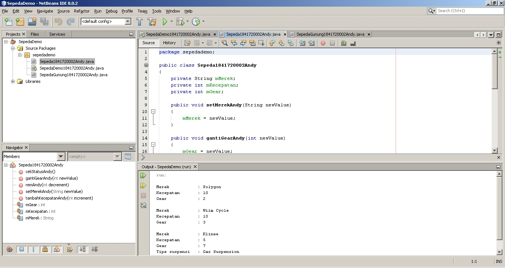
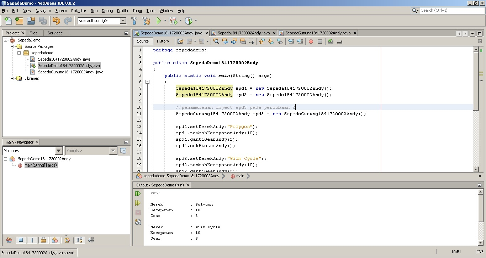
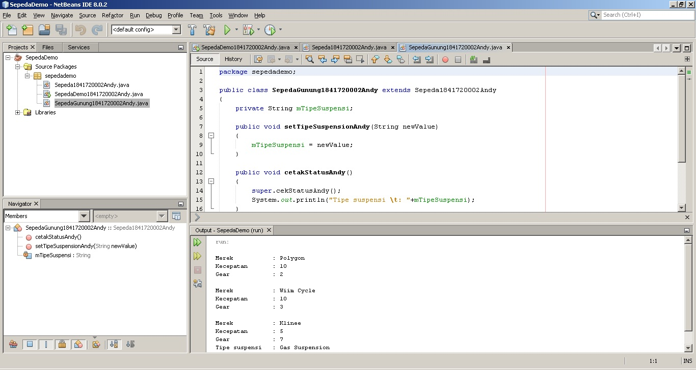
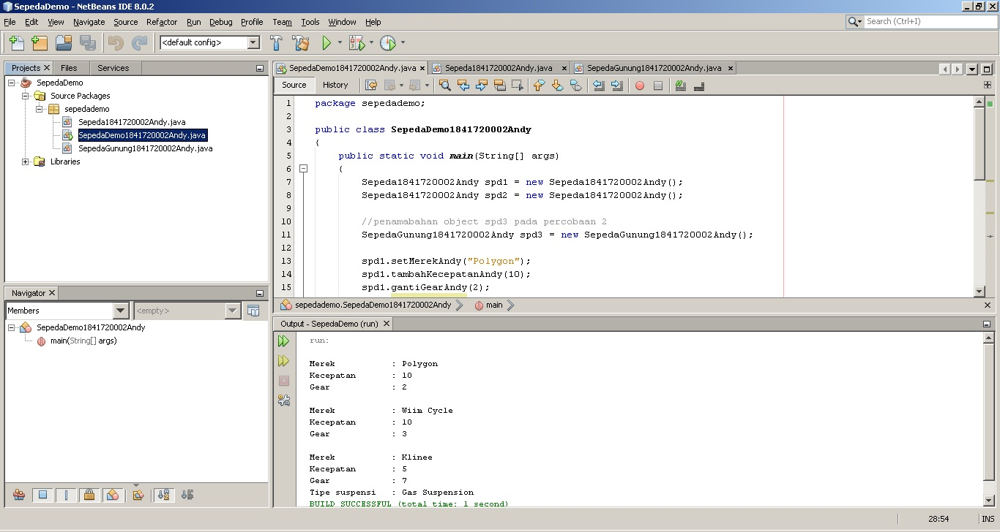
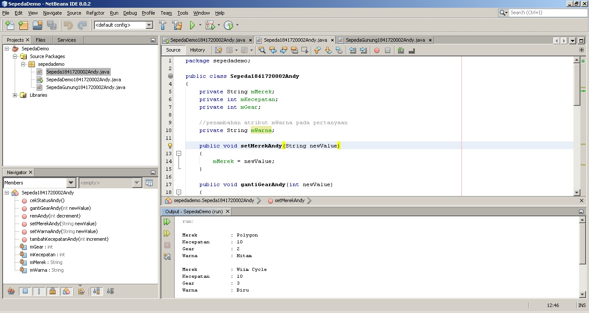
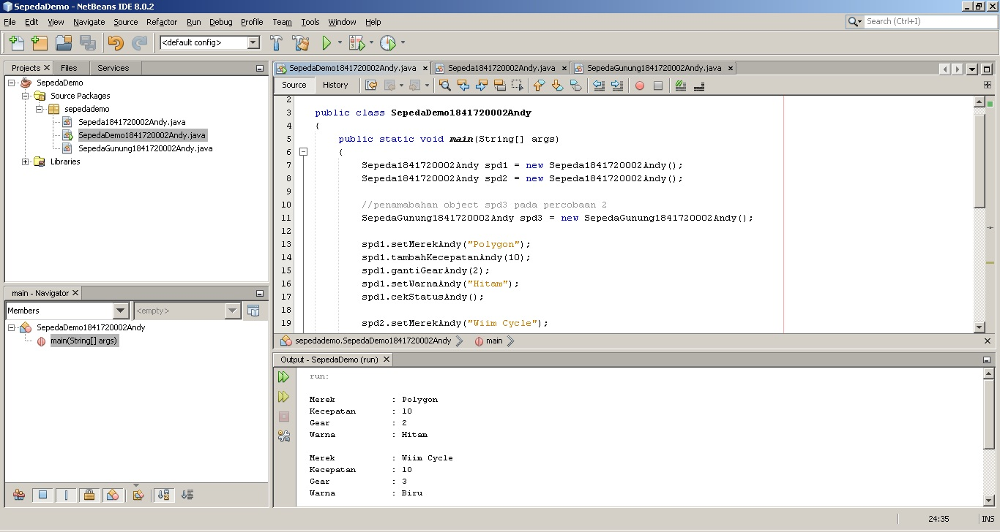
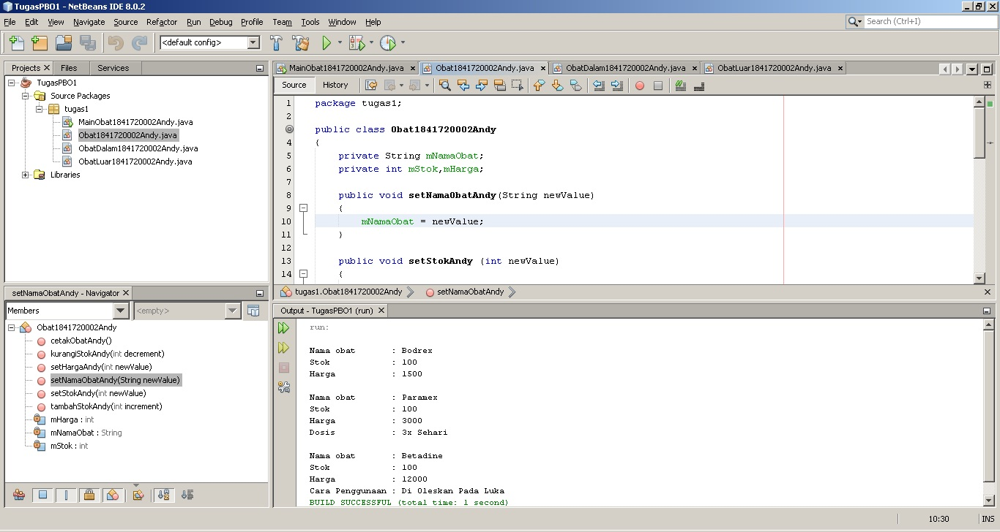
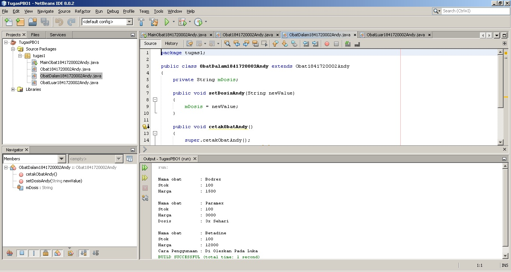
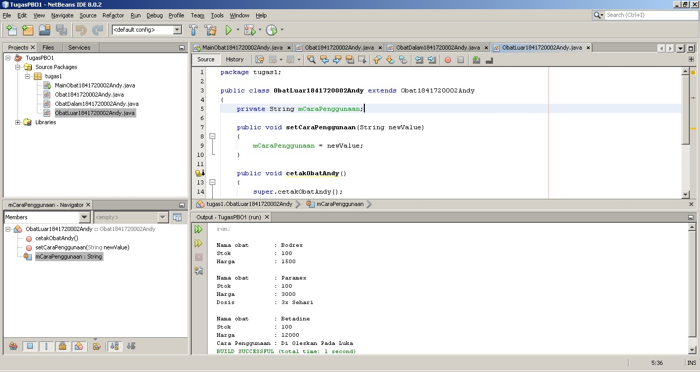
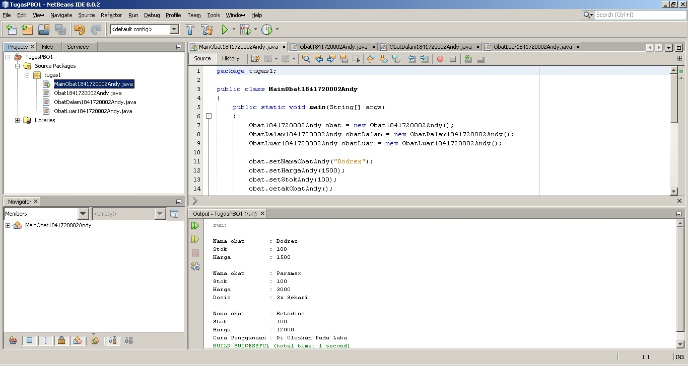

# Laporan Praktikum #1 - Pengantar Konsep PBO

## Kompetensi

Setelah menempuh materi percobaan ini, mahasiswa mampu mengenal:
1. Perbedaan paradigma berorientasi objek dengan paradigma struktural
2. Konsep dasar PBO

## Ringkasan Materi

Pemrograman Berorientasi Objek memiliki beberapa kelebihan dibanding Pemrograman terstruktur. Salah satunya adalah ketika kita mengubah kode program maka bisa dipastikan tidak akan mempengaruhi kode program lainya. Pemrograman Berorientasi Object di tandai dengan adanya sebuah objek yang membungkus state (atribut) dan method.

**Objek** sendiri adalah suatu rangkaian program yang memiliki **atribut** dan **method**. Contoh nyata dalam kehidupan sehari-hari adalah sebuah sepeda yang memiliki roda, warna, dll.Inilah yang disebut dengan **atribut, sesuatu yang dimiliki atau mencirikan suatu objek**. Sepeda tersebut juga memiliki method maju, mundur, berhenti, tambah kecepatan dll. Dan inilah yang disebut dengan **method, sesuatu yang bisa dilakukan oleh objek tersebut.**

Kemudian tentang class. Class adalah cetak biru atau rancangan dari sebuah objek.

 Terdapat **4 Konsep dasar** yang harus dipahami dalam perograman berorientasi objek, yakni :

**1. Encapsulation atau pembungkusan.**
   
   Encapsulation adalah pengumpulan atribut dan method menjadi suatu objek.

**2. Abstraction atau abstraksi.**
   
   Abstraction adalah penyederhanaan kode program agar kode program terserbut apabila dilihat tidak rumit dan mudah digunakan.

**3. Inheritance atau pewarisan.**
   
   Inheritance adalah pewarisan atribut dan method dari kelas induk kepada kelas anak, sehingga dengan menggunakan inheritance kita tidak perlu membuat sebuah object dari nol, cukup melakukan inheritance (extends) dari kelas induk menuju kelas anak yang saling terkait.

**4. Polymorphism atau banyak bentuk.**
   
   Polymorphism ini sendiri merupakan penerapan dari inheritance, setelah kita mengambil method-method yang berasa dari parent maka kita bisa merubah method-method tersebut sesuai dengan kebutuhan kita. Method-method yang bisa berubah-ubah inilah yang disebut dengan polymorphism.

## Percobaan

### Percobaan 1

Pada percobaan 1, percobaan yang dilakukan adalah membuat class, dan membuat objek kemudian mengakses method yang ada di dalam kelas tersebut.

Gambar dibawah ini adalah screenshot dari class yang dibuat pada percobaan 1, terdapat 2 class yaitu Sepeda1841720002Andy, SepedaDemo1841720002Andy.

Gambar diatas ada screenshot dari class Sepeda1841720002Andy. Class ini berisi object sepeda yang memiliki atribut mMerek, mKecepatan, dan mGear. Object ini juga memiliki beberapa method seperti gantiGearAndy, tambahKecepatanAndy, dll. [Klik disini untuk menuju ke kode program Sepeda1841720002Andy](../../src/1_Pengantar_Konsep_PBO/Sepeda1841720002Andy.java).

Gambar diatas ada screenshot dari class SepedaDemo1841720002Andy. Class ini berisi method main dan pemanggilan object Sepeda1841720002Andy . [Klik disini untuk menuju ke kode program SepedaDemo1841720002Andy](../../src/1_Pengantar_Konsep_PBO/SepedaDemo1841720002Andy.java).

### Percobaan 2

Pada percobaan 2, percobaan yang akan dilakukan adalah mencoba melakukan pewarisan (inheritance) dari class induk menuju class anak. Kelas induk yang akan digunakan adalah class Sepeda1841720002Andy dan kelas anaknya adalah SepedaGunung1841720002Andy. Dengan menggunakan pewarisan maka kita tidak perlu membuat class SepedaGunung1841720002Andy mulai dari nol. Class SepedaGunung1841720002Andy dapat mengambil atau menggunakan atribut dan method dari class Sepeda1841720002Andy.

Gambar dibawah ini adalah screenshot dari class SepedaGunung1841720002Andy dan class Sepeda1841720002Andy dengan penambahan sedikit kode program untuk memanggil object SepedaGunung1841720002Andy.

Gambar diatas ada screenshot dari class SepedaGunung1841720002Andy. Class ini merupakan class anak dari class Sepeda1841720002Andy. Pada pembuatan class ini, pembuatannya hanya menambahkan sedikit atribut dan method. Atribut yang berada pada class Sepeda1841720002Andy juga dapat digunakan di class SepedaGunung1841720002Andy. [Klik disini untuk menuju ke kode program SepedaGunung1841720002Andy](../../src/1_Pengantar_Konsep_PBO/SepedaGunung1841720002Andy.java).

Gambar diatas ada screenshot dari class SepedaDemo1841720002Andy dengan penambahan kode program untuk memanggil object SepedaGunung1841720002Andy. [Klik disini untuk menuju ke kode program SepedaGunung1841720002Andy](../../src/1_Pengantar_Konsep_PBO/SepedaDemo1841720002Andy.java).

## Pertanyaan

1. Sebutkan dan jelaskan aspek-aspek yang ada pada pemrograman berorientasi objek!
    **Jawab :**
     1. Object : Suatu rangkaian yang memiliki atribut dan method. Atribut adalah ciri2 atau sesuatu yang dimiliki oleh object tersebut. Method adalah perilaku atau sesuatu yang bisa dilakukan oleh object tersebut.
    2. Class : Blueprint atau prototype dari object.
    3. Inheritance : Pewarisan atribut dan method dari class induk kepada class anak.
    4. encapsulation : Pengumpulan atribut dan method menjadi sebuah object.
    5. polymorphism : Object tersebut memiliki sifat dapat berubah-ubah sesuai dengan kebutuhan.
    6. Abstraction : Penyembunyian atau penyederhaan kode program agar kode program tersebut dapat digunakan dengan mudah.
   
2. Apa yang dimaksud dengan object dan apa bedanya dengan class?
    **Jawab :**
    Object merupakan suatu rangkaian yang memiliki atribut dan method. Perbedaan antara class dan object adalah class merupakan prototype dari object, dan object pasti berada didalam class.
   
3. Sebutkan salah satu kelebihan utama dari pemrograman berorientasi objek dibandingkan
dengan pemrograman struktural!
    **Jawab :**
    Kelebihan PBO dibanding pemrograman struktural adalah, apabila terdapat perubahan pada program bisa dipastikan tidak akan menyebabkan perubahan pada kode program yang sudah ada.
   
4. Pada class Sepeda, terdapat state/atribut apa saja?
    **Jawab :**
    pada class Sepeda1841720002Andy terdapat atribut mMerek, mKecepatan dan mGear.
   
5. Tambahkan atribut warna pada class Sepeda.
    **Jawab :**
    Gambar dibawah ini adalah screenshot class Sepeda1841720002Andy setelah ditambahkan atribut warna.
   
   
   
   [klik disini untuk menuju ke kode program Sepeda1841720002Andy](../../src/1_Pengantar_Konsep_PBO/Sepeda1841720002Andy.java)
   
   Gambar dibawah ini adalah screenshot class SepedaDemo1841720002Andy setelah ditambahkan atribut warna pada class Sepeda1841720002Andy.
   
   
   
   [klik disini untuk menuju ke kode program SepedaDemo1841720002Andy](../../src/1_Pengantar_Konsep_PBO/SepedaDemo1841720002Andy.java)
   
6. Mengapa pada saat kita membuat class SepedaGunung, kita tidak perlu membuat class nya dari
nol?
    **Jawab :**
    Karena class SepedaGunung1841720002Andy mengunakan extends(inheritance) dari class Sepeda1841720002Andy  yakni mengambil atribut dan method yang sudah ada dari class Sepeda1841720002Andy.

## Tugas
Pada bagian tugas ini terdapat 4 class yakni MainObat1841720002Andy, Obat1841720002Andy, ObatDalam1841720002Andy, ObatLuar1841720002Andy. Konsepnya hampir sama dengan percobaan 1 dan 2 yakni percobaan menggunakan inheritance.

Gambar dibawah ini adalah screenshot dari class Obat1841720002Andy.

Dari gambar diatas bisa kita lihat terdapat beberapa atribut seperti mNamaObat, mStok, dan mHarga. Kemudian juga terdapat beberapa method seperti setNamaObatAndy, setStokAndy, dll.
[klik disini untuk menuju ke kode program Obat1841720002Andy](../../src/1_Pengantar_Konsep_PBO/Obat1841720002Andy.java)

Gambar dibawah ini adalah screenshot dari class ObatDalam1841720002Andy.

Dari gambar diatas bisa kita lihat class ObatDalam1841720002Andy mengextends class Obat1841720002Andy. Class ini menggunakan atribut dan method-method yang terdapat pada class Obat1841720002Andy.
[klik disini untuk menuju ke kode program ObatDalam1841720002Andy](../../src/1_Pengantar_Konsep_PBO/ObatDalam1841720002Andy.java).

Gambar dibawah ini adalah screenshot dari class ObatLuar1841720002Andy.

Class ini juga sama seperti class ObatDalam1841720002Andy. class ini mengextends class Obat1841720002Andy. 
[klik disini untuk menuju ke kode program ObatLuar1841720002Andy](../../src/1_Pengantar_Konsep_PBO/ObatLuar1841720002Andy.java).

Gambar dibawah ini adalah screenshot dari class MainObat1841720002Andy.

Pada class ini terdapat method main, dan pemanggilan object Obat1841720002Andy, ObatDalam1841720002Andy, dan ObatLuar1841720002Andy.
[klik disini untuk menuju ke kode program MainObat1841720002Andy](../../src/1_Pengantar_Konsep_PBO/MainObat1841720002Andy.java).

## Kesimpulan

Kesimpulan yang bisa kita dapatkan di praktikum kali ini adalah tentang dasar PBO. PBO memiliki ciri-ciri yaitu dalam kode programnya terdapat sebuah object yang setiap object bisa memiliki atribut dan method. PBO memiliki 4 Konsep dasar yaitu Encapsulation, Inheritance, Polymorphism, Abstraction. 4 konsep dasar ini dapat mempermudah kita dalam pembuatan aplikasi yang menerapkan PBO. Dengan menggunakan PBO bisa dipastikan perubahan-perubahan kode program yang baru saja kita lakukan tidak akan mengganggu kode program yang sudah ada.

## Pernyataan Diri

Saya menyatakan isi tugas, kode program, dan laporan praktikum ini dibuat oleh saya sendiri. Saya tidak melakukan plagiasi, kecurangan, menyalin/menggandakan milik orang lain.

Jika saya melakukan plagiasi, kecurangan, atau melanggar hak kekayaan intelektual, saya siap untuk mendapat sanksi atau hukuman sesuai peraturan perundang-undangan yang berlaku.

Ttd,

***(Oktaviano Andy Suryadi)***
