# Laporan Praktikum #2 - Class dan Object

## Kompetensi

- Mahasiswa dapat memahami deskripsi dari class dan object
- Mahasiswa memahami implementasi dari class
- Mahasiswa dapat memahami implementasi dari attribute
- Mahasiswa dapat memahami implementasi dari method
- Mahasiswa dapat memahami implementasi dari proses instansiasi
- Mahasiswa dapat memahami implementasi dari try-catch
- Mahasiswa dapat memahami proses pemodelan class diagram menggunakan UML

## Ringkasan Materi

Pada Praktikum kali ini kita belajar tentang **Class dan Object**. Class dan Object sendiri saling terkait. **Object** merupakan suatu bentuk yang memiliki atribut dan method, sedangkan **Class** sendiri merupakan merupakan rancangan dari object tersebut. Object sendiri disimpan dalam file class yang berektensi **.class**.

Setelah kita belajar tentang Class dan Object, kita juga belajar tentang beberapa **tata cara penulisan kode program**, seperti penulisan nama **class yang berupa kata benda dan harus diawali dengan huruf besar**, penulisan **nama atribut yang berupa kata benda dan harus diawali dengan huruf kecil**, dan **penulisan method yang berupa kata kerja dan diawali dengan huruf kecil**.

Kemudian pada praktikum ini juga dibahas secara jelas apa itu method pada suatu object. Terdapat dua jenis method yang bisa kita gunakan, yaitu **method dengan tipe data void** dan **method dengan tipe data bukan void** contohnya **method dengan tipe data int**. Yang membedakan dari kedua method ini adalah apabila **method dengan tipe data void tidak memerlukan nilai kembalian (return)**, jika **method dengan tipe data bukan void memerlukan nilai kembalian (return)**

Setelah belajar tentang method, selanjutnya adalah belajar tentang **instansiasi object**. **Instansiasi object ini digunakan ketika kita akan memanggil object dari class lain ke class yang ingin kita inginkan**.

Kemudian kita juga belajar tentang penggunaan **Try - Catch**. **Try - Catch digunakan untuk menangani error ketika program terjadi**, biasanya digunakan untuk **menangani error yang tidak terduga atau tidak bisa ditangani oleh programmer**. **Kelebihan menggunakan Try - Catch** adalah ketika **program eror maka program tidak langung berhenti**.

Selanjutnya adalah kita belajar tentang **UML(Unified Modelling Language)**. Apa itu UML? UML adalah cara untuk memodelkan atau cara standar yang digunakan untuk menvisualisasikan atau menggambarkan suatu sistem. Sebenarnya ada banyak jenis UML namun pada praktikum ini kita belajar tentang **Diagram Class (Class Diagram)**

**Class diagram** sendiri adalah **class yang menggambarkan struktur atau penjelasan class, paket, dan object serta hubungan satu sama lain seperti pewarisan, asosiasi, dan lain-lain**. Class juga memiliki **3 area pokok (utama)** yaitu : **nama, atribut, dan operasi**. **Nama berfungsi untuk member identitas pada sebuah kelas**, **atribut fungsinya adalah untuk member karakteristik pada data yang dimiliki suatu objek di dalam kelas**, sedangkan **operasi fungsinya adalah memberikan sebuah fungsi / method ke sebuah objek**. Untuk contoh dari UML terdapat pada percobaan 1.

## Percobaan

### Percobaan 1

Pada praktikum 1 ini, kita akan belajar tentang cara membuat UML sesuai dengan studi kasus yang sudah ada pada percobaan 1.

Studi Kasus 1:
 Dalam suatu perusahaan salah satu data yang diolah adalah data karyawan. Setiap karyawan memiliki id, nama, jenis kelamin, jabatan, dan gaji. Setiap karyawan juga bisa menampilkan data diri pribadi dan melihat gajinya.

Dari studi kasus di atas, selanjutnya adalah menjawab pertanyaan - pertanyaan di bawah ini.

1. Gambarkan desain class diagram dari studi kasus 1!,
    **Jawab:**
    Gambar di bawah ini adalah class diagram dari studi kasus 1.
   
   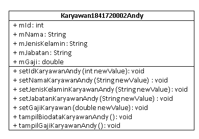

2. Sebutkan Class apa saja yang bisa dibuat dari studi kasus 1!,
    **Jawab:**
    Pada class diagram studi kasus 1, terdapat satu class yang bisa dibuat menurut saya. Kedua kelas tersebut adalah class **Karyawan1841720002Andy** yang digunakan untuk menyimpan data karyawan dan mengolah data karyawan.

3. Sebutkan atribut beserta tipe datanya yang dapat diidentifikasi dari masing-masing class dari studi kasus 1!
    **Jawab:**
    Pada class **Karyawan1841720002Andy** terdapat atribut sebagai berikut : 
   1. **mId** bertipe data **int**.
   2. **mNama** bertipe data **String**.
   3. **mJenisKelamin** bertipe data **String**.
   4. **mJabatan** bertipe data **String**.
   5. **mGaji** bertipe data **double**.
   
4. Sebutkan method-method yang sudah anda buat dari masing-masing class pada studi kasus 1!
    **Jawab:**
    Pada class **Karyawan1841720002Andy** terdapat method - method sebagai berikut : 
   1. **setIdKaryawanAndy(int newValue)** bertipe data **void**. Method ini digunakan untuk mengisi nilai mId.
   2. **setNamaKaryawanAndy(String newValue)** bertipe data **void**. Method ini digunakan untuk mengisi nilai mNama.
   3. **setJenisKelaminKaryawanAndy(String newValue)** bertipe data **void**. Method ini digunakan untuk mengisi nilai mJenisKelamin.
   4. **setJabatanKaryawanAndy(String newValue)** bertipe data **void**. Method ini digunakan untuk mengisi nilai mJabatan.
   5. **setGajiAndy(int newValue)** bertipe data **void**. Method ini digunakan untuk mengisi nilai mGaji.
   6. **tampilBiodataKaryawanAndy()** bertipe data **void**. Method ini digunakan untuk menampilkan biodata pribadi karyawan.
   7. **tampilGajiKarywanAndy()** bertipe data **void**. Method ini digunakan untuk menampilkan gaji karyawan.
   
### Percobaan 2

Pada percobaan 2, percobaan yang akan dilakukan adalah membuat program beradasarkan class diagram. Gambar dibawah ini adalah class diagram yang kode programnya akan dibuat.

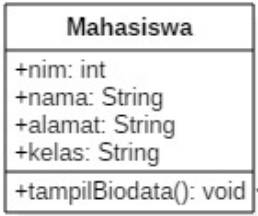

Gambar di bawah ini ada screenshot kode program class Mahasiswa1841720002Andy berdasarkan class diagram pada percobaan 2. Atribut dan method pada kode program ini sesuai dengan class diagram pada percobaan 2.

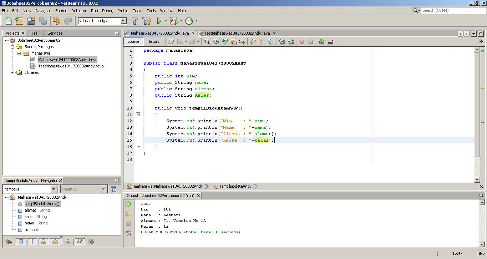

[Klik link ini untuk melihat kode program class Mahasiswa1841720002Andy.](../../src/2_Class_dan_Object/Mahasiswa1841720002Andy.java)

Gambar di bawah ini ada screenshot kode program class TestMahasiswa1841720002Andy. Class ini digunakan untuk memanggil object class Mahasiswa1841720002Andy. Pada class ini terdapat method main. Di dalam method main terdapat instansiasi object Mahasiswa1841720002Andy, pengisian atribut dari object Mahasiswa1841720002Andy, dan penggunaan dari method Mahasiswa1841720002Andy.

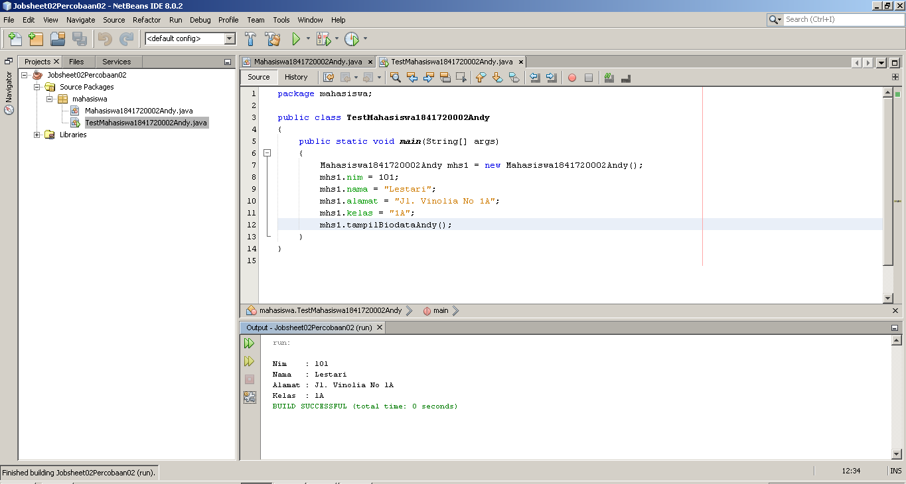

[Klik link ini untuk melihat kode program class TestMahasiswa1841720002Andy.](../../src/2_Class_dan_Object/TestMahasiswa1841720002Andy.java)

**Atribut pada program diatas dideklarasikan pada class Mahasiswa1841720002**, kemudian atribut-atribut tadi diisi melalui class TestMahasiswa1841720002Andy. Sebelum pengisian nilai perlu dilakukan instansiasi object pada class TestMahasiswa1841720002Andy.

Pendeklarasian method juga sama, **method dideklarasikan pada class Mahasiswa1841720002Andy**. Kemudian method tersebut diakses melalui class TestMahasiswa1841720002Andy.

Pada kode program atas awalnya hanya terdapat **satu instansiasi object**, namun pada tahap ke 12 percobaan ini instansiasi object menjadi tiga karena mendapat tambahan dua instansiasi object.

Pada kode program diatas terdapat sintaks **"mhs1.nim = 101"**, **maksud dari sintaks kode program tersebut adalah pengisian **atribut nim pada object mhs1 yang bernilai 101**.**

Pada kode program diatas juga terdapat sintaks **"mhs1.tampilBiodataAndy"**, **maksud dari sintaks kode program tersebut adalah pengaksesan method yang berada pada object mhs1 yang bernama tampilBiodataAndy.** Isi dari method tersebut adalah menampilkan biodata mahasiswa.

Gambar dibawah ini adalah screenshot dari **class TestMahasiswa1841720002Andy dengan penambahan dua object.**

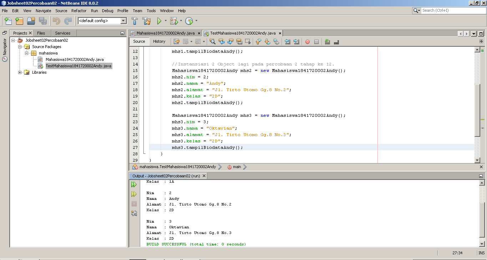

[Klik link ini untuk melihat kode program class TestMahasiswa1841720002Andy.](../../src/2_Class_dan_Object/TestMahasiswa1841720002Andy.java)

### Percobaan 3

Pada percobaan 3, percobaan yang akan dilakukan adalah membuat method yang berargumen (berparameter) dan memiliki return. Method yang beragumen (berparameter) biasanya digunakan untuk method-method yang membutuhkan nilai untuk melakukan proses-proses yang sudah ditentukan di dalamnya.

Pada percobaan ini juga terdapat method yang memiliki return. Biasanya method yang memiliki return adalah method yang menggunakan tipe data selain void. Contoh dari method yang bertipe data selain void terdapat pada Screenshot di bawah ini.

Gambar dibawah ini adalah screenshot kode program dari class Barang1841720002Andy.

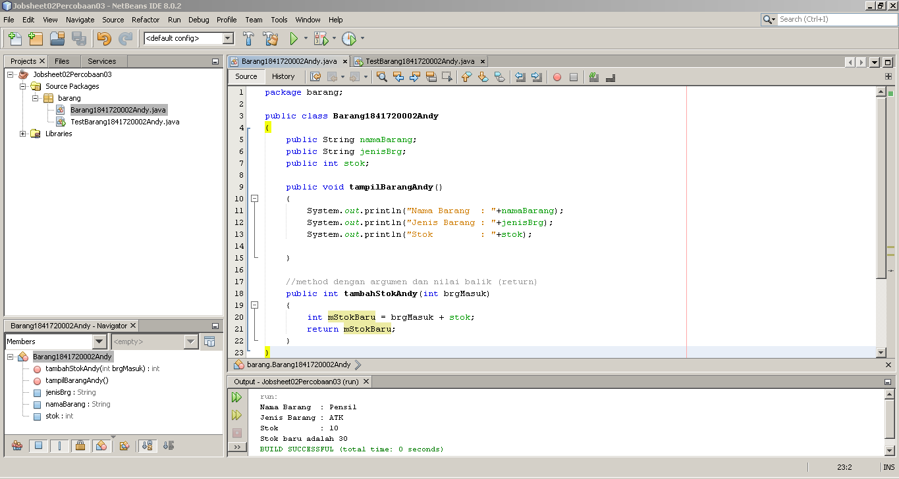

Pada class tersebut terdapat dua kelas yakni class tampilBarangAndy yang bertipe void, dan class tambahStokAndy yang memiliki parameter int brgMasuk dan juga memiliki return mStokbaru. method tambahStokAndy inilah yang merupakan contoh dari class berparameter dan memiliki return.
[Klik link ini untuk melihat kode program class Barang1841720002Andy.](../../src/2_Class_dan_Object/Barang1841720002Andy.java)

Gambar di bawah ini adalah screenshot kode program dari class TestBarang1841720002Andy.

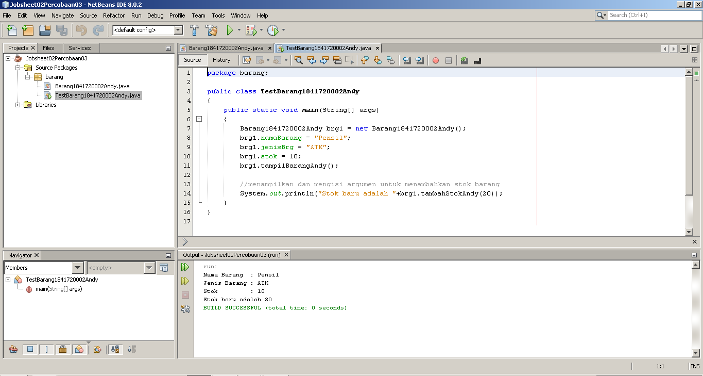

Pada gambar tersebut terlihat pemanggilan method tambahStokAndy yang berada dalam System.out.print("..."). Hal ini dikarenakan method tambahStokAndy tidak memiliki output beruba teks, hanya berupa nilai dari proses method tersebut, sehingga pemanggilannya harus di dalam System.out.print("..."). Apabila hanya dipanggil saja maka hasil dari method tersebut tidak akan ditampilkan. [Klik link ini untuk melihat kode program class TestBarang1841720002Andy.](../../src/2_Class_dan_Object/TestBarang1841720002Andy.java)

**Fungsi dari argumen atau parameter pada suatu method biasanya digunakan sebagai nilai yang akan di proses dalam method tersebut apabila method tersebut membutuhkan nilai selai dari atribut-atribut yang sudah ada.** Biasanya juga digunakan pada method yang membutuhkan nilai inputan untuk memproses perintah di dalamnya.

**Fungsi dari return** pada suatu **method adalah sebagai nilai pengembalian atau sebagai nilai hasil dari proses di dalam method tersebut**. Kata kunci return **digunakan pada method yang memiliki tipe data bukan void.**

## Tugas
1. Suatu toko persewaan video game salah satu yang diolah adalah peminjaman, dimana data yang dicatat ketika ada orang yang melakukan peminjaman adalah id, nama member, nama game, dan harga yang harus dibayar. Setiap peminjaman bisa menampilkan data hasil peminjaman dan harga yang harus dibayar. Buatlah class diagram pada studi kasus diatas!

    **Penjelasan:**
   - Harga yang harus dibayar diperoleh dari lama sewa x harga.
   - Diasumsikan 1x transaksi peminjaman game yang dipinjam hanya 1 game saja. 

    **Jawab :** 
    Gambar di bawah ini adalah UML dari studi kasus pada tugas nomor 1.

    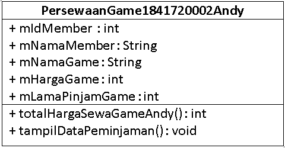

2. Buatlah program dari class diagram yang sudah anda buat di no 1! 
   **Jawab :** 
   Gambar di bawah ini adalah kode program dari class PersewaanGame1841720002Andy
   
   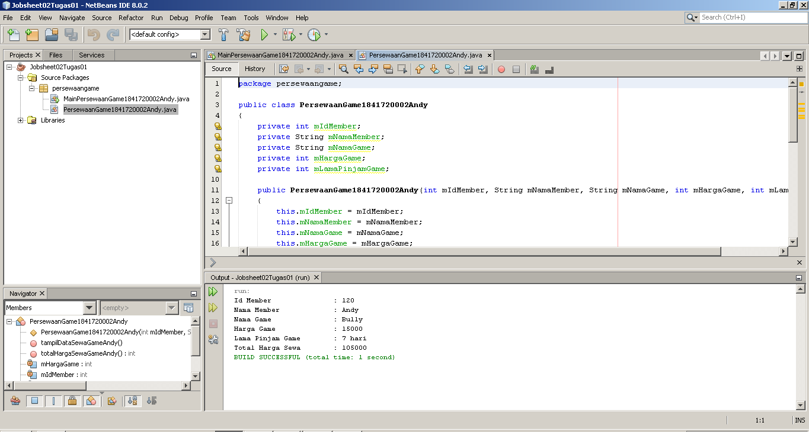

   Pada class ini saya menggunakan constructor yang berparameter, sehingga nanti pada class MainPersewaanGame1841720002Andy input datanya menjadi lebih mudah. [Klik link ini untuk menuju ke kode program class PersewaanGame1841720002Andy](../../src/2_Class_dan_Object/PersewaanGame1841720002Andy.java)

   Gambar di bawah ini adalah kode program dari class MainPersewaanGame1841720002Andy
   
   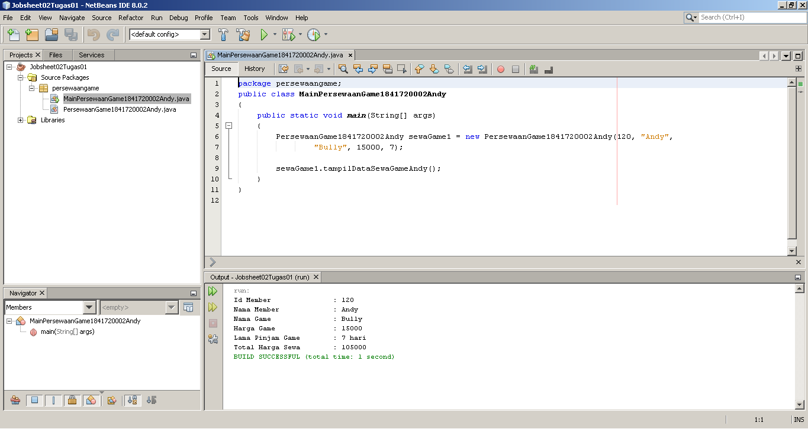

   Pada gambar tersebut dapat dilihat input data terjadi saat instansiasi object. Hal ini merupakan efek dari constuctor yang memiliki parameter [Klik link ini untuk menuju ke kode program class MainPersewaanGame1841720002Andy](../../src/2_Class_dan_Object/MainPersewaanGame1841720002Andy.java)

3. Buatlah program sesuai dengan class diagram berikut ini:
   
   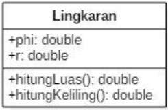

   **Jawab :** 
   Gambar di bawah ini adalah screenshot dari kode program class Lingkaran1841720002Andy.

   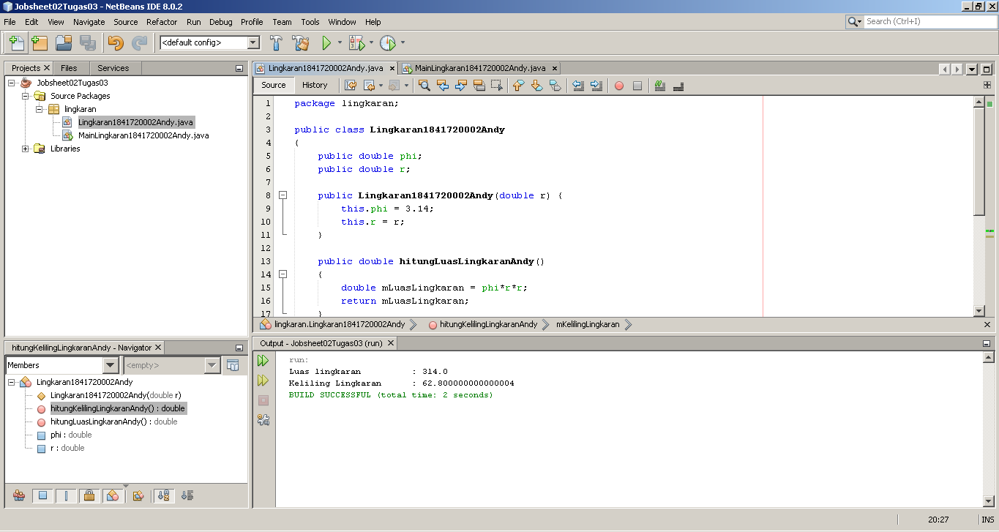

   Class tersebut menggunakan constructor dengan parameter. Atribut dan method pada class tersebut sesuai dengan class diagram pada soal ini. [Klik link ini untuk menuju ke kode program class Lingkaran1841720002Andy](../../src/2_Class_dan_Object/Lingkaran1841720002Andy.java)

   Gambar di bawah ini adalah screenshot dari kode program class MainLingkaran1841720002Andy.
   
   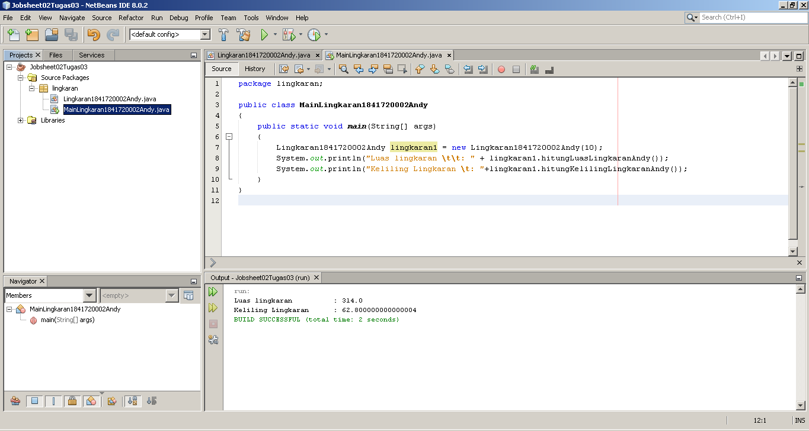

   Pada class ini terdapat instansiasi object dari class Lingkaran1841720002Andy dan pemanggilan method dari class Lingkaran1841720002Andy di dalam method main class ini. [Klik link ini untuk menuju ke kode program class MainLingkaran1841720002Andy](../../src/2_Class_dan_Object/MainLingkaran1841720002Andy.java).

4. Buatlah program sesuai dengan class diagram berikut ini:
   
   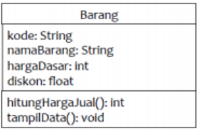

   **Deskripsi / Penjelasan :**
   - Nilai atribut hargaDasar dalam Rupiah dan atribut diskon dalam %
   - Method hitungHargaJual() digunakan untuk menghitung harga jual dengan perhitungan berikut ini:  **harga jual = harga dasar – (diskon x harga dasar)**.
   - Method tampilData() digunakan untuk menampilkan nilai dari kode, namaBarang, hargaDasar, diskon dan harga jual.  
   
   **Jawab :** 
   Gambar di bawah ini adalah screenshot dari kode program class Tugas4Barang1841720002Andy.

   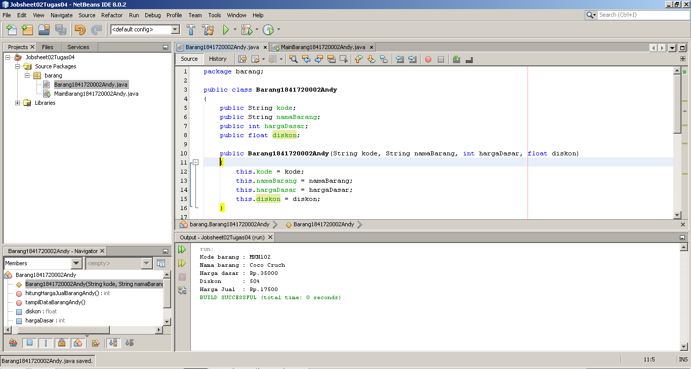

   Sama dengan tugas nomor sebelumnya, class ini menggunakan constructor berparameter. Atribut dan method juga menyesuaikan dengan apa yang sudah ada pada class diagram dan ketentuan yang sudah ditentukan. [Klik link ini untuk menuju ke kode program class Tugas4Barang1841720002Andy](../../src/2_Class_dan_Object/Tugas4Barang1841720002Andy.java).

   Gambar di bawah ini adalah screenshot dari kode program class MainTugas4Barang1841720002Andy.

   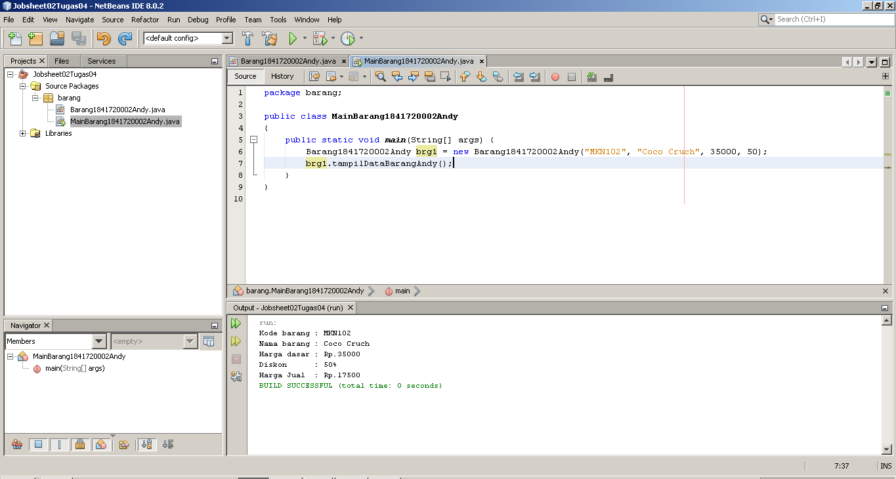

   Pada class ini juga hampir sama dengan tugas nomor sebelumnya yakni instansiasi object dari class Tugas4Barang1841720002Andy menuju class ini dan pemanggilan method yang dari class Tugas4Barang1841720002Andy menuju class ini juga. [Klik link ini untuk menuju ke kode program class Tugas4Barang1841720002Andy](../../src/2_Class_dan_Object/MainTugas4Barang1841720002Andy.java).

## Kesimpulan

Kesimpulan yang dapat kita peroleh dari praktikum kali ini adalah tentang pengguanaan berbagai macam hal yang ada di pemrogramaan PBO. Contohnya penggunaan object, atribut, method berparameter, method bertipe data void dan bukan void, try-catch, penggunaan return pada method, UML, dll.

Pada praktikum kali ini kita juga belajar tentang tata cara penulisan kode program, misalnya penulisan class yang menggunakan awalan huruf besar, penulisan atribut yang menggunakan awalan huruf kecil, penulisan method yang menggunakan awalan huruf kecil, dll.

Selelah paham dengan materi pada praktikum ini, diharapkan nantinya akan semakin mudah dan semakin lancar ketika mengerjakan kode program PBO lainya dan materi-materi selanjutnya.

## Pernyataan Diri

Saya menyatakan isi tugas, kode program, dan laporan praktikum ini dibuat oleh saya sendiri. Saya tidak melakukan plagiasi, kecurangan, menyalin/menggandakan milik orang lain.

Jika saya melakukan plagiasi, kecurangan, atau melanggar hak kekayaan intelektual, saya siap untuk mendapat sanksi atau hukuman sesuai peraturan perundang-undangan yang berlaku.

Ttd,

***(Oktaviano Andy Suryadi)***
