# Laporan Praktikum #3 - Enkapsulasi Pada Pemrograman Berorientasi Objek

## Kompetensi

Setelah melakukan percobaan pada modul ini, mahasiswa memahami konsep:
1. Konstruktor
2. Akses Modifier
3. Atribut/method pada class
4. Intansiasi atribut/method
5. Setter dan getter
6. Memahami notasi pada UML Class Diagram

## Ringkasan Materi

Pada praktikum kali ini kita belajar tentang beberapa hal yang berhubungan dengan encapsulasi. Beberapa hal tersebut yaitu :

**1. Encapsulation**
 **Encapsulation** atau **enkapsulasi** dapat diartikan sebagai penyebunyian informasi. Layaknya sebuah kapsul yang di dalamnya terdapat racikan-racikan obat yang sudah dijadikan satu, sehingga kita saat akan meminum kapsul tersebut hanya perlu meminum satu saja tidak satu persatu racikan tersebut kita minum secara bergantian. Pada enkapsulasi ini juga terjadi pengumpulan atau pengelompokan atribut dan method menjadi sebuah object.

**2. Konstruktor**
 **Konstuktor** sendiri adalah sebuah method yang diakses pertama kali saat instansiasi object. Konstruktor dapat diberi parameter ataupun tidak. Penggunaan dari konsturktor ini bersifat opsional, tergantung kebutuhan.

**3. Akses Modifier**
  Akses Modifier ini dibagi menjadi 4 jenis yakni : private, default, protected, dan public. Pembagian aksesnya adalah sebagai berikut :  
1. **Private** : Atribut dan method tersebut **hanya bisa diakses oleh class itu sendiri.**
2. **Default** : Atribut dan method tersebut hanya bisa **diakses oleh class itu** dan **class yang terdapat dalam satu package.**
3. **Protected** : Atribut dan method tersebut hanya bisa **diakses oleh class itu**, **class yang terdapat dalam satu package**, dan **class yang terdapat di luar package namun merupakan child dari class tersebut**.
4. **Public** : Atribut dan method dapat diakses oleh **class mana saja.**

**4. Getter dan Setter**
  Getter dan Setter adalah method-method yang diperlukan ketika atribut dalam class tersebut memiliki akses modifier private. Method Getter digunakan untuk mengambil nilai dari suatu atribut. Method getter menggunakan return yang berarti method tersebut adalah method bukan tipe void. Kemudian Setter adalah method yang digunakan untuk memanipulasi nilai suatu atribut.

**5. Notasi UML Class Diagram**
  Notasi akses modifier pada UML class diagram adalah sebagai berikut:
1. Tanda plus (+) untuk public
2. Tanda pagar (#) untuk protected
3. Tanda minus (-) untuk private
4. Untuk default, maka tidak diberi notasi

## Percobaan

### Percobaan 1 - Enkapsulasi

Pada percobaan 1 ini, kita belajar tentang konsep Enkapsulasi. Terdapat dua kelas yang akan kita gunakan yakni class Motor1841720002Andy yang berisi atribut dan method. Dan class MotorDemo1841720002Andy sebagai class yang memanggil object dari class Motor1841720002Andy.

Gambar di bawah ini adalah screenshot dari class Motor1841720002Andy.

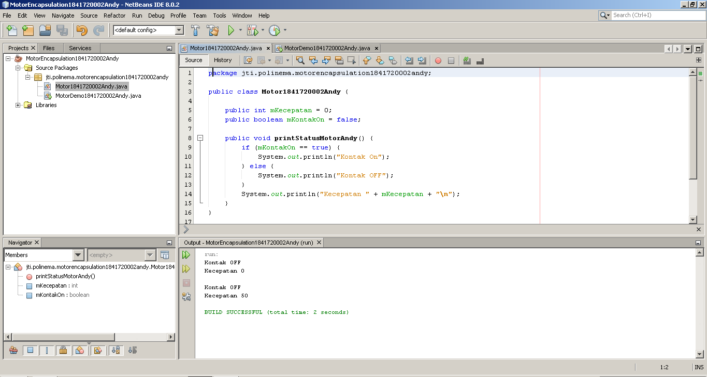

Pada class di atas terdapat dua atribut dengan akses modifier public dan juga sebuah method dengan akses modifier public. Atribut dan method ini nantinya akan diisi dan dipanggil di class MotorDemo1841720002Andy. [klik link berikut ini untuk menuju class Motor1841720002Andy.](../../src/3_Enkapsulasi/Motor1841720002Andy.java)

Gambar di bawah ini adalah screenshot dari class DemoMotor1841720002Andy.

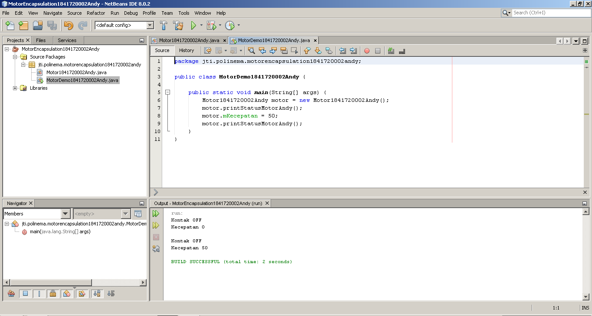

Pada class ini terjadi instansiasi object, pengisian atribut dan pemanggilan method dari class Motor1841720002Andy. [Klik link berikut ini untuk menuju class MotorDemo1841720002Andy.](../../src/3_Enkapsulasi/MotorDemo1841720002Andy.java)

Pada percobaan kali ini, terdapat berbagai macam kejanggalan seperti yang sudah dijelaskan dalam lembar jobsheet. Penyempurnaannya terdapat pada percobaan selanjutnya yakni percobaan 2.

### Percobaan 2 - Access Modifier

Pada percobaan 2 ini akan digunakan akses modifier bertipe private pada atribut-atributnya dan menambahkan beberapa method sesuai dengan perintah pada percobaan 2. Percobaan ini merupakan penyempurnaan dari percobaan 1.

Gambar di bawah ini adalah screenshot dari class Motor1841720002Andy yang sudah dimodifikasi.

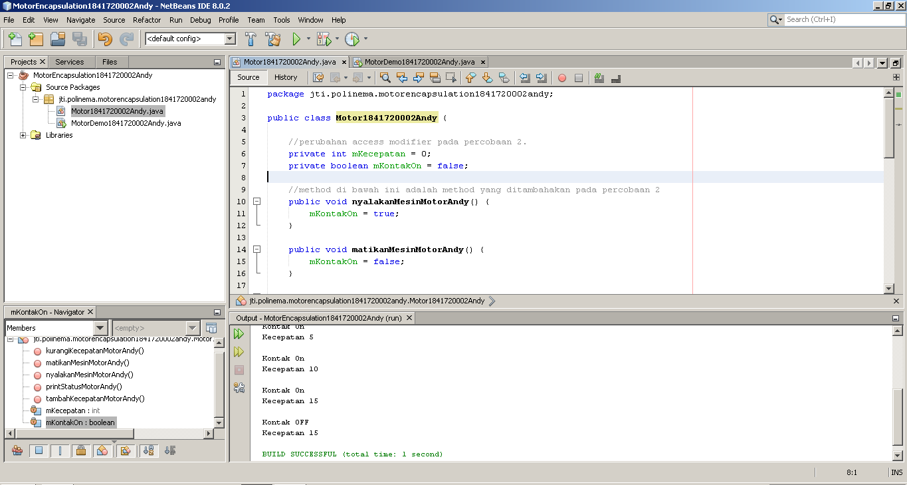

Pada gambar di atas dapat dilihat terdapat perubahan akses modifier dan penambahan beberapa method. [Klik link berikut ini untuk menuju class Motor1841720002Andy.](../../src/3_Enkapsulasi/Motor1841720002Andy.java)

Gambar di bawah ini adalah screenshot dari class DemoMotor1841720002Andy.

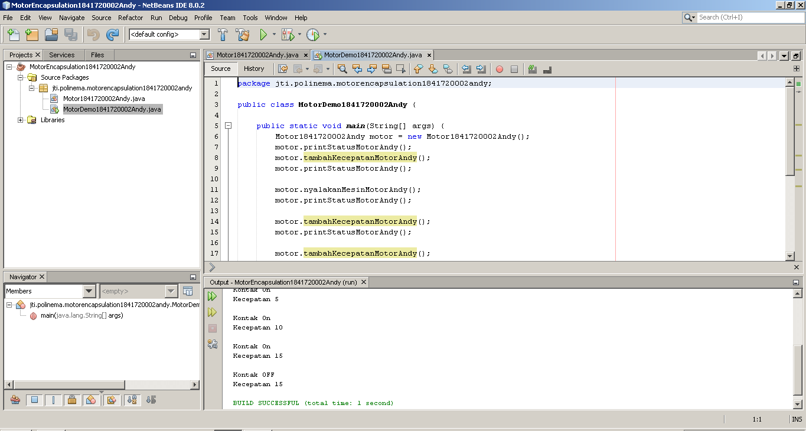

Pada percobaan 2 ini, yang dilakukan pada class ini hampir sama dengan percobaan 1. Hanya saja pada percobaan kali ini pengaksesan atribut dari class Motor1841720002Andy tidak diakses secara langsung, melainkan mengunakan method untuk mengakses atribut tersebut. [Klik link berikut ini untuk menuju class MotorDemo1841720002Andy.](../../src/3_Enkapsulasi/MotorDemo1841720002Andy.java)

**Pertanyaan**  
1. Pada class TestMobil, saat kita menambah kecepatan untuk pertama kalinya, mengapa
muncul peringatan “Kecepatan tidak bisa bertambah karena Mesin Off!”? 
**Jawab :** 
Karena pada method tambahKecepatanMotorAndy terdapat kondisi apabila nilai dari atribut mKotantakOn == true maka bisa menambahkan kecepatan, apabila kondisi mKontakOn == false maka akan muncul peringatan seperti pada soal tersebut.

2. Mengapat atribut kecepatan dan kontakOn diset private? 
**Jawab :** 
Karena atribut tersebut tidak perlu dipanggil atau ditampilkan secara langsung dengan cara memanggil atribut tersebut.

1. Ubah class Motor sehingga kecepatan maksimalnya adalah 100! 
**Jawab :** 
Gambar di bawah ini adalah screenshot dari class Motor1841720002Andy yang sudah di modifikasi.

    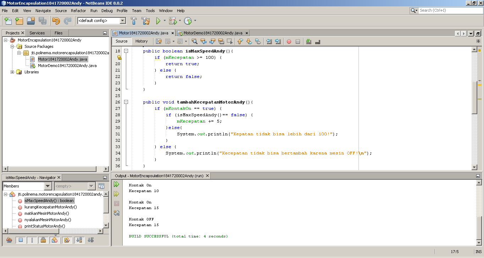

    Pada gambar di atas terdapat method isMaxSpeedAndy() digunakan untuk mengecek apakah kecepatan motor lebih dari sama dengan 100 atau tidak. Method tersebut bertipe boolean, sehingga method tersebut mereturn nilai true atau false.

    Kemudian pada method tambahKecepatanMotorAndy() terdapat penambahan kondisi yaitu apabila nilai dari method isMaxSpeedAndy() adalah false maka kecepatan dapat ditambah, dan apabila nilai dari method isMaxSpeedAndy() adalah true maka akan muncul peringatan **Kecepatan tidak bisa lebih dari 100!**.

### Percobaan 3 - Getter dan Setter

Pada percobaan 3 ini, percobaan yang dilakukan adalah membuat aplikasi koperasi sederhana dimana terdapat dua class yang bernama AnggotaKoperasi1841720002Andy yang berisi atribut anggota dan method-method untuk memanipulasi atribut-atribut dari class tersebut. Method dan atribut class AnggotaKoperasi1841720002Andy menyesuaikan dengan diagram class pada percobaan 3. Kemudian class yang kedua yakni KoperasiDemo1841720002Andy yang berisi instansiasi object dari class AnggotaKoperasi1841720002Andy. Pada percobaan ini, kita juga belajar tentang pengunaan getter dan setter.

Gambar di bawah ini adalah screenshot dari class AnggotaKoperasi1841720002Andy.

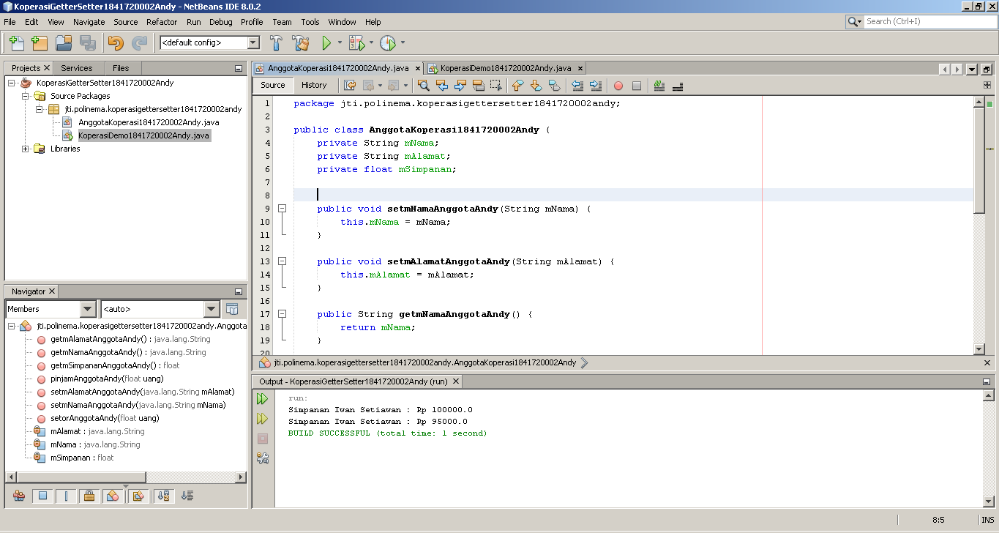

Pada screenshot diatas dapat kita lihat class tersebut memiliki atribut dengan akses modifier private, sehingga pada class itu juga terdapat getter dan setter untuk memanggil dan memanipulasi nilai dari atribut class tersebut. [Klik link berikut ini untuk menuju class AnggotaKoperasi1841720002Andy.](../../src/3_Enkapsulasi/AnggotaKoperasi1841720002Andy.java)

Gambar di bawah ini adalah class KoperasiDemo1841720002Andy.

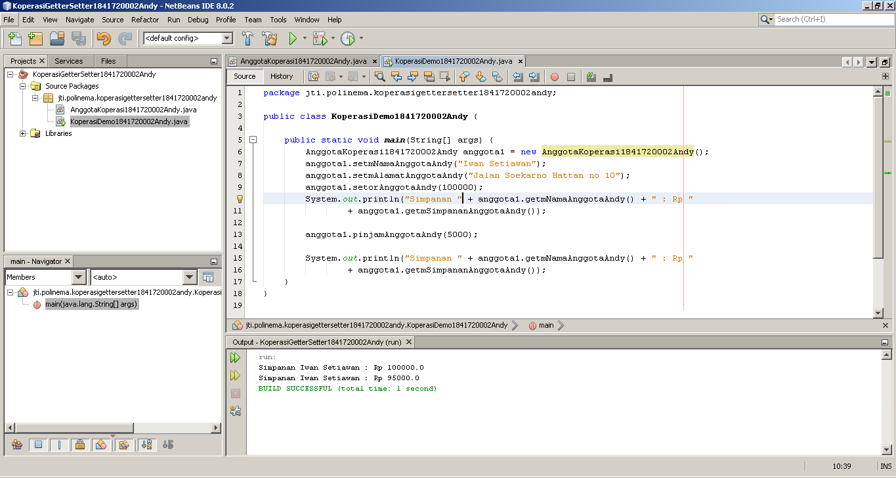

Class KoperasiDemo1841720002Andy ini hanya sebagai class bantu yakni, class yang terpadapat method main di dalamnya. Di dalam method main tersebut terdapat instansiasi object dari class AnggotaKoperasi1841720002Andy dan pemanggilan method-method dari class AnggotaKoperasi1841720002Andy. [Klik link berikut ini untuk menuju class KoperasiDemo1841720002Andy.](../../src/3_Enkapsulasi/KoperasiDemo1841720002Andy.java)

### Percobaan 4 - Konstruktor, Instansiasi

Pada Praktikum 4 ini, kita belajar tentang penggunaan konstuktor. Konstruktor sendiri adalah sebuah method yang pertama kali dieksekusi saat instansiasi object. Konstrukstor dapat diberi parameter, sehingga pengisian atributnya dapat dilakukan ketika instansiasi object.

Pada percobaan ini class yang digunakan adalah clas yang terdapat pada percobaan 3. Class yang terdapat pada percobaan 3 tersebut akan dimodifikasi sesuai dengan langkah-langkah pada percobaan 4.

Gambar di bawah ini adalah screenshot dari class AnggotaKoperasi1841720002Andy yang sudah diberikan konstuktor.

Konstruktor tersebut juga memiliki parameter yang artinya pada saat instansiasi object parameter tersebut harus langsung diisi. Nilai dari parameter tersebut akan masuk pada atribut-atribut yang terdapat dalam konstruktor tersebut.[Klik link berikut ini untuk menuju class AnggotaKoperasi1841720002Andy.](../../src/3_Enkapsulasi/AnggotaKoperasi1841720002Andy.java)

Gambar di bawah ini adalah class KoperasiDemo1841720002Andy yang sudah di modifikasi.

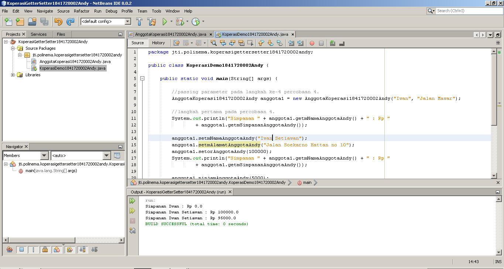

Yang membedakan dari percobaan sebelumnya adalah pada saat instansiasi object class AnggotaKoperasi1841720002Andy terdapat pengisian nilai sesuai dengan parameter konstruktor class AnggotaKoperasi1841720002Andy. [Klik link berikut ini untuk menuju class KoperasiDemo1841720002Andy.](../../src/3_Enkapsulasi/KoperasiDemo1841720002Andy.java)

**Pertanyaan Percobaan 3 dan 4**  
1. Apa yang dimaksud getter dan setter? 
   **Jawab :** 
   Getter adalah method yang digunakan untuk mengambil nilai dari suatu atribut. Setter adalah method yang digunakan untuk memanipulasi nilai dari suatu atribut.

2. Apa kegunaan dari method getSimpanan()? 
   **Jawab :** 
   method getSimpanan() digunakan untuk mengambil nilai dari atribut mSimpanan.

3. Method apa yang digunakan untk menambah saldo 
   **Jawab :** 
   method yang digunakan untuk menambahkan saldo adalah method setorAnggotaAndy().

4. Apa yand dimaksud konstruktor? 
   **Jawab :** 
   Konstruktor adalah sebuah method yang pertama kali dieksekusi ketika sebuah object di instansiasi.

5. Sebutkan aturan dalam membuat konstruktor? 
   **Jawab :** 
   1. Nama konstruktor harus sama dengan nama classnya.
   2. Access Modifiernya harus selain private, apabila menggunakan private akan terjadi eror saat instansiasi object. Lebih aman menggunakan public saat pembuatan konstruktor.
   3. Konstruktor tidak dapat menggunakan tipe static atau pun void.
   4. Konstuktor dapat menggunakan parameter atau tidak. Penggunaan parameter sesuai dengan kebutuhan.

6. Apakah boleh konstruktor bertipe private? 
   **Jawab :** 
   Sebenarnya bisa, pada class yang diberi konstuktor tidak akan terjadi eror. Namun akan terjadi eror pada class yang akan menginstansiasi object dari class yang memiliki konstruktor bertipe private tadi.

7. Kapan menggunakan parameter dengan passsing parameter? 
   **Jawab :** 
   Ketika sebuah atribut membutuhkan nilai yang spesifik 
   
8. Apa perbedaan atribut class dan instansiasi atribut? 
   **Jawab :** 
   Atribut class adalah atribut yang sudah ada pada class tersebut. Sedangkan instansiasi atribut adalah atribut baru atau pengisian atribut yang sudah ada melalui konstruktor atau method.

9.  Apa perbedaan class method dan instansiasi method? 
   **Jawab :** 
   Method class adalah method yang sudah ada pada class tersebut. Sedangkan instansiasi method adalah pemanggilan method yang sudah ada di dalam suatu class ke class lain.

## Tugas

1. Cobalah program dibawah ini dan tuliskan hasil outputnya

    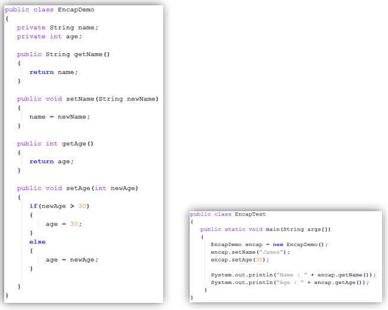

    **Jawab :** 
    Gambar di bawah ini adalah screenshot dari class EncapDemo1841720002Andy.

    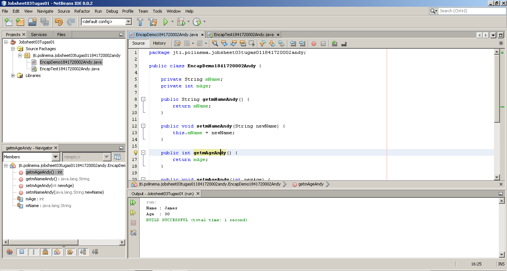

    Pada class tersebut terdapat atribut dan method sesuai dengan gambar pada soal nomor 1. [Klik link berikut ini untuk menuju class EncapDemo1841720002Andy.](../../src/3_Enkapsulasi/EncapDemo1841720002Andy.java)

    Gambar di bawah ini adalah screenshot dari class EncapTest1841720002Andy.

    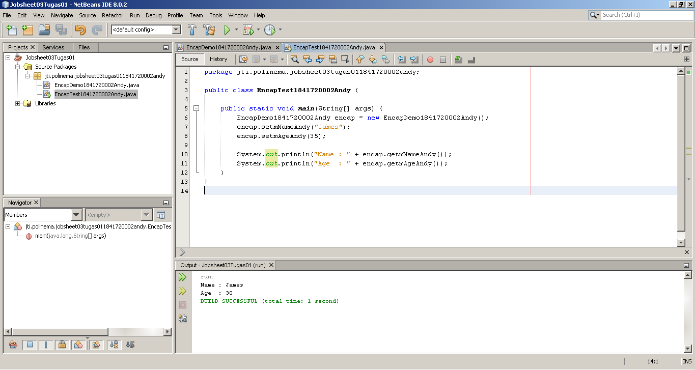

    Pada class ini juga terdapat atribut dan method sesuai dengan gambar pada soal nomor 1. [Klik link berikut ini untuk menuju class EncapDemo1841720002Andy.](../../src/3_Enkapsulasi/EncapTest1841720002Andy.java)

2. Pada program diatas, pada class EncapTest kita mengeset age dengan nilai 35, namun pada
saat ditampilkan ke layar nilainya 30, jelaskan mengapa? 
**Jawab :** 
    Karena pada method setMageAndy() terdapat kondisi apabila nilai newAge lebih dari 30 maka nilai dari mAge adalah 30.

3. Ubah program diatas agar atribut age dapat diberi nilai maksimal 30 dan minimal 18. 
**Jawab :** 
    Gambar di bawah ini adalah screenshot dari class EncapDemo1841720002Andy yang sudah dimodifikasi.

    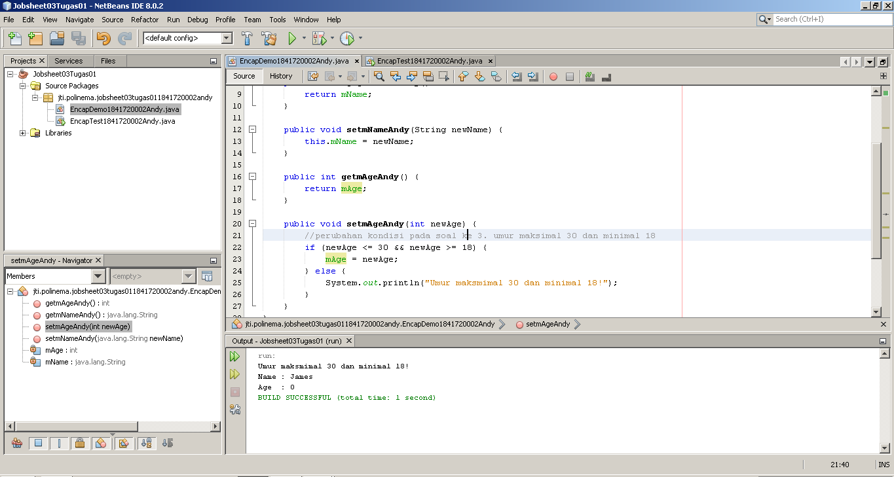

    Modifikasi yang dilakukan pada class tersebut adalah pada method setmAgeAndy() yakni menambahkan kondisi newAge kurang dari sama dengan 30 dan lebih dari sama dengan 18. [Klik link berikut ini untuk menuju class EncapDemo1841720002Andy.](../../src/3_Enkapsulasi/EncapDemo1841720002Andy.java) 

4. Pada sebuah sistem informasi koperasi simpan pinjam, terdapat class Anggota yang memiliki
atribut antara lain nomor KTP, nama, limit peminjaman, dan jumlah pinjaman. Anggota
dapat meminjam uang dengan batas limit peminjaman yang ditentukan. Anggota juga dapat
mengangsur pinjaman. Ketika Anggota tersebut mengangsur pinjaman, maka jumlah
pinjaman akan berkurang sesuai dengan nominal yang diangsur. Buatlah class Anggota
tersebut, berikan atribut, method dan konstruktor sesuai dengan kebutuhan. Uji dengan
TestKoperasi berikut ini untuk memeriksa apakah class Anggota yang anda buat telah sesuai
dengan yang diharapkan.

    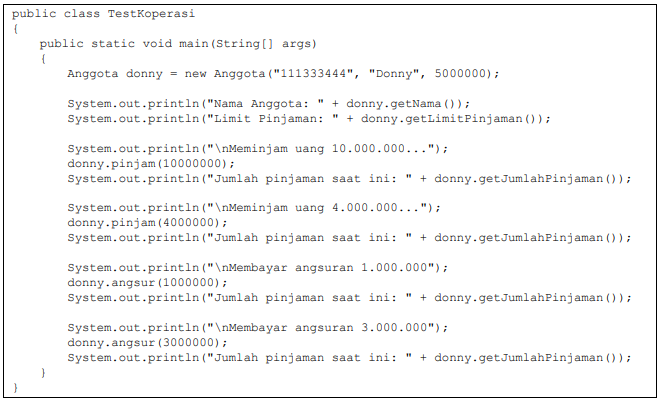

    Hasil yang diharapkan:

    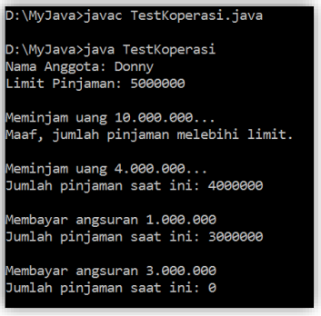

    **Jawab :** 
    Gambar di bawah ini adalah screenshot dari class Tugas04AnggotaKoperasi1841720002Andy.

    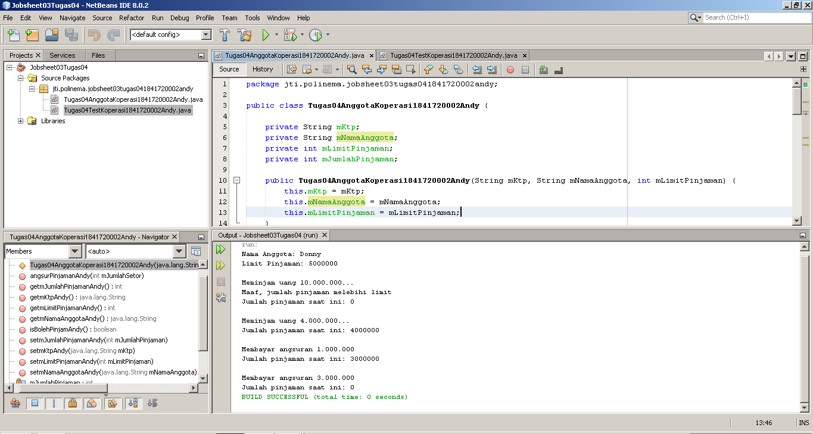

    Pada class tersebut terdapat atribut dan method sesuai dengan kebutuhan pada soal 4. Pada class tersebut juga terdapat konstruktor dengan parameter yang berisi beberapa atribut pada class tersebut. [Klik link berikut ini untuk menuju class Tugas04AnggotaKoperasi1841720002Andy.](../../src/3_Enkapsulasi/Tugas04AnggotaKoperasi1841720002Andy.java)

    Gambar di bawah ini adalah screenshot dari class Tugas04TestKoperasi1841720002Andy.

    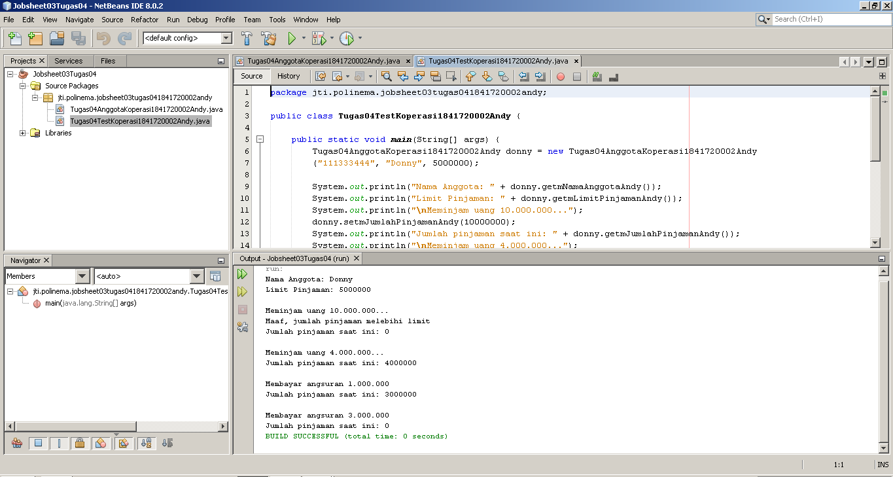

    Isi dari class ini adalah kode program pada soal nomor 4, lebih tepatnya adalah class TestKoperasi. [Klik link berikut ini untuk menuju class Tugas04TestKoperasi1841720002Andy.](../../src/3_Enkapsulasi/Tugas04TestKoperasi1841720002Andy.java)

5. Modifikasi soal no. 4 agar nominal yang dapat diangsur minimal adalah 10% dari jumlah
pinjaman saat ini. Jika mengangsur kurang dari itu, maka muncul peringatan “Maaf,
angsuran harus 10% dari jumlah pinjaman”. 
**Jawab :** 
    Gambar di bawah ini adalah screenshot dari class Tugas04AnggotaKoperasi1841720002Andy yang sudah di modifikasi.

    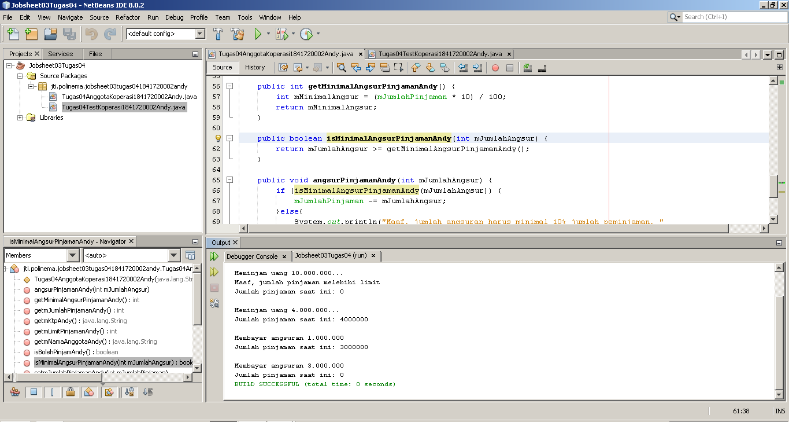

    Modifikasi yang dilakukan yaitu penambahan method getMinimalAngsuranPinjamanAndy untuk mendapatkan nilai dari mMinimalAngsur, isMinimalAngsurPinjamanAndy yang berisi pengecekan jumlah angsuran apakah sudah tercukupi atau belum dan pemberian kondisi pada method angsurPinjamanAndy agar terjadi pengecekan apakah boleh mengasur pinjaman atau tidak. [Klik link berikut ini untuk menuju class Tugas04AnggotaKoperasi1841720002Andy.](../../src/3_Enkapsulasi/Tugas04AnggotaKoperasi1841720002Andy.java) 

    Gambar di bawah ini adalah screenshot dari class Tugas04TestKoperasi1841720002Andy yang sudah di modifikasi.

    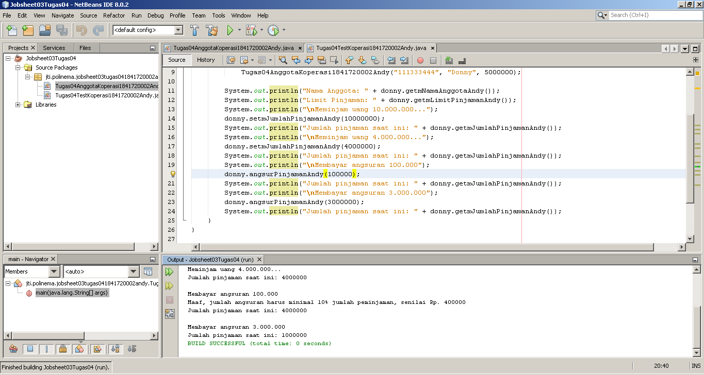

    Modifikasi yang dilakukan yaitu merubah angsuran yang awalnya bernilai 1 juta menjadi seratus ribu, sehingga angsuran tersebut kurang dari 10% pinjaman. Hasilnya adalah muncul peringatan seperti gambar diatas. [Klik link berikut ini untuk menuju class Tugas04AnggotaKoperasi1841720002Andy.](../../src/3_Enkapsulasi/Tugas04TestKoperasi1841720002Andy.java)

1. Modifikasi class TestKoperasi, agar jumlah pinjaman dan angsuran dapat menerima input
dari console.  
**Jawab :** 
    Pada Jawaban soal ini saya membuat sebuah class TestKoperasi baru karena terjadi perubahan yang sangat banyak pada class TestKoperasi sebelumnya. Hal ini agar tidak terjadi kebingungan dan bisa melihat perbedaan perubahan yang terjadi pada class TestKoperasi soal nomor 5 dengan nomor 6.

    Gambar di bawah ini adalah Gambar di bawah ini adalah screenshot dari class Tugas04TestKoperasiSoal61841720002Andy yang sudah dimodifikasi.

    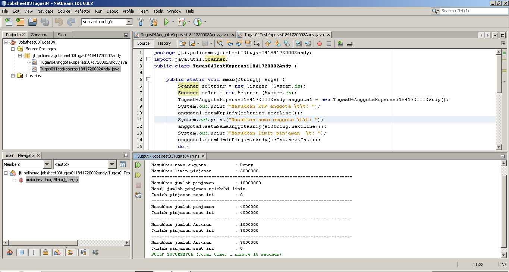

    Beberapa modifikasi yang dilakukan yaitu mengimport Scanner, kemudian membuat dua object scanner baru agar bisa melakukan input melalui konsol,dll. Kemudian di dalam kelas ini juga terdapat dua perulangan yang menggunakan perulangan Do .. While, perulangan pertama digunakan untuk mengulangi input jumlah pinjaman hingga jumlah yang diinputkan valid, kemudian perulangan ke dua digunakan untuk mengulangi input pengangsuran hingga jumlah pinjamannya bernilai 0. [Klik link berikut ini untuk menuju class Tugas04TestKoperasiSoal61841720002Andy.](../../src/3_Enkapsulasi/Tugas04AnggotaKoperasi1841720002Andy.java)

    Modifikasi juga dilakukan pada class Tugas04AnggotaKoperasi1841720002Andy yakni penghapusan konstruktor. Penghapusan dilakukan karena konstruktor sudah tidak dibutuhkan lagi. [Klik link berikut ini untuk menuju class Tugas04AnggotaKoperasi1841720002Andy.](../../src/3_Enkapsulasi/Tugas04AnggotaKoperasi1841720002Andy.java)

## Kesimpulan

Kesimpulan yang bisa kita dapatkan dari pertemuan kali ini adalah tentang apa itu encapsulasi, akses modifier dan pengunaannya, konstruktor, kemudian notasi pada UML, penggunaan dari getter dan setter, dll.

Diharapkan setelah pertemuan ini kita bisa semakin paham bagaimana cara kerja OOP, semakin mudah ketika membuat program yang menggunakan konsep OOP dan mudah ketika belajar materi selanjutnya.

## Pernyataan Diri

Saya menyatakan isi tugas, kode program, dan laporan praktikum ini dibuat oleh saya sendiri. Saya tidak melakukan plagiasi, kecurangan, menyalin/menggandakan milik orang lain.

Jika saya melakukan plagiasi, kecurangan, atau melanggar hak kekayaan intelektual, saya siap untuk mendapat sanksi atau hukuman sesuai peraturan perundang-undangan yang berlaku.

Ttd,

***(Oktaviano Andy Suryadi)***
