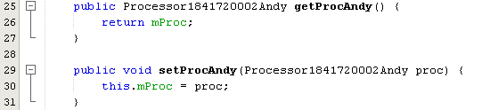
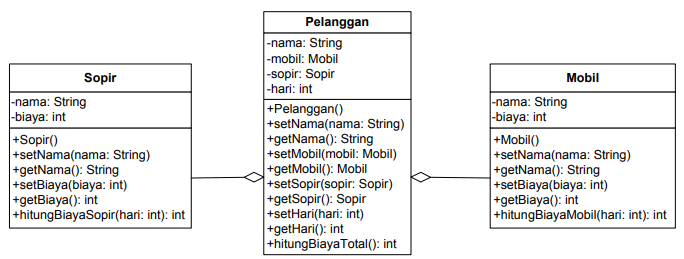
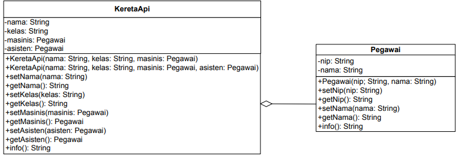
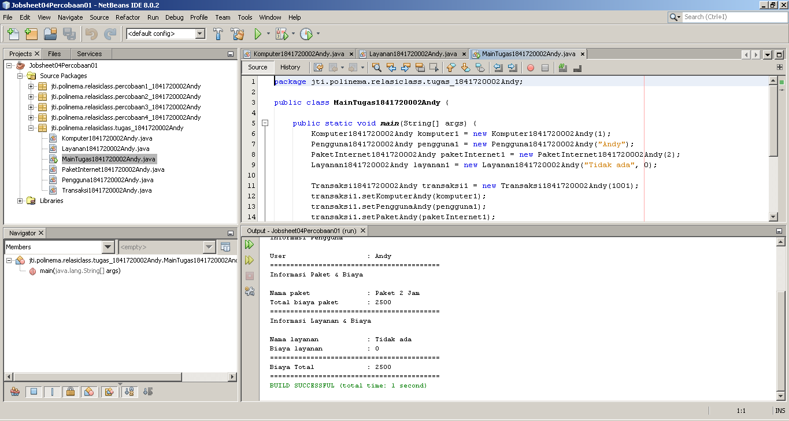

# Laporan Praktikum #4 - Relasi Kelas

## Kompetensi
Setelah menempuh pokok bahasan ini, mahasiswa mampu:
1. Memahami konsep relasi kelas;
2. Mengimplementasikan relasi has‑a dalam program.

## Ringkasan Materi

Pada praktikum kali ini, kita belajar tentang konsep relasi pada PBO. Relasi sendiri berarti hubungan, sehingga maksud dari relasi disini adalah hubungan antar kelas yang saling berinteraksi.

Sebenarnya saat praktikum sebelum-sebelumnya kita sudah melakuan relasi antar kelas yakni menggunakan extends (inheritance) pada class induk ke class anak.

relasi sendiri dibagi menjadi 3 yaitu : 
**1. Agregasi (has-a)** atau memiliki.  
**2. Dependensi (uses-a)** atau menggunakan.  
**3. Inheritance (is-a).** atau warisan.

Pada praktikum ini kita lebih fokus pada relasi jenis Agregasi.

## Percobaan

### Percobaan 1

Pada percobaan 1 ini kita akan membuat dua class yang nantinya akan saling berelasi. Class tersebut adalah class Laptop1841720002Andy dan class Processor1841720002Andy. Kedua class tersebut digambarkan dengan diagram class di bawah ini.

Dapat kita lihat dari diagram class di atas. Class Laptop1841720002Andy memiliki (has-a) Processor1841720002Andy. Class Laptop1841720002Andy memiliki beberapa atribut yang ada pada class Processor1841720002Andy.

Gambar di bawah ini adalah screenshot dari class Processor1841720002Andy. 

Class Processor1841720002Andy ini berisi konstruktor, method, dan atribut sesuai dengan yang ada pada class diagram di atas. [Klik link berikut ini untuk menuju ke class Processor1841720002Andy.](../../src/4_Relasi_Class/Processor1841720002Andy.java)

Gambar di bawah ini adalah screenshot dari class Laptop1841720002Andy. 

Class Laptop1841720002Andy ini berisi konstruktor, method, dan atribut sesuai dengan yang ada pada class diagram di atas. Pada class ini terdapat atribut mProc yang bertipe object Laptop1841720002Andy (dapat dilihat dibagian deklrasi atribut dan konstruktor) dan juga getter setter atribut mProc. [Klik link berikut ini untuk menuju ke class Laptop1841720002Andy.](../../src/4_Relasi_Class/Laptop1841720002Andy.java)

Setelah pembuatan kedua class diatas, tahap selanjutnya adalah pembuatan class MainPercobaan1_1841720002Andy.

Gambar di bawah ini adalah screenshot dari class MainPercobaan1_1841720002Andy. 

Class ini berisi sebuah method main yang di dalamnya terdapat instansiasi object dari class Processor1841720002Andy dan class Laptop1841720002Andy dan juga pemanggilan method-method dari kedua class tersebut. [Klik link berikut ini untuk menuju ke class MainPercobaan1_1841720002Andy.](../../src/4_Relasi_Class/MainPercobaan1_1841720002Andy.java)

Setelah melakukan percobaan 1 ini, selanjutnya adalah menjawab beberapa pertanyaan di bawah ini.

**Pertanyaan** 
Berdasarkan percobaan 1, jawablah pertanyaan‑pertanyaan yang terkait:
1. Di dalam class Processor dan class Laptop , terdapat method setter dan getter untuk
masing‑masing atributnya. Apakah gunanya method setter dan getter tersebut ?  
**Jawab :** 
Fungsi dari method setter adalah digunakan untuk mengisi atau memanipulasi nilai dari suatu atribut dan method getter digunakan untuk mengambil nilai dari suatu atribut.

2. Di dalam class Processor dan class Laptop, masing‑masing terdapat konstruktor
default dan konstruktor berparameter. Bagaimanakah beda penggunaan dari kedua jenis
konstruktor tersebut ?  
**Jawab :** 
Konsturktor default digunakan apabila class tersebut tidak memerlukan pengisian nilai dari atribut yang berasal dari inputan. Sedangkan konstruktor berparameter digunakan apabila class tersebut memerlukan pengisian nilai dari atribut yang berasal dari inputan.

3. Perhatikan class Laptop, di antara 2 atribut yang dimiliki (merk dan proc), atribut
manakah yang bertipe object ?  
**Jawab :** 
Atribut yang bertipe object adalah mProc.

4. Perhatikan class Laptop, pada baris manakah yang menunjukan bahwa class Laptop
memiliki relasi dengan class Processor ?  
**Jawab :** 
Gambar di bawah ini adalah screenshot dari beberapa baris kode program class Laptop1841720002Andy yang
memiliki relasi dengan class Processor1841720002Andy.
   1. Pada baris ke 6.

        

   2. Pada baris ke 12 dan 14.
   
        
        
   3. Pada baris ke 25 dan 29.
   
        

   4. Pada baris ke 35.
   
        

    Untuk lebih jelasnya silahkan klik link berikut. [Klik link berikut ini untuk menuju ke class Laptop1841720002Andy.](../../src/4_Relasi_Class/Laptop1841720002Andy.java)

5. Perhatikan pada class Laptop , Apakah guna dari sintaks proc.info() ?  
**Jawab :** 
Sintaks tersebut digunakan untuk memanggil method infoAndy() yang berada di dalam class Laptop1841720002Andy.

6. Pada class MainPercobaan1, terdapat baris kode:
***Laptop l = new Laptop("Thinkpad", p);***. 
Apakah p tersebut ?
Dan apakah yang terjadi jika baris kode tersebut diubah menjadi:  
***Laptop l = new Laptop("Thinkpad", new Processor("Intel i5",3));***  
Bagaimanakah hasil program saat dijalankan, apakah ada perubahan ? 
**Jawab :** 
Fungsi dari p dalam baris kode ***Laptop l = new Laptop("Thinkpad", p);*** adalah mengisi nilai dari konstruktor dari object L dengan nilai dari object p.

    Gambar dibawah ini adalah hasil modifikasi baris kode ***Laptop l = new Laptop("Thinkpad", p);*** menjadi ***Laptop l = new Laptop("Thinkpad", new Processor("Intel i5",3));***

    

    Tidak adak perubahan sama sekali pada outputnya, karena kedua modifikasi program tersebut adalah sintaks bagaimana caranya menginisiasi object dengan konstruktor. Hanya berbeda cara pengisiannya saja. Kode program yang pertama mengisi dengan cara memanggil object p, sedangkan yang kedua adalah mengisi secara manual. 
    
    Untuk melihat lebih jelas perubahan kode programnya silahkan klik link berikut. [Klik link berikut ini untuk menuju ke class MainPercobaan1_1841720002Andy.](../../src/4_Relasi_Class/MainPercobaan1_1841720002Andy.java)

### Percobaan 2

Pada percobaan 2 ini, percobaan yang dilakukan hampir sama seperti percobaan 1. Hanya saja berbeda diagram class dan studi kasus.

Berikut ini adalah studi kasus pada percobaan 2 :
 Perhatikan diagram class berikut yang menggambarkan sistem rental mobil. Pelanggan bisa
menyewa mobil sekaligus sopir. Biaya sopir dan biaya sewa mobil dihitung per hari.

Berikut ini adalah gambar class diagram pada percobaan 2 :

Berdasarkan studi kasus dan diagram class diatas maka percobaan ini dibuatlah 4 class yaitu class Sopir1841720002Andy, Mobil1841720002Andy, Pelanggan1841720002Andy, dan MainPercobaan2_1841720002Andy.

Gambar di bawah ini adalah screenshot dari class Sopir1841720002Andy.

Class Sopir1841720002Andy ini berisi konstruktor, method, dan atribut sesuai dengan yang ada pada class diagram di atas. [Klik link berikut ini untuk menuju ke class Sopir1841720002Andy.](../../src/4_Relasi_Class/Sopir1841720002Andy.java)

Selanjutnya setelah class Sopir1841720002Andy selesai dibuat, adalah pembuatan class Mobil1841720002Andy.

Gambar di bawah ini adalah screenshot dari class Mobil1841720002Andy.

Class Mobil1841720002Andy ini berisi konstruktor, method, dan atribut sesuai dengan yang ada pada class diagram di atas. [Klik link berikut ini untuk menuju ke class Mobil1841720002Andy.](../../src/4_Relasi_Class/Mobil1841720002Andy.java)

Selanjutnya setelah class Sopir1841720002Andy selesai dibuat, adalah pembuatan class Pelanggan1841720002Andy.

Gambar di bawah ini adalah screenshot dari class Pelanggan1841720002Andy.

Class Pelanggan1841720002Andy ini berisi konstruktor, method, dan atribut sesuai dengan yang ada pada class diagram di atas. Pada class ini terdapat atribut mMobil yang bertipe object Mobil1841720002Andy dan atribut mSopir yang bertipe object Sopir1841720002Andy (dapat dilihat dibagian deklrasi atribut dan konstruktor) dan bergaimacam method sesuai dengan yang ada pada diagram class. [Klik link berikut ini untuk menuju ke class Pelanggan1841720002Andy.](../../src/4_Relasi_Class/Pelanggan1841720002Andy.java)

Selanjutnya setelah class Pelanggan1841720002Andy selesai dibuat, adalah pembuatan class MainPercobaan2_1841720002Andy.

Gambar di bawah ini adalah screenshot dari class MainPercobaan2_1841720002Andy.

Class MainPercobaan2_1841720002Andy ini berisi sebuah method main yang di dalamnya terdapat instansiasi dari ketiga class yang sudah kita buat sebelumnya yakni class Mobil1841720002Andy, Sopir1841720002Andy, dan Pelanggan1841720002Andy. Dalam class ini juga terjadi pemanggilan-pemanggilan method-method yang ada dalam class ketiga class yang sudah kita buat tadi.[Klik link berikut ini untuk menuju ke class MainPercobaan2_1841720002Andy.](../../src/4_Relasi_Class/MainPercobaan2_1841720002Andy.java)

Setelah melakukan percobaan 2 ini, selanjutnya adalah menjawab beberapa pertanyaan di bawah ini.

**Pertanyaan** 
Berdasarkan percobaan 2, jawablah pertanyaan‑pertanyaan yang terkait:
1. Perhatikan class Pelanggan. Pada baris program manakah yang menunjukan bahwa class
Pelanggan memiliki relasi dengan class Mobil dan class Sopir ? 
**Jawab :** 
Gambar di bawah ini adalah screenshot dari beberapa baris kode program class Pelanggan1841720002Andy yang 
memiliki relasi dengan class Mobil1841720002Andy dan class Sopir1841720002Andy.
    1. Pada baris ke 6 dan 7.

        

   2. Pada baris ke 22, 26, 30 dan 34.
   
        
        
   3. Pada baris ke 47 dan 48.
   
        

    Untuk lebih jelasnya silahkan klik link berikut. [Klik link berikut ini untuk menuju ke class Pelanggan1841720002Andy.](../../src/4_Relasi_Class/Pelanggan1841720002Andy.java)

2. Perhatikan method hitungBiayaSopir pada class Sopir, serta method hitungBiayaMobil pada class Mobil. Mengapa menurut Anda method tersebut harus memiliki argument hari ? 
**Jawab :** 
Karena nilai dari argumen hari itu tidak tetap bisa berubah-ubah tergantung kondisi sehingga kedua method tersebut harus memiliki argument hari.

3. Perhatikan kode dari class Pelanggan. Untuk apakah perintah
mobil.hitungBiayaMobil(hari) dan sopir.hitungBiayaSopir(hari) ? 
**Jawab :** 
Mengakses method hitungBiayaMobilAndy(hari) di dalam class Mobil1841720002Andy dan method hitungBiayaSopirAndy(hari) di dalam class Sopir1841720002Andy.

4. Perhatikan class MainPercobaan2. Untuk apakah sintaks p.setMobil(m) dan p.setSopir(s) ? 
**Jawab :** 
sintaks p.setMobilAndy(m) digunakan untuk mengisi nilai dari atibut mMobil dengan nilai dari object m dan sintaks p.setSopirAndy(s) juga hampir sama yakni mengisi nilai dari atribut mSopir dengan nilai dari object s. 

5. Perhatikan class MainPercobaan2. Untuk apakah proses p.hitungBiayaTotal() tersebut ? 
**Jawab :** 
Proses p.hitungBiayaTotalAndy() digunakan untuk menjumlahkan nilai dari method mMobil.hitungBiayaMobilAndy(hari) dan mSopir.hitungBiayaSopirAndy(hari).

6. Perhatikan class MainPercobaan2, coba tambahkan pada baris terakhir dari method main dan amati perubahan saat di‑run!   ***System.out.println(p.getMobil().getMerk());*** 
Jadi untuk apakah sintaks p.getMobil().getMerk() yang ada di dalam method main tersebut?  
**Jawab :** 
Gambar di bawah ini adalah screenshot dari class MainPercobaan2_1841720002Andy yang sudah sedikit di motfikasi.

     

     Jadi untuk apakah sintaks p.getMobilAndy().getMerkAndy() digunakan untuk mengambil nilai atribut mNama dalam class Mobil1841720002Andy melalui class Pelanggan1841720002Andy.

### Percobaan 3

Pada percobaan 3 ini, percobaan yang dilakukan hampir sama seperti percobaan 2. Hanya saja berbeda diagram class dan studi kasus. Kita juga belajar tentang multiplicity. Apa itu multiplicity? Multiplicity  relasi class melibatkan lebih dari satu.

Berikut ini adalah studi kasus pada percobaan 3 :
 Sebuah Kereta Api dioperasikan oleh Masinis serta seorang Asisten Masinis. Baik Masinis
maupun Asisten Masinis keduanya merupakan Pegawai PT. Kereta Api Indonesia. 

Dari
ilustrasi cerita tersebut, dapat digambarkan dalam diagram kelas sebagai berikut:

Berdasarkan studi kasus dan diagram class diatas maka percobaan ini dibuatlah 3 class yaitu class KeretaApi1841720002Andy, Pegawai1841720002Andy, dan MainPercobaan3_1841720002Andy.

Hal pertama yang kita lakukan pada percobaan 3 ini adalah membuat class Pegawai1841720002Andy

Gambar di bawah ini adalah screenshot dari class Pegawai1841720002Andy.

Class Pegawai1841720002Andy ini berisi konstruktor, method, dan atribut sesuai dengan yang ada pada class diagram di atas. [Klik link berikut ini untuk menuju ke class Pegawai1841720002Andy.](../../src/4_Relasi_Class/Pegawai1841720002Andy.java)

Selanjutnya setelah class Pegawai1841720002Andy selesai dibuat, adalah pembuatan class KeretaApi1841720002Andy.

Gambar di bawah ini adalah screenshot dari class KeretaApi1841720002Andy.

Dapat kita lihat sedikit screenshot dari class KeretaApi1841720002Andy terdapat dua object dengan nama mMasinis dan mAsisten yang berasal dari satu class yang sama yakni Pegawai1841720002Andy. Kemudian juga terdat dua konstruktor yang memiliki paramenter yang berbeda. Konstruktor yang pertama digunakan apabila ketika instansiasi object terdapat data asisten(terdapat data asisten untuk ditambahkan) sedangkan konstruktor yang kedua digunakan apabila terdapat data asisten yang akan ditambahkan [Klik link berikut ini untuk menuju ke class KeretaApi1841720002Andy.](../../src/4_Relasi_Class/KeretaApi1841720002Andy.java)

Selanjutnya setelah class KeretaApi1841720002Andy selesai dibuat, adalah pembuatan class MainPercobaan3_1841720002Andy.

Gambar di bawah ini adalah screenshot dari class MainPercobaan3_1841720002Andy.

Class MainPercobaan3_1841720002Andy ini berisi sebuah method main yang di dalamnya terdapat instansiasi dari kedua class yang sudah kita buat sebelumnya yakni class KeretaApi1841720002Andy, dan Pegawai1841720002Andy. Dalam class ini juga terjadi pemanggilan-pemanggilan method-method yang ada dalam class kedua class yang sudah kita buat tadi.[Klik link berikut ini untuk menuju ke class MainPercobaan3_1841720002Andy.](../../src/4_Relasi_Class/MainPercobaan3_1841720002Andy.java)

Setelah melakukan percobaan 3 ini, selanjutnya adalah menjawab beberapa pertanyaan di bawah ini.

**Pertanyaan** 
Berdasarkan percobaan 3, jawablah pertanyaan‑pertanyaan yang terkait:
1. Di dalam method info() pada class KeretaApi, baris this.masinis.info() dan this.asisten.info() digunakan untuk apa ? 
**Jawab :** 
Fungsi dari this.mMasinis.infoAndy() adalah mengakses method infoAndy() yang berada di dalam class Pegawai1841720002Andy yakni mencetak data pegawai tersebut. Sedangkan this.mAsisten.infoAndy() juga memiliki fungsi yang sama yakni method infoAndy() yang berada di dalam class Pegawai1841720002Andy yakni mencetak data pegawai.

2. Buatlah main program baru dengan nama class MainPertanyaan pada package yang sama. Tambahkan kode berikut pada method main() 
***  !Pegawai masinis = new Pegawai("1234", "Spongebob
Squarepants"); KeretaApi keretaApi = new KeretaApi("Gaya Baru", "Bisnis", masinis);   
System.out.println(keretaApi.info());***  
**Jawab :** 
Gambar di bawah ini adalah screenshot dari class MainPertanyaan1841720002Andy.

     

     Class ini berisi sintaks yang sesuai dengan soal diatas.[Klik link berikut ini untuk menuju ke class MainPertanyaan1841720002Andy.](../../src/4_Relasi_Class/MainPertanyaan1841720002Andy.java)

1. Apa hasil output dari main program tersebut ? Mengapa hal tersebut dapat terjadi ? 
**Jawab :** 
Hasil output dari main program tersebut adalah eror. Eror tersebut terjadi pada class KeretaApi1841720002Andy pada bagian method infoAndy(). Main program ini hanya melakukan input masinis saja tanpa asisten, sedangkan dalam method infoAndy() method tersebut membutkan nilai asisten. Hal ini lah yang membuat main program menhasilkan output eror. Untuk lebih jelasnya silahkan lihat pada jawaban soal nomor 4.

4. Perbaiki class KeretaApi sehingga program dapat berjalan ! 
**Jawab :** 
Gambar di bawah ini adalah screenshot dari bagian class KeretaApi1841720002Andy yang sudah di modifikasi.

     

     Modifikasi yang dilakukan adalah dengan menambahkan sebuah kondisi dalam method infoAndy(). Apabila nilai dari atribut mAsisten tidak kosong maka nilai dari atribut mAsisten juga dimasukkan dalam variabel mInfo. Apabila nilai dari atribut mAsisten kosong maka atribut nilai mAsisten tidak perlu dimasukkan ke dalam variabel mInfo. [Klik link berikut ini untuk menuju ke class KeretaApi1841720002Andy.](../../src/4_Relasi_Class/KeretaApi1841720002Andy.java)

### Percobaan 4

Pada percobaan 4 ini, percobaan yang dilakukan hampir sama seperti percobaan 3. Hanya saja berbeda diagram class dan tanpa studi kasus. Pada percobaan 4 ini kita juga belajar bagaimana membuat object array dengan tipe data class.

Berikut ini adalah diagram class pada percobaan 4 :

Berdasarkan studi kasus dan diagram class diatas maka percobaan ini dibuatlah 4 class yaitu class Penumpang1841720002Andy, Kursi1841720002Andy, Gerbong1841720002Andy,dan MainPercobaan4_1841720002Andy.

Hal pertama yang kita lakukan pada percobaan 4 ini adalah membuat class Penumpang1841720002Andy

Gambar di bawah ini adalah screenshot dari class Penumpang1841720002Andy.

Class Penumpang1841720002Andy ini berisi konstruktor, method, dan atribut sesuai dengan yang ada pada class diagram di atas. [Klik link berikut ini untuk menuju ke class Penumpang1841720002Andy.](../../src/4_Relasi_Class/Penumpang1841720002Andy.java)

Selanjutnya setelah class Penumpang1841720002Andy selesai dibuat, adalah pembuatan class Kursi1841720002Andy.

Gambar di bawah ini adalah screenshot dari class Kursi1841720002Andy.

Class Kursi1841720002Andy ini berisi konstruktor, method, dan atribut sesuai dengan yang ada pada class diagram di atas. Pada screenshot di atas dapat kita lihat di dalam class ini atribut mPenumpang dengan tipe object class Penumpang1841720002Andy. [Klik link berikut ini untuk menuju ke class Kursi1841720002Andy.](../../src/4_Relasi_Class/Kursi1841720002Andy.java)

Selanjutnya setelah class Kursi1841720002Andy selesai dibuat, adalah pembuatan class Gerbong1841720002Andy.

Gambar di bawah ini adalah screenshot dari class Gerbong1841720002Andy.

Class Gerbong1841720002Andy ini berisi konstruktor, method, dan atribut sesuai dengan yang ada pada class diagram di atas. Pada screenshot di atas dapat kita lihat di dalam class ini atribut mArrayKursi dengan tipe arrray object class Kursi1841720002Andy. [Klik link berikut ini untuk menuju ke class Gerbong1841720002Andy.](../../src/4_Relasi_Class/Gerbong1841720002Andy.java)

Selanjutnya setelah class Gerbong1841720002Andy selesai dibuat, adalah pembuatan class MainPercobaan4_1841720002Andy.

Gambar di bawah ini adalah screenshot dari class MainPercobaan4_1841720002Andy.

Class MainPercobaan4_1841720002Andy ini berisi sebuah method main yang di dalamnya terdapat instansiasi dari dua class yang sudah kita buat sebelumnya yakni class Penumpang1841720002Andy, dan Gerbong1841720002Andy. Dalam class ini juga terjadi pemanggilan-pemanggilan method-method yang ada dalam class dua class yang sudah kita instansiasi tadi.[Klik link berikut ini untuk menuju ke class MainPercobaan4_1841720002Andy.](../../src/4_Relasi_Class/MainPercobaan4_1841720002Andy.java)

Setelah melakukan percobaan 4 ini, selanjutnya adalah menjawab beberapa pertanyaan di bawah ini.

**Pertanyaan** 
Berdasarkan percobaan 4, jawablah pertanyaan‑pertanyaan yang terkait:
1. Pada main program dalam class MainPercobaan4, berapakah jumlah kursi dalam Gerbong A ? 
**Jawab :** 
Pada main program dalam class MainPercobaan4_1841720002Andy terdapat 10 kursi dalam Gerbong A.

2. Perhatikan potongan kode pada method info() dalam class Kursi. Apa maksud kode tersebut ?  
******... 
if (this.mPenumpang != null) {
mInfo += "Penumpang: " + mPenumpang.infoAndy() + "\n";
} ***
...***  
**Jawab :** 
Maksud dari potongan kode tersebut adalah apabila nilai dari atribut mPenumpang tidak sama dengan null maka nilai dari atirbut mInfo diisi dengan ***"Penumpang: " + penumpang.info() + "\n"***.

3. Mengapa pada method setPenumpang() dalam class Gerbong, nilai nomor dikurangi dengan angka 1 ?  
**Jawab :** 
Karena indeks sebuah array dimulai dari 0 sehingga perlu dikurang dengan angka 1.

4. Instansiasi objek baru budi dengan tipe Penumpang, kemudian masukkan objek baru tersebut pada gerbong dengan gerbong.setPenumpang(budi, 1). Apakah yang terjadi ? 
**Jawab :** 
Gambar di bawah ini adalah screenshot dari modifikasi class MainPercobaan4_1841720002Andy yang sudah dimodifikasi sesuai dengan soal di atas.

     

     Nilai sebelumnya yang berada pada array mArrayKursi pada indeks ke 0 berubah menjadi nilai yang baru saja diinput (ditimpa). [Klik link berikut ini untuk menuju ke class MainPercobaan4_1841720002Andy.](../../src/4_Relasi_Class/MainPercobaan4_1841720002Andy.java)
     
5. Modifikasi program sehingga tidak diperkenankan untuk menduduki kursi yang sudah ada penumpang lain ! 
**Jawab :** 
Gambar di bawah ini adalah screenshot dari class Gerbong1841720002Andy yang sudah dimodifikasi agar program sehingga tidak diperkenankan untuk menduduki kursi yang sudah ada penumpang lain.

     

     Modifikasi yang dilakukan pada class ini adalah menambahan method bertipe boolean isKursiKosongAndy(int mNomor) yang digunakan untuk mengecek apakah kursi tersebut masih kosong atau tidak. Method ini akan mereturn nilai true apabila nilai dari mArrayKursi[mNomor - 1].getPenumpang() adalah null;
     
     Kemudian method isKursiKosongAndy(int mNomor) dipanggil di dalam method setPenumpangAndy(Penumpang184120002Andy mPenumpang, int mNomor) di dalam sebuah kondisi. Apabila kondisi dari method isKursiKosongAndy(int mNomor) adalah true, maka penumpang tesebut boleh memilih kursi tersebut. Namun apabila nilanya adalah false maka akan muncul peringatan seperti yang ada pada screenshot diatas. [Klik link berikut ini untuk menuju ke class Gerbong1841720002Andy.](../../src/4_Relasi_Class/Gerbong1841720002Andy.java)

## Tugas

Buatlah sebuah studi kasus, rancang dengan class diagram, kemudian implementasikan ke dalam
program! Studi kasus harus mewakili relasi class dari percobaan‑percobaan yang telah dilakukan
pada materi ini, setidaknya melibatkan minimal 4 class (class yang berisi main tidak dihitung).

**Jawab :**  
**Studi Kasus**  
Sebuah warung internet membutuhkan aplikasi untuk mencatat setiap transaksi yang ada dalam warnet tersebut. Transaksi tersebut terdiri dari data komputer, data pengguna, data paket yang dipilih pengguna, data layanan yang digunakan pengguna, dan biaya-biaya yang harus dipakai pengguna setelah menggunakan jasa warnet tersebut.

Berdasarkan studi kasus diatas maka class diagram yang dapat dihasilkan yaitu :

Dari gambar class diagram tersebut dapat kita lihat terdapat 4 class yang nantinya akan kita buat. Class-class tersebut yaitu class Komputer1841720002Andy, PaketInternet1841720002Andy, Pengguna1841720002Andy, Layanan1841720002Andy, dan Transaksi1841720002Andy.

Class yang pertama kali kita buat adalah class Komputer1841720002Andy.Class ini berisi data komputer.

Gambar di bawah ini adalah screenshot dari class Komputer1841720002Andy.

Class Komputer1841720002Andy ini berisi konstruktor, method, dan atribut sesuai dengan yang ada pada class diagram di atas. [Klik link berikut ini untuk menuju ke class Komputer1841720002Andy.](../../src/4_Relasi_Class/Komputer1841720002Andy.java)

Selanjutnya setelah pembuatan class Komputer1841720002Andy, adalah pembuatan class Pengguna1841720002Andy. Class ini berisi data-data pengguna seperti nama.

Gambar di bawah ini adalah screenshot dari class Pengguna1841720002Andy.

Class Pengguna1841720002Andy ini berisi konstruktor, method, dan atribut sesuai dengan yang ada pada class diagram di atas. [Klik link berikut ini untuk menuju ke class Pengguna1841720002Andy.](../../src/4_Relasi_Class/Pengguna1841720002Andy.java)

Setelah pembuatan class Pengguna1841720002Andy, selanjutnya adalah pembuatan class Layanan1841720002Andy. Class ini berisi nama layanan dan harga layanan-layanan tersebut.

Gambar di bawah ini adalah screenshot dari class Layanan1841720002Andy.

Class Layanan1841720002Andy ini berisi konstruktor, method, dan atribut sesuai dengan yang ada pada class diagram di atas. [Klik link berikut ini untuk menuju ke class Pengguna1841720002Andy.](../../src/4_Relasi_Class/Pengguna1841720002Andy.java)

Setelah pembuatan class Layanan1841720002Andy, selanjutnya adalah pembuatan class PaketInternet1841720002Andy. Class ini berisi paket internet yang bisa dipilih pengguna dan perhitungan biaya pake internet yang nantinya digunakan.

Gambar di bawah ini adalah screenshot dari class PaketInternet1841720002Andy.

Class PaketInternet1841720002Andy ini berisi konstruktor, method, dan atribut sesuai dengan yang ada pada class diagram di atas. Salah satu methodnya adalah initKodePaketInternetAndy(). Method ini berisi switch - case untuk mKodePaket yang nantinya setiap pilihan pada dalam casenya memanipulasi nilai dari atribut mNamaPaket, mHargaPaket. [Klik link berikut ini untuk menuju ke class PaketInternet1841720002Andy.](../../src/4_Relasi_Class/PaketInternet1841720002Andy.java)

Setelah pembuatan class PaketInternet1841720002Andy, selanjutnya adalah pembuatan class Transaksi1841720002Andy. Class ini berisi atribut-atribut dari keempat class yang sudah kita buat tadi.

Gambar di bawah ini adalah screenshot dari class Transaksi1841720002Andy.

Class Transaksi1841720002Andy ini berisi konstruktor, method, dan atribut sesuai dengan yang ada pada class diagram di atas. Class ini memiliki atribut-atribut bertipe object dari class-class yag sudah kita buat tadi. Dalam class ini juga terjadi pemanggilan method-method yang ada dalam beberapa class lain yang sudah kita buat tadi (yang berkaitan dengan warnet). Untuk lebih lengkapnya silahkan klik link berikut ini. [Klik link berikut ini untuk menuju ke class Transaksi1841720002Andy.](../../src/4_Relasi_Class/Transaksi1841720002Andy.java)

Dan selanjutnya adalah pembuatan class terakhir yaitu class MainTugas1841720002Andy. Class ini berisi class main yang di dalamnya terdapat instansiasi object dari kelima class yang sudah kita buat tadi.

Gambar di bawah ini adalah screenshot dari class MainTugas1841720002Andy.

Dapat kita lihat dari screenshot diatas, terdapat instansiasi kelima class yang sudah kita buat tadi. Dan juga terdapat pengaksesan method-method, dan pengisian nilai atribut melalui method class-class yang sudah kita buat tadi. Untuk lebih lengkapnya silahkan klik link berikut [Klik link berikut ini untuk menuju ke class MainTugas1841720002Andy.](../../src/4_Relasi_Class/MainTugas1841720002Andy.java)

## Kesimpulan

Kesimpulan yang bisa kita dapatkan dari praktikum kali ini adalah terdapat relasi antar class yang bisa saling dihubungkan sehingga setiap class tidak perlu berdiri sendiri. Walaupun tidak diharuskan semua class memiliki relasi dengan class lainya, konsep relasi antar class ini bisa memudahkan kita ketika kita membuat program yang kompleks apabila class-class yang akan kita buat memiliki saling keterhubungan sehingga kita hanya perlu membuat atribut bertipe object dan memanggil method atau atribut yang dibutuhkan. 

Dengan kita belajar konsep ini, diharapkan kode program yang kita buat setidaknya tidak memiliki kode yang berulang-ulang (redudansi) yang intinya sama. Kita hanya perlu memanggil kode-kode yang dibutuhkan tersebut tanpa harus membuat dari nol.

Diharapkan setelah pertemuan ini kita bisa semakin paham bagaimana cara kerja OOP, semakin mudah ketika membuat program yang menggunakan konsep OOP dan mudah ketika belajar materi selanjutnya.

## Pernyataan Diri

Saya menyatakan isi tugas, kode program, dan laporan praktikum ini dibuat oleh saya sendiri. Saya tidak melakukan plagiasi, kecurangan, menyalin/menggandakan milik orang lain.

Jika saya melakukan plagiasi, kecurangan, atau melanggar hak kekayaan intelektual, saya siap untuk mendapat sanksi atau hukuman sesuai peraturan perundang-undangan yang berlaku.

Ttd,

***(Oktaviano Andy Suraydi)***
