# Laporan Praktikum #6 - Inheritance (Pewarisan)

## Kompetensi
Setelah menempuh pokok bahasan ini, mahasiswa mampu:
1. Memahami	konsep	dasar	inheritance	atau	pewarisan.
2. Mampu	membuat	suatu	subclass	dari	suatu	superclass	tertentu.
3. Mampu	mengimplementasikan	konsep	single	dan	multilevel	inheritance.
4. Mampu	membuat	objek	dari	suatu	subclass	dan	melakukan	pengaksesan	terhadap	atribut	
dan	method	baik	yang	dimiliki	sendiri	atau	turunan	dari	superclass	nya.

## Ringkasan Materi

Pada praktikum kali ini, kita belajar tentang salah satu dari ke empat konsep PBO yakni **inheritance**. **Inheritance** ini sendiri adalah suatu cara untuk menurunkan suatu class yang lebih umum menjadi suatu class	yang lebih spesifik. Apakah yang diturunkan? bisa jadi yang diturunkan adalah atribut, method ataupun konstruktor dari class induk. 

Dua istilah penting yang nantinya akan sering disebut dalam praktikum ini adalah **kelas dasar(base class/super class)** dan 	**kelas turunan(derived class/sub class/child class)**. Kelas dasar adalah class yang menurunkan sedakan kelas turunan adalah class yang mendapatkan keturunan dari kelas dasar. 

Cara menggunakan inheritance adalah dengan  cara menambahkan kata kunci extends setelah deklarasi nama class, kemudian diikuti dengan nama parent	class-nya.	Kata kunci extends	tersebut memberitahu	kompiler Java bahwa kita ingin melakukan perluasan class.

Terdapat **3 bentuk pewarisan**: **single inheritance**, **multilevel inheritance**, dan **multiple inheritance**. Pada praktikum kali ini kita lebih berfokus pada single inherintance dan multilevel inheritance.

Berikut ini adalah penjelasan dari dua bentuk pewarisan yang nantinya akan kita gunakan.

**1. Single	Inheritance**
Single inheritance adalah Suatu class yang hanya mempunyai	satu parent class.

**2. Multilevel	Inheritance**
Multilevel inheritance adalah Suatu subclass bisa menjadi	 superclass bagi class yang lain.

Gambar di bawah ini adalah contoh dari class diagram dalam inheritance.

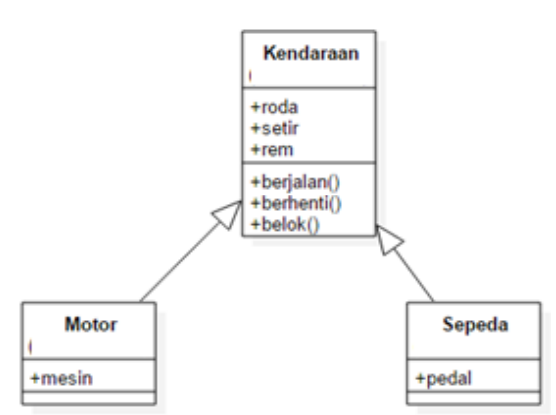

Pada gambar di atas dapat dilihat terdapat 3 class yakni, class Kendaraan, Motor dan Sepeda. Class Kendaraan adalah supper class atau class induk dan class Motor dan Sepeda adalah child class atau class anak. Tanda apabila suatu class merupakan child dari dari suatu supper class adalah class tersebut memiliki tanda panah mengarah suatu class dan bentuk panahnya seperti gambar class diagram di atas.

Supper class bisa memiliki akses modifier bermacam-macam untuk atribut dan method yang class tersebut miliki. Dan ini memiliki arti bahwa parent class dapat tidak memberikan akses atribut atau methodnya pada sub classnya. Akses modifiernya sama pada saat kita mengerjakan praktikum encapsulation, yakni misalnya terdapat akses modifier private, default, protected, dan public.

Beberapa penggunaan kata kunci supper yang dapat kita gunakan apabila menggunakan inheritance adalah sebagai berikut.

- super.namaAtribut<br>
Merujuk/mengakses atribut dari parent class /superclass.

- super.namaMethod()<br>
Merujuk/memanggil method dari parent class /superclass.

- super()<br>
Merujuk / memanggil konstruktor parent class /superclass
Hanya bisa digunakan dibaris pertama dalam kontruktor.

- super(parameter1,	parameter2,dst)<br>
Merujuk	/ memanggil konstruktor berparamter	dari superklas.

Pada saat object dari sub class dibuat maka object dari supper classnya juga akan terbentuk.

## Percobaan

### Percobaan 1 (Extends)

Percobaan yang dilakukan pada percobaan 1 ini adalah melakukan percobaan extend dari class induk ke kelas child. 

Terdapat 3 class yang akan kita buat yakni class ClassA1841720002Andy, ClassB1841720002Andy, dan  Percobaan1_1841720002Andy. 

Pada percobaan ini ClassA1841720002Andy berfungsi sebagai class induk dari ClassB1841720002Andy. dan class Percobaan1_1841720002Andy adalah class yang berisi class main yang berisi method main yang nantinya akan diinstansiasi object dari class ClassB1841720002Andy dalam method main tersebut.

Gambar di bawah ini adalah screenshot hasil dari percobaan 1.

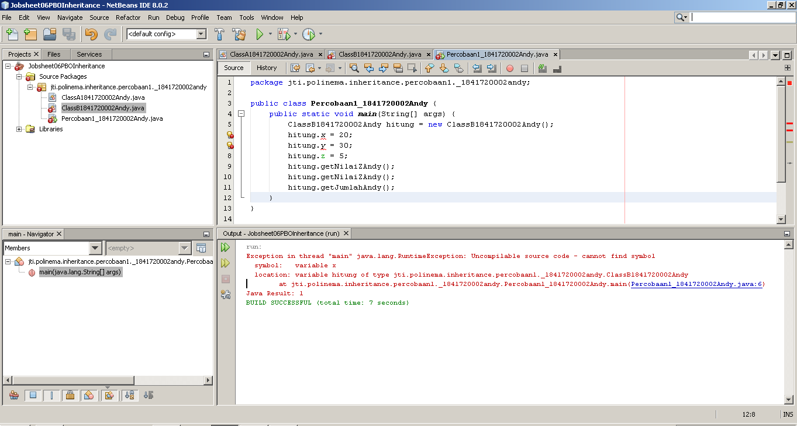

Terlihat pada screenshot tersebut tejadi eror pada saat kode program pada percobaan ini di run. Untuk pembahasan mengapa eror akan dijelaskan pada bagian pertanyaan.

Berikut ini adalah beberapa kode program yang dibuat pada percobaan 1, silahkan klik link-link di bawah ini :
- [ClassA1841720002Andy.java](../../src/6_inheritance/percobaan1/_1841720002andy/ClassA1841720002Andy.java)
- [ClassB1841720002Andy.java](../../src/6_inheritance/percobaan1/_1841720002andy/ClassB1841720002Andy.java)
- [Percobaan1_1841720002Andy.java](../../src/6_inheritance/percobaan1/_1841720002andy/Percobaan1_1841720002Andy.java)

Setelah kita mengerjakan percobaan di atas, selanjutnya adalah menjawab beberapa pertanyaan di bawah ini.

**Pertanyaan**
1. Pada	percobaan 1 diatas program yang dijalankan terjadi error, kemudian perbaiki sehingga program tersebut bisa dijalankan dan tidak error!<br>
   **Jawab:**<br>
   Program tersebut error karena class ClassB1841720002Andy belum mengextends class ClassA1841720002Andy.

   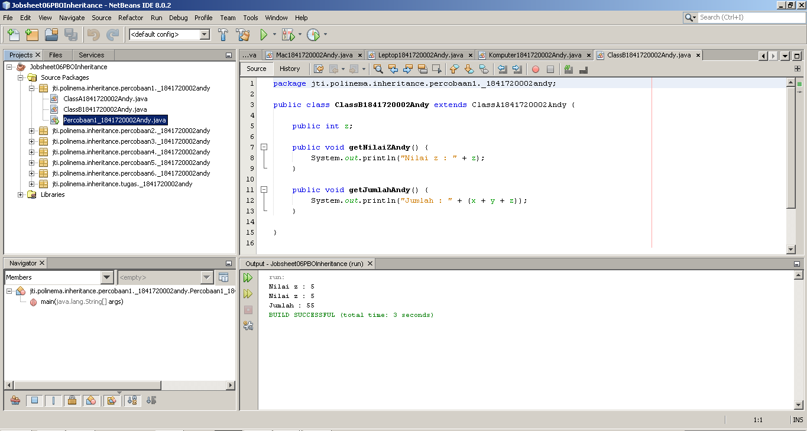

   Cara memperbaikinya adalah dengan cara menambahkan **extends ClassA1841720002Andy** disamping penamaan class ClassB1841720002Andy.

2. Jelaskan	apa	penyebab	program pada	percobaan	1	ketika	dijalankan	terdapat	error!<br>
   **Jawab:**<br>
   Program tersebut error karena class ClassB1841720002Andy belum mengextend class ClassA1841720002Andy.

   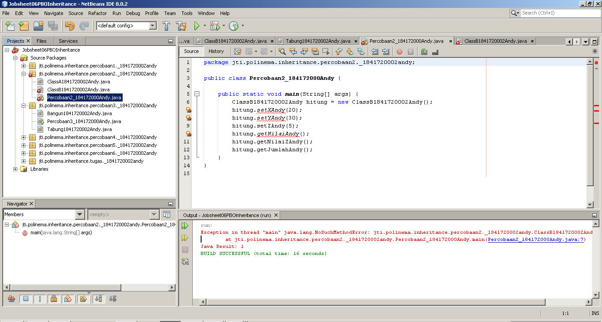

   Pada gambar di atas dapat dilihat bahwa class ClassB1841720002Andy belum mengextends class ClassA1841720002Andy.


### Percobaan 2 (Hak Akses)

Percobaan yang dilakukan pada percobaan 2 ini adalah melakukan percobaan penggunaan hak akses pada inherintance 

Terdapat 3 class yang akan kita buat yakni class ClassA1841720002Andy, ClassB1841720002Andy, dan  Percobaan2_1841720002Andy. 

Percobaan yang dilakukan hampir sama dengan percobaan 1, namun pada percobaan ini atribut di class ClassA1841720002Andy dan ClassB1841720002Andy menggunakan akses modifier tipe private

Gambar di bawah ini adalah screenshot hasil dari percobaan 2.


Terlihat pada screenshot tersebut tejadi eror pada saat kode program pada percobaan ini di run. Untuk pembahasan mengapa eror akan dijelaskan pada bagian pertanyaan.

Berikut ini adalah beberapa kode program yang dibuat pada percobaan 2, silahkan klik link-link di bawah ini :
- [ClassA1841720002Andy.java](../../src/6_inheritance/percobaan2/_1841720002andy/ClassA1841720002Andy.java)
- [ClassB1841720002Andy.java](../../src/6_inheritance/percobaan2/_1841720002andy/ClassB1841720002Andy.java)
- [Percobaan1_1841720002Andy.java](../../src/6_inheritance/percobaan2/_1841720002andy/Percobaan2_184172000Andy.java)

Setelah kita mengerjakan percobaan di atas, selanjutnya adalah menjawab beberapa pertanyaan di bawah ini.

**Pertanyaan**
1. Pada	percobaan 2 diatas program yang dijalankan terjadi error, kemudian perbaiki sehingga program tersebut bisa dijalankan dan tidak error!**<br>
   **Jawab:**<br>
   Gambar di bawah ini adalah screenshot hasil percobaan 2 seletah di modifikasi.

   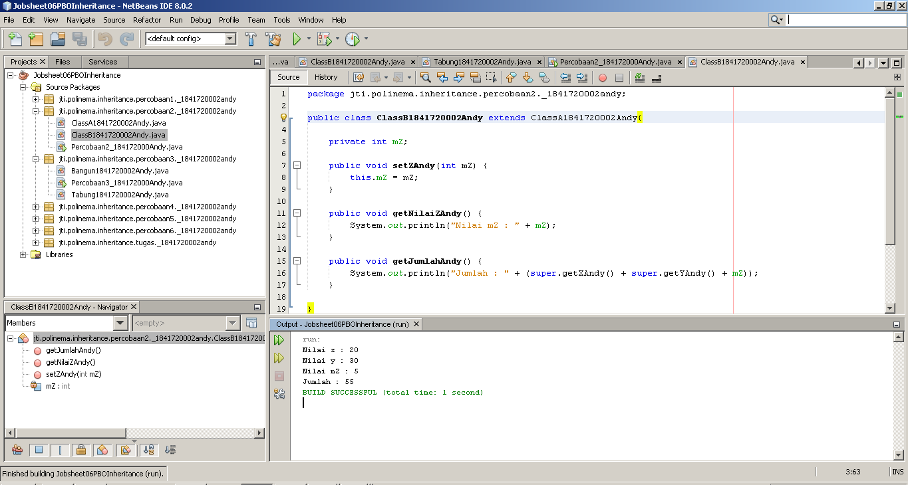

   Modifikasi yang dilakukan adalah pemberian extends pada class ClassB1841720002Andy dan pemanggilan nilai x dan y menggunakan getter yang ada pada class ClassA1841720002Andy untuk mendapatkan nilai dan y.

2. Jelaskan	apa	penyebab	program pada	percobaan	2	ketika	dijalankan	terdapat	error!<br>
   **Jawab:**<br>
   Eror yang terjadi disebabkan oleh class ClassB1841720002Andy belum mengextends class ClassA1841720002Andy dan ClassB1841720002Andy melakukan pengaksesan secara langsung terhadap nilai atribut x dan y, dimana akses modifier kedua atribut ini adalah private.

### Percobaan 3 (Super)

Percobaan yang dilakukan pada percobaan 3 ini adalah melakukan percobaan penggunaan super pada inherintance 

Terdapat 3 class yang akan kita buat yakni class Bangun1841720002Andy, Percobaan3_184172000Andy, dan  Tabung1841720002Andy. 

Gambar di bawah ini adalah screenshot hasil dari percobaan 3.

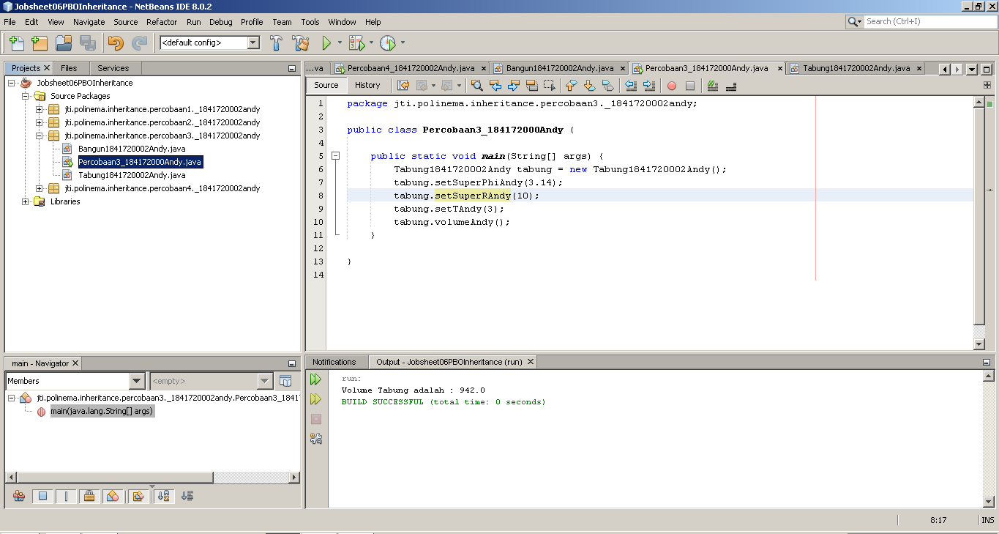

Berikut ini adalah beberapa kode program yang dibuat pada percobaan 3, silahkan klik link-link di bawah ini :
- [Bangun1841720002Andy.java](../../src/6_inheritance/percobaan3/_1841720002andy/Bangun1841720002Andy.java)
- [Percobaan3_184172000Andy.java](../../src/6_inheritance/percobaan3/_1841720002andy/Percobaan3_184172000Andy.java)
- [Tabung1841720002Andy.java](../../src/6_inheritance/percobaan3/_1841720002andy/Tabung1841720002Andy.java)

Setelah kita mengerjakan percobaan di atas, selanjutnya adalah menjawab beberapa pertanyaan di bawah ini.

**Pertanyaan**
1. Jelaskan fungsi “super” pada potongan program berikut di	class	Tabung!<br>
   
   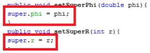

   **Jawab:**<br>
   Fungsi dari supper tersebut adalah memanggil atribut dari class supper.

2. Jelaskan	fungsi “super” dan “this” pada potongan program	berikut	di class Tabung!<br>
   
   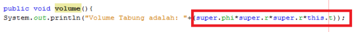

    **Jawab:**<br>
   Fungsi dari super adalah memanggil nilai dari atribut yang berada di class super yakni phi dan r. Fungsi dari this adalah menandakan bahwa atribut tersebut berasal dari class itu sendiri.

3. Jelaskan	mengapa	pada class Tabung tidak dideklarasikan atribut “phi” dan “r” tetapi class tersebut dapat mengakses	atribut tersebut! <br>
    **Jawab:**<br>
    Karena class Tabung1841720002Andy merupakan sub class dari class Bangun1841720002Andy. Dan class ini jugan memanggil atribut phi dan r menggunakan super.

### Percobaan 4 (Super Constuctor)

Percobaan yang dilakukan pada percobaan 4 ini adalah melakukan percobaan penggunaan super constructor pada inherintance 

Terdapat 4 class yang akan kita buat yakni class ClassA1841720002Andy, ClassB1841720002Andy, ClassC1841720002Andy, dan  Percobaan4_1841720002Andy. 

Gambar di bawah ini adalah screenshot hasil dari percobaan 3.

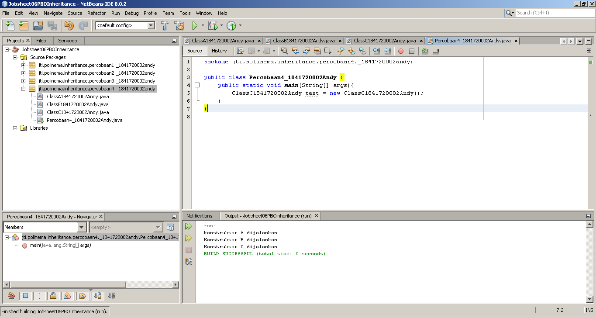

Berikut ini adalah beberapa kode program yang dibuat pada percobaan 4, silahkan klik link-link di bawah ini :
- [ClassA1841720002Andy.java](../../src/6_inheritance/percobaan4/_1841720002andy/ClassA1841720002Andy.java)
- [ClassB1841720002Andy.java](../../src/6_inheritance/percobaan4/_1841720002andy/ClassB1841720002Andy.java)
- [ClassC1841720002Andy.java](../../src/6_inheritance/percobaan4/_1841720002andy/ClassC1841720002Andy.java)
- [Percobaan4_1841720002Andy.java](../../src/6_inheritance/percobaan4/_1841720002andy/Percobaan4_1841720002Andy.java)
  
Setelah kita mengerjakan percobaan di atas, selanjutnya adalah menjawab beberapa pertanyaan di bawah ini.

**Pertanyaan**
1. Pada	percobaan 4 sebutkan mana class yang termasuk superclass	dan	subclass, kemudian jelaskan alasannya!<br>
   **Jawab:**<br>
  **-** class ClassA1841720002Andy merupakan superclass dari class ClassB1841720002Andy karena class ClassB1841720002Andy mengextends class ClassA1841720002Andy. Dan ClassB1841720002Andy merupakan subclass dari class ClassA1841720002Andy.

  **-** class ClassB1841720002Andy merupakan superclass dari class ClassC1841720002Andy karena class ClassC1841720002Andy mengextends class ClassB1841720002Andy. Dan ClassC1841720002Andy merupakan subclass dari class ClassA1841720002Andy.


2. Ubahlah	isi	konstruktor	default	ClassC	seperti	berikut:<br>
   
   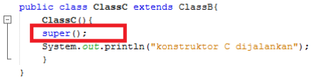

   Tambahkan kata super() di baris Pertama dalam konstruktor defaultnya. Coba jalankan kembali class Percobaan 4 dan	terlihat	tidak ada perbedaan dari hasil outputnya!

    **Jawab:**<br>
   Hasilnya sama saja, tidak ada perbedaan yang terjadi,

3. Ubalah isi konstruktor default ClassC seperti berikut:<br>
   
    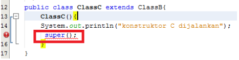

    Ketika mengubah	posisi super() dibaris kedua dalam	kontruktor	defaultnya dan terlihat ada error. Kemudian	kembalikan	super()	kebaris	pertama	seperti	sebelumnya,	maka errornya akan hilang. Perhatikan hasil keluaran ketika class Percobaan4 dijalankan.	Kenapa bisa tampil output seperti berikut pada saat instansiasi	objek test dari class ClassC?<br>

    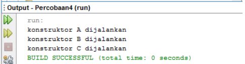

    Jelaskan bagaimana urutan proses jalannya konstruktor saat	objek test dibuat!
    **Jawab:**<br>
    Ketika konstruktor di class ClassC1841720002Andy dijalankan maka konstruktor di ClassB1841720002Andy juga dijalankan dan konstruktor di class ClassA1841720002Andy juga dijalankan juga.

4. Apakah	fungsi	super()	pada	potongan	program	dibawah	ini	di	ClassC!
   
   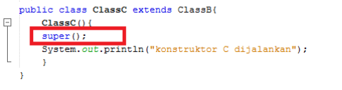

   **Jawab:**<br>
    Memanggil konstruktor dari class ClassB1841720002Andy.


### Percobaan 5

Percobaan yang dilakukan pada percobaan 5 ini adalah melakukan percobaan inheritance yang lebih rumit.

Terdapat 4 class yang akan kita buat yakni class Inheritance1_1841720002Andy, Karyawan1841720002Andy, Manager1841720002Andy, dan  Staff1841720002Andy. 

Gambar di bawah ini adalah screenshot hasil dari percobaan 5.

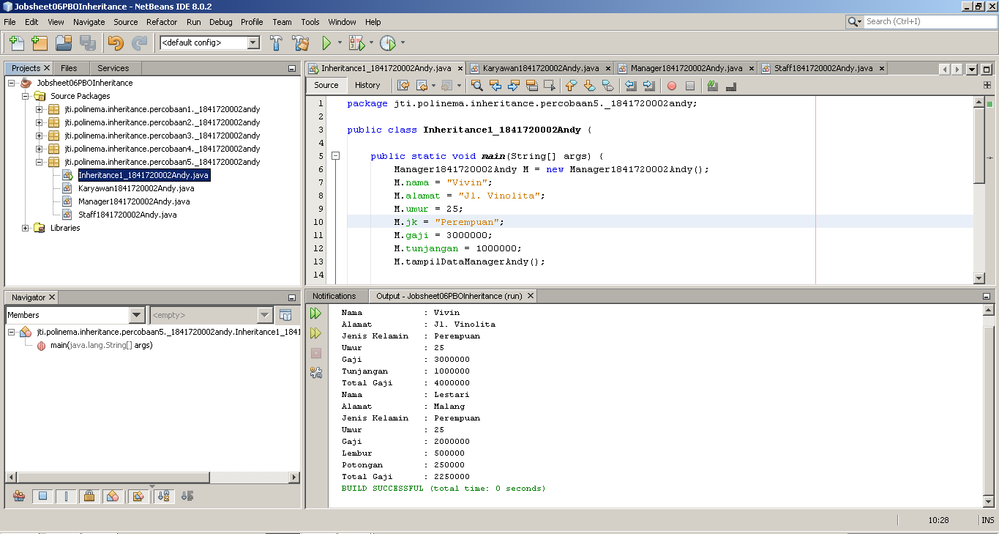

Berikut ini adalah beberapa kode program yang dibuat pada percobaan 5, silahkan klik link-link di bawah ini :
- [Inheritance1_1841720002Andy.java](../../src/6_inheritance/percobaan5/_1841720002andy/Inheritance1_1841720002Andy.java)
- [Karyawan1841720002Andy.java](../../src/6_inheritance/percobaan5/_1841720002andy/Karyawan1841720002Andy.java)
- [Manager1841720002Andy.java](../../src/6_inheritance/percobaan5/_1841720002andy/Manager1841720002Andy.java)
- [Staff1841720002Andy.java](../../src/6_inheritance/percobaan5/_1841720002andy/Staff1841720002Andy.java)

Setelah kita mengerjakan percobaan di atas, selanjutnya adalah menjawab beberapa pertanyaan di bawah ini.

**Pertanyaan**
1. Sebutkan	class mana yang termasuk super class dan sub class	dari percobaan 5 diatas!<br>
   **Jawab:**<br>
   super class : Karyawan1841720002Andy.<br>
   sub class : Manager1841720002Andy dan Staff1841720002Andy.

2. Kata	kunci apakah yang digunakan	untuk menurunkan suatu class ke class yang lain?<br>
    **Jawab:**<br>
   extends

3. Perhatikan kode program pada class Manager, atribut apa saja	yang dimiliki oleh class tersebut? Sebutkan atribut	mana saja yang	diwarisi dari class Karyawan!<br>
    **Jawab:**<br>
    Pada class Manager1841720002Andy memiliki atribut tunjangan yang bertipe integer.<br>
    Atribut yang diwarisi dari class Karyawan1841720002Andy adalah atribut gaji.

4. Jelaskan	kata kunci super pada potongan program dibawah ini yang	terdapat pada class	Manager!

    ```java
    System.out.print("Total Gaji    ="+(supper.gaji+tunjangan))
    ```

   **Jawab:**<br>
    Kata super di sini digunakan untuk menrujuk pada class parent yang dimana untuk mengakses atribut gaji pada class parent.

5. Program	pada percobaan 5 diatas	termasuk dalam	jenis inheritance apa? Jelaskan	alasannya!<br>
   **Jawab:**<br>
    Percobaan 2 termasuk dalam single inheritance, karena hanya memiliki 1 class parent (Karyawan1841720002Andy).

### Percobaan 6

Percobaan yang dilakukan pada percobaan 5 ini adalah melakukan percobaan multilevel inherintance.

Terdapat 6 class yang akan kita buat yakni class Inheritance1_1841720002Andy, Karyawan1841720002Andy, Manager1841720002Andy, Staff1841720002Andy, StaffHarian1841720002Andy, dan StaffTetap1841720002Andy. 

Gambar di bawah ini adalah screenshot hasil dari percobaan 6.

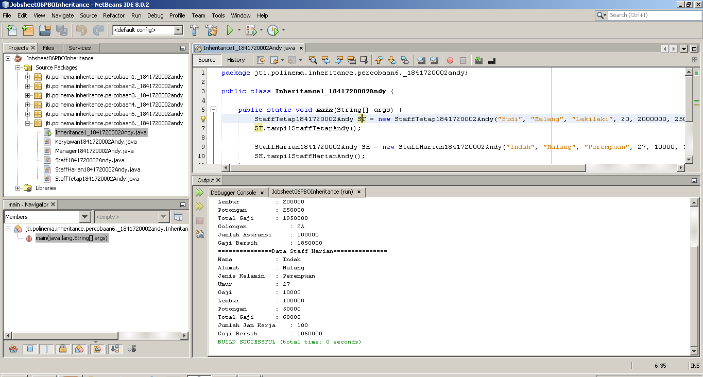

Berikut ini adalah beberapa kode program yang dibuat pada percobaan 6, silahkan klik link-link di bawah ini :
- [Inheritance1_1841720002Andy.java](../../src/6_inheritance/percobaan6/_1841720002andy/Inheritance1_1841720002Andy.java)
- [Karyawan1841720002Andy.java](../../src/6_inheritance/percobaan6/_1841720002andy/Karyawan1841720002Andy.java)
- [Manager1841720002Andy.java](../../src/6_inheritance/percobaan6/_1841720002andy/Manager1841720002Andy.java)
- [Staff1841720002Andy.java](../../src/6_inheritance/percobaan6/_1841720002andy/Staff1841720002Andy.java)
- [StaffHarian1841720002Andy.java](../../src/6_inheritance/percobaan6/_1841720002andy/StaffHarian1841720002Andy.java)
- [StaffTetap1841720002Andy.java](../../src/6_inheritance/percobaan6/_1841720002andy/StaffTetap1841720002Andy.java)

Setelah kita mengerjakan percobaan di atas, selanjutnya adalah menjawab beberapa pertanyaan di bawah ini.

**Pertanyaan**
1. Berdasarkan class diatas manakah	yang termasuk single inheritance dan mana	yang termasuk multilevel	inheritance?<br>
   **Jawab:**<br>
   Yang termasuk single inheritance :
   Manager1841720002Andy.

   Yang merupakan multilevel inheritance:
   StaffTetap1841720002Andy dan StaffHarian1841720002Andy yang merupakan turunan dari Staff1841720002Andy, dan class Staff1841720002Andy merupakan turunan dari Karyawan1841720002Andy.

2. Perhatikan kode program class StaffTetap	dan	StaffHarian, atribut apa saja yang dimiliki oleh class tersebut? Sebutkan atribut mana saja yang diwarisi dari class Staff!<br>
    **Jawab:**<br>
   Atribut yang dimiliki StaffTetap1841720002Andy:
   - golongan.
   - asuransi.
   - Atribut yang dimiliki 
  
    StaffHarian1841720002Andy:
    - jmlJamKerja.

    Atribut warisan di class StaffTetap1841720002Andy dan StaffHarian1841720002Andy:
    - nama.
    - alamat.
    - jk.
    - umur.
    - gaji.
    - lembur.
    - potongan.

2. Apakah fungsi potongan program berikut pada class StaffHarian?<br>

    ```java
    super(nama, alamat, jk, umur, gaji, lembur, potongan);
    ```

    **Jawab:**<br>
    Fungsi potongan program tersebut digunakan untuk meng-akses atribut nama, alamat, jk, umur, gaji, lembur dan potongan pada class Staff1841720002Andy yang dimana class Staff1841720002Andy sebagai class parent.

2. Apakah fungsi potongan program berikut pada class StaffHarian?

    ```java
    super.tampilDataStaff();
    ```

   **Jawab:**<br>
    asdasdasds

3. Perhatikan kode program dibawah ini yang terdapat pada class StaffTetap 
   
   ```java
    System.out.println("Gaji Bersih     ="+(gaji+lembur-potongan-asuransi));
    ```
   
   Terlihat dipotongan program diatas atribut gaji, lembur dan potongan	dapat diakses langsung. Kenapa	hal	ini	bisa terjadi dan bagaimana class StaffTetap memiliki	atribut	gaji, lembur, dan	potongan padahal dalam class tersebut tidak dideklarasikan atribut gaji lembur, dan potongan?
   **Jawab:**<br>
    Fungsi dari potongan program tersebut adalah untuk memanggil / meng-akses method bernama tampilDataStaffAndy di class parent (Staff1841720002Andy).


## Tugas

Buatlah	sebuah program dengan konsep pewarisan seperti	pada class diagram berikut ini.
Kemudian buatlah instansiasi objek untuk menampilkan data pada class Mac, Windows dan Pc!.

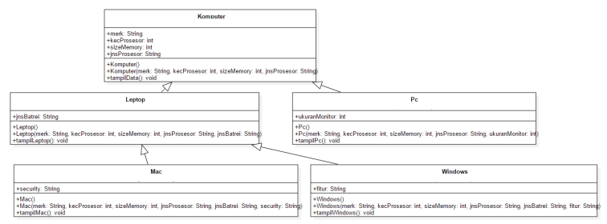

**Jawab:**

Gambar di bawah ini adalah screenshot hasil dari soal tugas di atas.

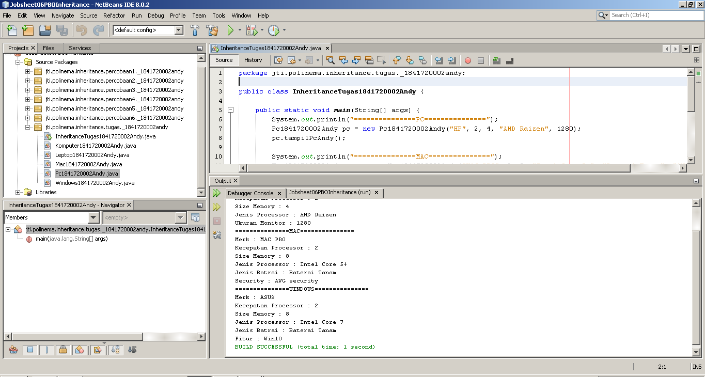

Berikut ini adalah beberapa kode program yang dibuat pada bagian tugas, silahkan klik link-link di bawah ini :
- [Inheritance1_1841720002Andy.java](../../src/6_inheritance/tugas/_1841720002andy/InheritanceTugas1841720002Andy.java)
- [Komputer1841720002Andy.java](../../src/6_inheritance/tugas/_1841720002andy/Komputer1841720002Andy.java)
- [Leptop1841720002Andy.java](../../src/6_inheritance/tugas/_1841720002andy/Leptop1841720002Andy.java)
- [Mac1841720002Andy.java](../../src/6_inheritance/tugas/_1841720002andy/Mac1841720002Andy.java)
- [Pc1841720002Andy.java](../../src/6_inheritance/tugas/_1841720002andy/Pc1841720002Andy.java)
- [Windows1841720002Andy.java](../../src/6_inheritance/tugas/_1841720002andy/Windows1841720002Andy.java)

## Kesimpulan

Kesimpulan yang bisa kita dapatkan dari praktikum kali ini adalah tentang salah satu konsep dari empat konsep PBO yakni inheritance. Inheritance ini sendiri merupakan penurunan atau pewarisan atribut atau method dari class yang bersifat umum ke kelas yang lebih spesifik. Inti dari	pewarisan adalah sifat reusable dari konsep object oriented. Setiap subclass akan “mewarisi”	sifat dari	 superclass selama bersifat protected ataupun	public. Terdapat 3 bentuk pewarisan: single	 inheritance, multilevel inheritance, dan multiple inheritance

Diharapkan setelah pertemuan ini kita bisa semakin paham bagaimana cara kerja OOP, semakin mudah ketika membuat program yang menggunakan konsep OOP dan semakin mudah ketika belajar materi selanjutnya. 

## Pernyataan Diri

Saya menyatakan isi tugas, kode program, dan laporan praktikum ini dibuat oleh saya sendiri. Saya tidak melakukan plagiasi, kecurangan, menyalin/menggandakan milik orang lain.

Jika saya melakukan plagiasi, kecurangan, atau melanggar hak kekayaan intelektual, saya siap untuk mendapat sanksi atau hukuman sesuai peraturan perundang-undangan yang berlaku.

Ttd,

***(Oktaviano Andy Suryadi)***
