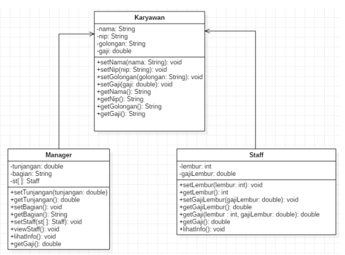
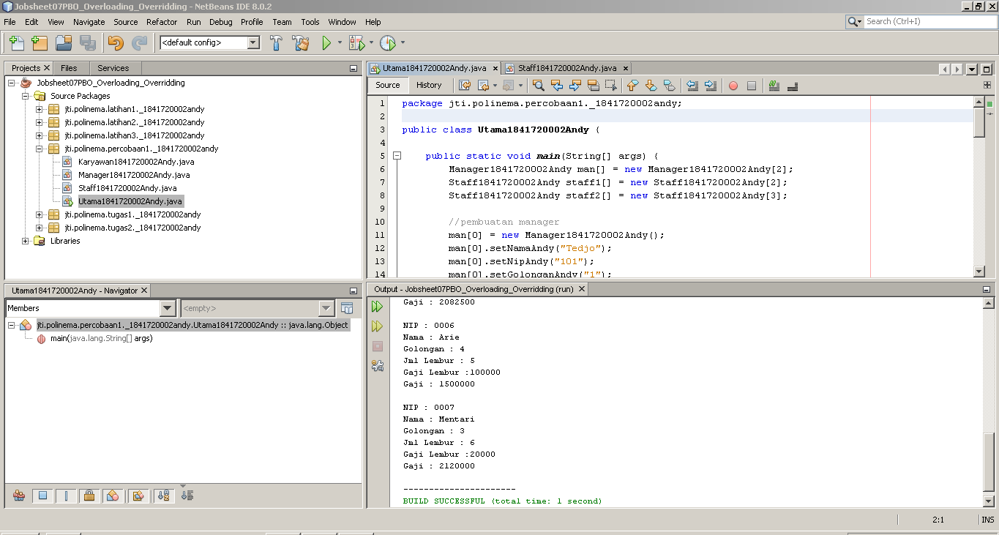
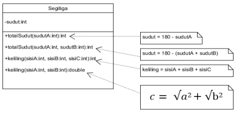
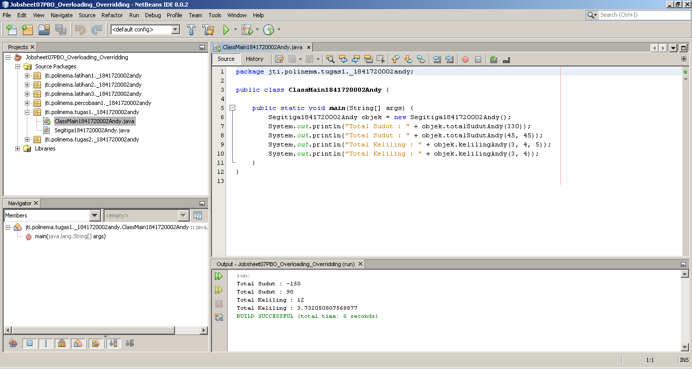
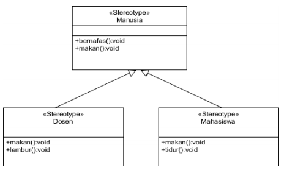
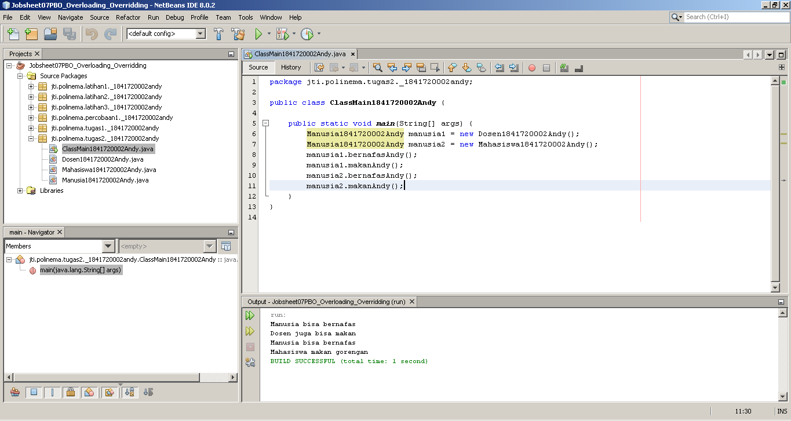

# Laporan Praktikum #7 - Overloading dan Overriding

## Kompetensi

Setelah menempuh pokok bahasan ini, mahasiswa mampu : <br>
a. Memahami konsep overloading dan overriding,<br>
b. Memahami perbedaan overloading dan overriding,<br>
c. Ketepatan dalam mengidentifikasi method overriding dan overloading<br>
d. Ketepatan dalam mempraktekkan instruksi pada jobsheet<br>
e. Mengimplementasikan method overloading dan overriding.

## Ringkasan Materi

Pada praktikum kali ini, kita belajar tentang **Overloading** dan **Overriding**.

**Overloading** sendiri adalah adalah menuliskan kembali method dengan nama yang sama pada suatu class. Tujuannya dapat memudahkan penggunaan/pemanggilan method dengan fungsionalitas yang mirip.

**Overloading memiliki aturan pendeklarasian**, aturan-aturan tersebut adalah sebagai berikut :

1. Nama method harus sama.
2. Daftar parameter harus berbeda.
3. Return type boleh sama, juga boleh berbeda
   
Terdapat beberapa kriteria daftar parameterer atau signature yang perlu diperhatikan dalam pengunaan overloading, yaitu :

1. Perbedaan daftar parameter bukan hanya terjadi pada perbedaan banyaknya parameter, tetapi juga urutan dari parameter tersebut. Misalnya saja dua buah parameter berikut ini:
   - Function_member (int x, string n)
   - Function_member (String n, int x)
  
    Dua parameter tersebut juga di anggap berbeda daftar parameternya.
2. Daftar parameter tidak terkait dengan penamaan variabel yang ada dalam parameter. Misalnya saja 2 daftar parameter berikut :
   - function_member(int x)
   - function_member(int y)

    Dua daftar parameter diatas dianggap sama karena yang berbeda hanya
penamaan variable parameternya saja.

Overloading juga bisa terjadi antara parent class dengan subclass-nya jika memenuhi ketiga syarat overload. Ada beberapa aturan overloading yaitu:
1. Primitive widening conversion didahulukan dalam overloading dibandingkan boxing dan var args.
2. Kita tidak dapat melakukan proses widening dari tipe wrapper ke tipe wrapper lainnya (mengubah Integer ke Long).
3. Kita tidak dapat melakukan proses widening dilanjutkan boxing (dari int menjadi Long)
4. Kita dapat melakukan boxing dilanjutkan dengan widening (int dapat menjadi Object melalui Integer)
5. Kita dapat menggabungkan var args dengan salah satu yaitu widening atau boxing 

Setelah kita belajar tentang overloading selanjutnya kita belajar tentang **overriding**.

**Overriding** adalah adalah Sublass yang berusaha memodifkasi tingkah laku yang diwarisi dari superclass. Tujuannya subclass dapat memiliki tingkah laku yang lebih spesifik sehingga dapat dilakukan dengan cara mendeklarasikan kembali method milik parent class di subclass.

Deklarasi method pada subclass harus sama dengan yang terdapat di super class. Kesamaan pada:
1. Nama
2. Return type (untuk return type : class A atau merupakan subclass dari class A)
3. Daftar parameter (jumlah, tipe dan urutan)
   
Intinya method tersebut harus sama persis namun hanya isi dari method tersebut yang berbeda.

Apabila kita menggunakan overriding,**method pada parent class disebut overridden method** dan **method pada subclass disebut overriding method.** Ada beberapa aturan method didalam overriding, yaitu:
1. Mode akses overriding method harus sama atau lebih luas dari pada overridden method.
2. Subclass hanya boleh meng-override method superclass satu kali saja, tidak boleh ada lebih dari satu method pada kelas yang sama persis.
3. Overriding method tidak boleh throw checked exceptions yang tidak
dideklarasikan oleh overridden method.

## Percobaan

### Percobaan 1

Pada percobaan 1 ini, percobaan yang dilakukan adalah melakukan override dan overloading method yang berasal dari super class ke clild class.

Untuk pembuatan classnya kita mengikuti class diagram dan kode program yang sudah ada pada percobaan 1.

Gambar di bawah ini adalah class diagram pada percobaan 1.



Berdasarkan class diagram tersebut nantinya kita akan memiliki 3 class dari class diagram dan 1 class main untuk yang berisi method main untuk menjalankan keseluruhan kode program. 3 class utama tersebut yakni Karyawan1841720002Andy, Manager1841720002Andy dan Staff1841720002Andy.

Class Karyawan1841720002Andy merupakan super class dari class Manager1841720002Andy dan Staff1841720002Andy.

Overriding dan overloading yang akan kita lakukan adalah melakukan overriding dan overloading pada method getGajiAndy() pada class Karyawan1841720002Andy ke dalam class Manager1841720002Andy dan Staff1841720002Andy sehingga kedua child class tersebut memiliki method getGajiAndy() yang berbeda namun berasal dari method yang sama yakni getGajiAndy() dari class Karyawan1841720002Andy.

Gambar di bawah ini adalah hasil dari seluruh kode program pada percobaan 1.



Untuk melihat lebih jelasnya bagaimana overloading dan overriding pada method getGajiAndy() silahkan klik link kode program di bawah ini.

[1. Class Karyawan1841720002Andy](../../src/7_Overriding_dan_Overloading/percobaan1/_1841720002andy/Karyawan1841720002Andy.java)<br>
[2. Class Manager1841720002Andy](../../src/7_Overriding_dan_Overloading/percobaan1/_1841720002andy/Manager1841720002Andy.java)<br>
[3. Class Staff1841720002Andy](../../src/7_Overriding_dan_Overloading/percobaan1/_1841720002andy/Staff1841720002Andy.java)<br>
[4. Class Utama1841720002Andy](../../src/7_Overriding_dan_Overloading/percobaan1/_1841720002andy/Utama1841720002Andy.java)

### Latihan

Setelah kita melakukan percobaan pada percobaan 1, selanjutnya adalah mengerjakan latihan - latihan di bawah ini. Tujuan latihan ini adalah mengasah apakah kita sudah paham atau belum tentang overloading dan overriding.

Berikut ini adalah latihan yang harus dikerjakan :

#### Latihan 1
```java
package jti.polinema.latihan1._1841720002andy;

public class Perkalianku1841720002Andy {

    void perkalianAndy(int mA, int mB) {
        System.out.println(mA * mB);
    }

    void perkalianAndy(int mA, int mB, int mC) {
        System.out.println(mA * mB * mC);
    }

    public static void main(String[] args) {
        Perkalianku1841720002Andy objek = new Perkalianku1841720002Andy();
        objek.perkalianAndy(25, 43);
        objek.perkalianAndy(34, 23, 56);
    }
    
}
```
Berdasarkan kode program tersebut, selanjutnya kita akan mengerjakan soal di bawah ini.
1. Dari source coding diatas terletak dimanakah overloading?<br>
**Jawab:**<br>
overloading terjadi pada method :
    ```java
    void perkalianAndy(int mA, int mB) {
        System.out.println(mA * mB);
    }
    ```
    Kemudia method tersebut dioverloading menjadi :
    ```java
    void perkalianAndy(int mA, int mB, int mC) {
        System.out.println(mA * mB * mC);
    }
    ```

2. Jika terdapat overloading ada berapa jumlah parameter yang berbeda?<br>
**Jawab:**<br>
Terdapat tiga parameter yang berbeda, yang awalnya parameternya dua setelah dioverloading parameternya diubah menjadi tiga.

#### Latihan 2

```java
package jti.polinema.latihan2._1841720002andy;

public class Perkalianku1841720002Andy {

    void perkalianAndy(int mA, int mB) {
        System.out.println(mA * mB);
    }

    void perkalianAndy(double mA, double mB) {
        System.out.println(mA * mB);
    }

    public static void main(String[] args) {
        Perkalianku1841720002Andy objek = new Perkalianku1841720002Andy();

        objek.perkalianAndy(25, 43);
        objek.perkalianAndy(34.56, 23.7);
    }
    
}
```
Berdasarkan kode program tersebut, selanjutnya kita akan mengerjakan soal di bawah ini.
1. Dari source coding diatas terletak dimanakah overloading?<br>
**Jawab:**<br>
overloading terjadi pada method :
    ```java
    void perkalianAndy(int mA, int mB) {
        System.out.println(mA * mB);
    }
    ```
    Kemudia method tersebut dioverloading menjadi :
    ```java
    void perkalianAndy(double mA, double mB) {
        System.out.println(mA * mB);
    }
    ```

2. Jika terdapat overloading ada berapa tipe parameter yang berbeda?<br>
**Jawab:**<br>
Terdapat dua tipe parameter yang berbeda, yang awalnya parameternya bertipe int seletah dioverloading parameternya diubah menjadi bertipe double.

#### Latihan 3

```java
public class Ikan1841720002Andy {

    public void swimAndy() {
        System.out.println("Ikan bisa berenang");
    }
    
}

public class Piranha1841720002Andy extends Ikan1841720002Andy {

    @Override
    public void swimAndy() {
        System.out.println("Piranha bisa makan daging");
    }

}

public class Fish1841720002Andy {

    public static void main(String[] args) {
        Ikan1841720002Andy a = new Ikan1841720002Andy();
        Ikan1841720002Andy b = new Piranha1841720002Andy();
        a.swimAndy();
        b.swimAndy();
    }
    
}
```
Berdasarkan kode program tersebut, selanjutnya kita akan mengerjakan soal di bawah ini.
1. Dari source coding diatas terletak dimanakah overriding?<br>
**Jawab:**<br>
overriding terjadi pada method swimAndy() pada class Ikan1841720002Andy, method tersebut berisi :
    ```java
    public void swimAndy() {
        System.out.println("Ikan bisa berenang");
    }
    ```
    Kemudia method tersebut dioverriding menjadi pada class Piranha1841720002Andy menjadi :
    ```java
    @Override
    public void swimAndy() {
        System.out.println("Piranha bisa makan daging");
    }
    ```

2. Jabarkanlah apabila sourcoding diatas jika terdapat overriding?<br>
**Jawab:**<br>
Overriding terjadi pada method swimAndy() dari class Ikan1841720002Andy ke class Piranha1841720002Andy. Overriding tersebut dapat dilakukan karena class Ikan1841720002Andy merupakan super class dari Class Piranha1841720002Andy.

## Tugas

Setelah belajar tentang overloading dan overriding dan juga mengerjakan latihan, langkah selanjutnya adalah mengerjakan tugas.

Berikut ini adalah tugas yang harus dikerjakan :

**1. Overloading**<br>Implementasikan konsep overloading pada class diagram dibawah ini :



**Jawab :**<br>
Pada class Segitiga1841720002Andy terdapat satu atri bernama sudut. Atribut ini bertipe int dengan akses modifier private. Kemudian terdapat 4 method, dimana method tersebut merupakan overloading dari method-method yang ada di dalam class tersebut. Contohny adalah method totalSudutAndy(int mSudutA) menjadi totalSudutAndy(int mSudutA, int mSudutB).

Gambar di bawah ini adalah hasil run dari kode program di atas.



Berikut ini adalah file-file java yang terkait pada tugas 1 ini. Klik link berikut ini untuk melihat lebih lanjut :<br>
[1. Class Segitiga1841720002Andy](../../src/7_Overriding_dan_Overloading/tugas1/_1841720002andy/Segitiga1841720002Andy.java)<br>
[2. Class ClassMain1841720002Andy](../../src/7_Overriding_dan_Overloading/tugas1/_1841720002andy/ClassMain1841720002Andy.java)


**2. Overrinding**<br>Implementasikan class diagram dibawah ini dengan menggunakan teknik dynamic method dispatch :



**Jawab :**<br>
Terdapat empat class yang akan kita buat, yakni class Manusia1841720002Andy, Dosen1841720002Andy, Mahasiswa1841720002Andy, dan ClassMain1841720002Andy.

Class Manusia1841720002Andy merupakan super class dari Class Dosen1841720002Andy dan Mahasiswa1841720002Andy. 

Class Dosen1841720002Andy dan Mahasiswa1841720002Andy nantinya akan melakukan overide method makanAndy() dari class supernya yakni Manusia1841720002Andy.

Maksud dari dynamic method dispatch adalah ketika intansiasi object parent, object tersebut dinstansiasi dengan nama childnya. Sehingga parent tersebut dapat mengakses method yang yang sudah dioverride atau diturunkan ke childnya. 

Gambar di bawah ini adalah hasil run dari kode program di atas.



Berikut ini adalah file-file java yang terkait pada tugas 2 ini. Klik link berikut ini untuk melihat lebih lanjut :<br>
[1. Class Manusia1841720002Andy](../../src/7_Overriding_dan_Overloading/tugas2/_1841720002andy/Manusia1841720002Andy.java)<br>
[2. Class Dosen1841720002Andy](../../src/7_Overriding_dan_Overloading/tugas2/_1841720002andy/Dosen1841720002Andy.java)<br>
[3. Class Mahasiswa1841720002Andy](../../src/7_Overriding_dan_Overloading/tugas2/_1841720002andy/Mahasiswa1841720002Andy.java)<br>
[4. Class ClassMain1841720002Andy](../../src/7_Overriding_dan_Overloading/tugas2/_1841720002andy/ClassMain1841720002Andy.java)<br>

## Kesimpulan

Kesimpulan yang dapat kita ambil dari praktikum kali ini adalah, kita belajar tentang overloading dan overriding, bagaimana caraya melalukan kedua hal tersebut, peraturan-peraturan pada kedua hal tesebut, cara membuatnya, dll.

Diharapkan setelah pertemuan ini kita bisa semakin paham bagaimana cara kerja OOP, semakin mudah ketika membuat program yang menggunakan konsep OOP dan semakin mudah ketika belajar materi selanjutnya. 

## Pernyataan Diri

Saya menyatakan isi tugas, kode program, dan laporan praktikum ini dibuat oleh saya sendiri. Saya tidak melakukan plagiasi, kecurangan, menyalin/menggandakan milik orang lain.

Jika saya melakukan plagiasi, kecurangan, atau melanggar hak kekayaan intelektual, saya siap untuk mendapat sanksi atau hukuman sesuai peraturan perundang-undangan yang berlaku.

Ttd,

***(Oktaviano Andy Suryadi)***
