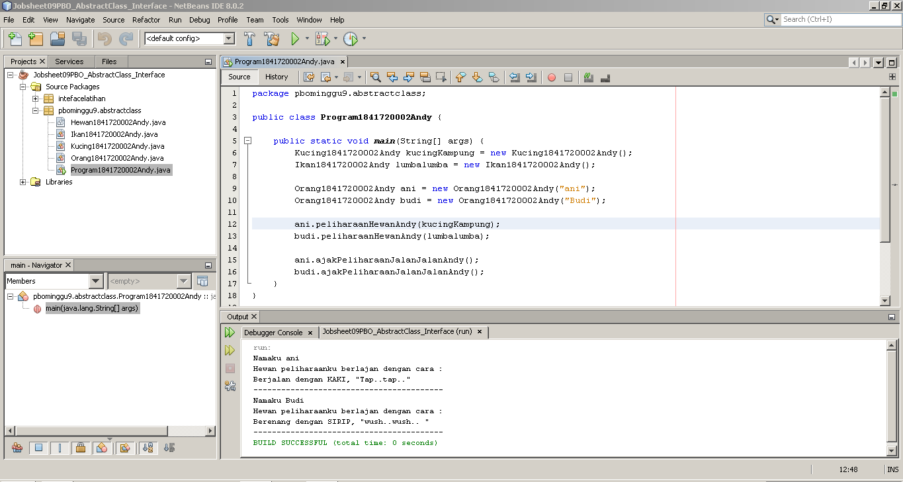

# Laporan Praktikum #9 - Abstract Class dan Interface

## Kompetensi

Setelah menyelesaikan lembar kerja ini mahasiswa diharapkan mampu:
1. Menjelaskan maksud dan tujuan penggunaan Abstract Class.
2. Menjelaskan maksud dan tujuan penggunaan Interface.
3. Menerapkan Abstract Class dan Interface di dalam pembuatan program.

## Ringkasan Materi

Pada praktikum kali ini kita belajar tetang Abstract Class dan Interface.

**Abstract Class** adalah class yang tidak dapat diinstansiasi namun dapat di-extend. Abstract class baru dapat dimanfaatkan ketika ia di-extend.

**Abstract Class** memiliki beberapa **karakteristik**, yaitu :
1. Dapat memiliki properties dan methods seperti class biasa.
2. Selalu memiliki methods yang tidak memiliki tubuh (hanya deklarasinya saja), disebut juga
abstract method.
3. Selalu dideklarasikan dengan menggunakan kata kunci abstract class.

**Kegunaan** dari **Abstract Class** adalah Menggambarkan sesuatu yang bersifat umum, yang hanya bisa berfungsi setelah ia dideskripsikan ke
dalam bentuk yang lebih spesifik.

**Interface** adalah struktur data yang hanya berisi abstract methods. Tidak ada apa-apa selain method
abstract pada interface, termasuk atribut getter dan setter. 

**Interface** juga memiliki **karakteristik**, yaitu:
1. Tidak ada apa-apa di dalamnya selain abstract methods.
2. Di konvensi bahasa pemrograman Java, namanya dianjurkan untuk selalu diawali dengan huruf kapital ‘I’.
3. Selalu dideklarasikan dengan menggunakan kata kunci interface.
4. Diimplementasikan dengan menggunakan kata kunci implements.

**Kegunaan** dari **Interface** adalah bertindak seperti semacam kontrak/syarat yang HARUS dipenuhi bagi suatu class agar class tersebut dapat dianggap sebagai ‘sesuatu yang lain’. Atau lebih mudahnya dalah seperti sebuah rancangan dari suatu hal.

## Percobaan

### Percobaan 1: Abstract Class

Pada percobaan 1 ini, kita akan mencoba menggunakan Abstract Class sesuai dengan studi kasus dan class diagram yang sudah ada di dalam percobaan 1 ini.

Berikut ini adalah studi kasus pada percobaan 1 :

Di dunia ini terdapat banyak jenis hewan. Semua hewan memiliki beberapa karakteristik yang sama, seperti contohnya semua hewan memiliki umur, hewan apapun itu,umurnya akan bertambah sama jumlahnya setiap tahun. 

Selain karakteristik yang sama, masing-masing hewan juga memiliki karakteristik yang berbeda satu dengan yang lainnya. Contohnya dalam hal bergerak. Cara kucing bergerak berbeda dengan cara ikan bergerak. Kucing bergerak dengan cara melangkahkan kaki-kakinya sedangkan ikan bergerak dengan cara menggerakkan siripnya.

Setiap orang yang memelihara hewan dapat mengajak hewan peliharaannya berjalan (membuat agar hewan peliharaannya bergerak). Namun orang yang memelihara hewan yang berbeda, akan berbeda pula cara hewan peliharaannya dalam bergerak.

Berdasarkan studi kasus diatas, berikut ini adalah diagram class dari studi kasus di atas:

Berdasarkan studi kasus dan diagram class diatas, maka pada percobaan 1 ini akan ada 5 class yang nantinya akan kita buat. Class tersebut yaitu : 
1. Class Hewan1841720002Andy sebagai abstract class.
2. Class Orang1841720002Andy.
3. Class Ikan1841720002Andy yang merupakan subclass dari class Orang1841720002Andy. 
4. Class Kucing1841720002Andy yang juga merupakan subclass dari class Orang1841720002Andy.
5. Class Program1841720002Andy sebagai class yang terdapat method main.

Berikut ini adalah screenshot hasil running dari kode program yang telah di buat di percobaan 1.

Bertikut ini adalah link untuk menuju kode program class-class yang sudah kita buat di percobaan 1 ini :  
1. [Class Orang1841720002Andy](../../src/9_Abstract_Class_dan_Interface/pbominggu9/abstractclass/Orang1841720002Andy.java) 
2. [Class Hewan1841720002Andy](../../src/9_Abstract_Class_dan_Interface/pbominggu9/abstractclass/Hewan1841720002Andy.java) 
3. [Class Kucing1841720002Andy](../../src/9_Abstract_Class_dan_Interface/pbominggu9/abstractclass/Kucing1841720002Andy.java) 
4. [Class Ikan1841720002Andy](../../src/9_Abstract_Class_dan_Interface/pbominggu9/abstractclass/Ikan1841720002Andy.java) 
5. [Class Program1841720002Andy](../../src/9_Abstract_Class_dan_Interface/pbominggu9/abstractclass/Program1841720002Andy.java) 

Setelah kita melakukan percobaan, selanjutnya adalah menjawab pertanyaan diskusi yang ada di bawah ini.

**Pertanyaan diskusi :**

1. Bolehkah apabila sebuah class yang meng-extend suatu abstract class tidak
mengimplementasikan method abstract yang ada di class induknya? Buktikan! 
**Jawab :** 
 Tidak boleh, karena apabila tidak mengimplementasikan method abstract yang ada di class induknya, maka akan terjadi eror.

    Screenshot di bawah ini adalah percobaan ketika saya menghapus dari method abstract yang sudah diimplementasikan dari class induknya.

    

     Solusinya adalah mengimplementasikan method abstract di class induknya.

    Percobaan lain yang saya lakukan adalah menambahkan satu lagi sebuah method abstract di class induk dan hanya mengimplementasikan salah satu method abstract di subclassnya, hasilnya adalah eror. Sehingga kesimpulannya adalah harus mengimplementasikan semua method abstract yang ada di class induk di subclassnya.

### Percobaan 2: Interface

Pada percobaan 2 ini kita akan mencoba menggunakan Interface sesuai dengan studi kasus dan class diagram yang sudah ada pada percobaan 2.

Berikut ini adalah studi kasus pada percobaan 2 :

Pada sebuah wisuda, seorang Rektor akan memberikan penghargaan sertifikat Cumlaude pada semua mahasiswa yang memenuhi persyaratan. Persyaratan agar seorang mahasiswa dapat disebut sebagai Cumlaude berbeda-beda antara mahasiswa Sarjana dan Pasca Sarjana.

Untuk menjadi cumlaude, mahasiswa Sarjana harus mengerjakan skripsi dan memiliki IPK lebih tinggi dari 3,51. Sedangkan untuk mahasiswa Pasca Sarjana, mereka harus mengerjakan tesis dan meraih IPK lebih tinggi dari 3,71.

Berdasarkan studi kasus di atas, berikut ini adalah diagram class dari studi kasus di atas.

Berdasarkan studi kasus dan diagram class diatas, maka pada percobaan 2 ini akan ada 6 class yang nantinya akan kita buat. Class tersebut yaitu : 
1. Class ICumlaude1841720002Andy sebagai interface.
2. Class Mahasiswa1841720002Andy.
3. Class PascaSarjana1841720002Andy yang merupakan subclass dari class Mahasiswa1841720002Andy dan akan mengimplementasikan method abstract dari interface ICumlaude1841720002Andy. 
4. Class Sarjana1841720002Andy yang juga merupakan subclass dari class Mahasiswa1841720002Andy dan akan mengimplementasikan method abstract dari interface ICumlaude1841720002Andy.
5. Class Rektor1841720002Andy.
6. Class Program1841720002Andy sebagai class yang terdapat method main, namun class ini masih eror. Untuk eror pada class sudah saya perbaiki. Penjelasan bagaimana perbaikan dan mengapa eror akan dijelaskan pada bagian pertanyaan diskusi percobaan 2 ini.

Berikut ini adalah screenshot hasil running dari kode program yang telah di buat di percobaan 2.

Bertikut ini adalah link untuk menuju kode program class-class yang sudah kita buat di percobaan 2 ini :  
1. [Class ICumlaude1841720002Andy](../../src/9_Abstract_Class_dan_Interface/intefacelatihan/ICumlaude1841720002Andy.java) 
2. [Class Mahasiswa1841720002Andy](../../src/9_Abstract_Class_dan_Interface/intefacelatihan/Mahasiswa1841720002Andy.java) 
3. [Class Sarjana1841720002Andy](../../src/9_Abstract_Class_dan_Interface/intefacelatihan/Sarjana1841720002Andy.java) 
4. [Class PascaSarjana1841720002Andy](../../src/9_Abstract_Class_dan_Interface/intefacelatihan/PascaSarjana1841720002Andy.java) 
5. [Class Rektor1841720002Andy](../../src/9_Abstract_Class_dan_Interface/intefacelatihan/Rektor1841720002Andy.java) 
6. [Class Program1841720002Andy](../../src/9_Abstract_Class_dan_Interface/intefacelatihan/Program1841720002Andy.java) 

Setelah kita melakukan percobaan, selanjutnya adalah menjawab pertanyaan diskusi yang ada di bawah ini.

**Pertanyaan diskusi :**

1. Mengapa pada langkah nomor 9 terjadi error? Jelaskan! 
   **Jawab :** 
   Pada langkah nomor 9 terjadi eror karena class Mahasiswa1841720002Andy tidak melakukan implements pada interface ICumlaude1841720002Andy.

   Gambar di bawah ini adalah solusi yang bisa dilakukan agar kode program pada langkah 9 tidak eror.

   

    Solusinya yakni menonaktifkan kode program object pakRektor yang menggunakan object mahasiswaBiasa menggunakan komentar.

2. Dapatkah method kuliahDiKampusAndy() dipanggil dari objek sarjanaCumlaude di class Program? Mengapa demikian? 
   **Jawab :** 
   Dapat, karena Class Sarjana1841720002Andy yang meiliki object sarjanaCumlaude merupakan subclass dari class Mahasiswa1841720002Andy.

   Gambar di bawah ini adalah percobaan memanggil method kuliahDiKampusAndy() dari objek sarjanaCumlaude di class Program1841720002Andy.

   

   Berdasarkan screenshot di atas dapat kita simpulkan bahwa method kuliahDiKampusAndy() dapat dipanggil dari objek sarjanaCumlaude di class Program1841720002Andy.

3. Dapatkah method kuliahDiKampus() dipanggil dari parameter mahasiswa di method beriSertifikatCumlaude()pada class Rektor1841720002Andy? Mengapa demikian? 
   **Jawab :** 
   Tidak bisa karena interface ICumlaude1841720002Andy tidak memiliki method abstract kuliahDiKampusAndy().

   Gambar di bawah ini adalah percobaan memanggil method kuliahDiKampus() dipanggil dari parameter mahasiswa di method beriSertifikatCumlaude()pada class Rektor1841720002Andy.

   

   Berdasarkan screenshot di atas dapat kita simpulkan bahwa pememanggilan method kuliahDiKampus() dipanggil dari parameter mahasiswa di method beriSertifikatCumlaude()pada class Rektor1841720002Andy tidak dapat dilakukan.

4. Modifikasilah method beriSertifikatCumlaudeAndy() pada class Rektor1841720002Andy agar hasil eksekusi class Program menjadi seperti berikut ini:
   
   

   **Jawab :** 
   Gambar di bawah ini adalah screenshot dari kode program class Rektor1841720002Andy yang sudah saya modifikasi.

   

   modifikasi yang saya lakukan adalah mengubah menambahkan satu lagi parameter di method beriSertifikatCumlaudeAndy() dengan nama mMahasiswa2 yang beripe class Mahasiswa1841720002Andy.

   Modifikasi lain yang saya lakukan adalah dengan menambahkan parameter pada object pakRektor.

    

    Gambar di atas adalah screenshot dari kode program class Rektor1841720002Andy yang sudah saya modifikasi.

### Percobaan 3: Multiple Interfaces Implementation

Pada percobaan 3 ini kita akan mencoba menggunakan multiple interfaces implementation yakni melakukan banyak implements pada suatu class. Kode program yang akan kita gunakan adalah kode program yang ada pada percobaan 2. Pada percobaan 3 ini kita hanya akan membuat satu interface lagi yakni IBerprestasi1841720002Andy. 

Class yang akan menggunakan multiple interface implementation adalah class PascaSarjana1841720002Andy.

Modifikasi juga dilakukan pada class Rektor1841720002Andy yakni pembuatan method baru dengan nama beriSertifikatMawapresAndy().

Berikut ini adalah hasil running dari kode program yang sudah kita buat pada percobaan 3.

Bertikut ini adalah link untuk menuju kode program class-class yang sudah kita buat di percobaan 3 ini :  
1. [Class ICumlaude1841720002Andy](../../src/9_Abstract_Class_dan_Interface/intefacelatihan/ICumlaude1841720002Andy.java) 
2. [Class IBerprestasi1841720002Andy](../../src/9_Abstract_Class_dan_Interface/intefacelatihan/IBerprestasi1841720002Andy.java) 
3. [Class Mahasiswa1841720002Andy](../../src/9_Abstract_Class_dan_Interface/intefacelatihan/Mahasiswa1841720002Andy.java) 
4. [Class Sarjana1841720002Andy](../../src/9_Abstract_Class_dan_Interface/intefacelatihan/Sarjana1841720002Andy.java) 
5. [Class PascaSarjana1841720002Andy](../../src/9_Abstract_Class_dan_Interface/intefacelatihan/PascaSarjana1841720002Andy.java) 
6. [Class Rektor1841720002Andy](../../src/9_Abstract_Class_dan_Interface/intefacelatihan/Rektor1841720002Andy.java) 
7. [Class Program1841720002Andy](../../src/9_Abstract_Class_dan_Interface/intefacelatihan/Program1841720002Andy.java) 

Setelah kita melakukan percobaan, selanjutnya adalah menjawab pertanyaan diskusi yang ada di bawah ini.

**Pertanyaan diskusi :**

1. Apabila **Sarjana Berprestasi** harus **menjuarai kompetisi NASIONAL** dan menerbitkan artikel **di jurnal NASIONAL**, maka modifikasilah class-class yang terkait pada aplikasi Anda agar di class **Program** objek **pakRektor** dapat memberikan sertifikat mawapres pada objek **sarjanaCumlaude**

     
   **Jawab :** 
   Modifikasi yang saya lakukan adalah mengimplements method abstract pada interface IBerprestasi1841720002Andy ke class Sarjana1841720002Andy.

   Gambar di bawah ini adalah screenshot kode program pada class Sarjana1841720002Andy.

   

   Gambar di bawah ini adalah screenshot kode program pada class Program1841720002Andy dan hasil dari running.

   

## Kesimpulan

Kesimpulan yang dapat kita ambil dari praktikum kali ini adalah tentang apa itu Abstract Class dan Interface, karakteristrisktinya bagaimana, apa fungsi dari Abstract Class dan Interface dan penggunaan dari Abstract Class dan Interface itu bagaimana.

Diharapkan setelah pertemuan ini kita bisa semakin paham bagaimana cara kerja OOP, semakin mudah ketika membuat program yang menggunakan konsep OOP dan semakin mudah ketika belajar materi selanjutnya. 

## Pernyataan Diri

Saya menyatakan isi tugas, kode program, dan laporan praktikum ini dibuat oleh saya sendiri. Saya tidak melakukan plagiasi, kecurangan, menyalin/menggandakan milik orang lain.

Jika saya melakukan plagiasi, kecurangan, atau melanggar hak kekayaan intelektual, saya siap untuk mendapat sanksi atau hukuman sesuai peraturan perundang-undangan yang berlaku.

Ttd,

***(Oktaviano Andy Suryadi)***
